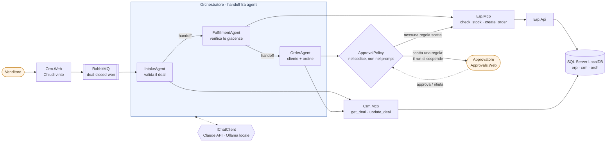
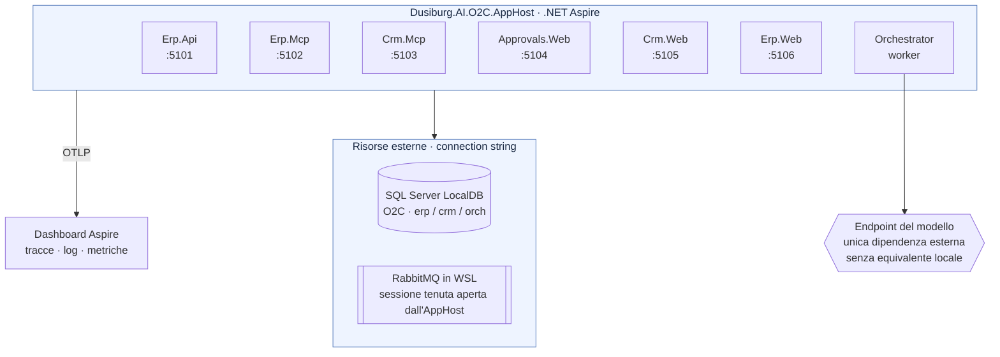
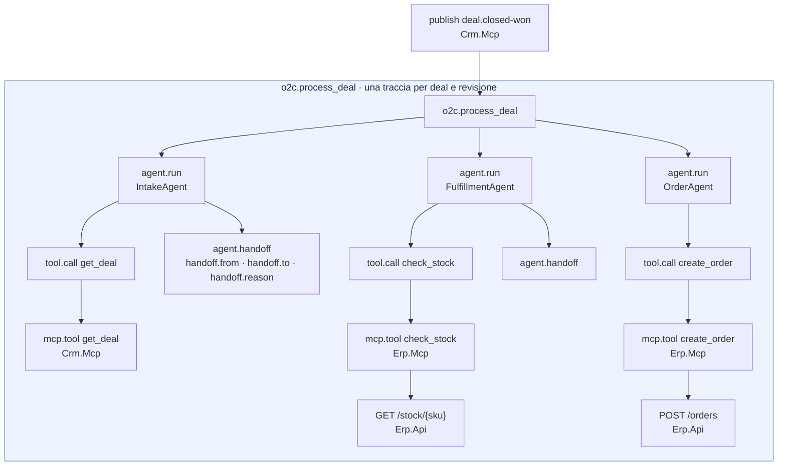

# AI.POC-OrderToCash

> 🇮🇹 **Italiano** · 🇬🇧 [English](README.md)

[](https://github.com/Dusi-burg/AI.POC-OrderToCash/actions/workflows/ci.yml)

POC **Order-to-Cash agentico**: quando un deal passa a *Closed Won* nel CRM, tre agenti specializzati (Microsoft Agent Framework) leggono il deal, verificano la disponibilità e creano l'ordine nell'ERP tramite due server **MCP**, con **approvazione umana** sopra determinate soglie di rischio.

- **Cos'è, in poche pagine e senza gergo**: [docs/il-progetto-in-breve.md](docs/il-progetto-in-breve.md)
- Quando serve un'approvazione, regola per regola: [docs/regole-di-approvazione.md](docs/regole-di-approvazione.md)
- Specifica (fonte di verità): [docs/architettura.md](docs/architettura.md)

> **Stato**: Fasi 0-6 completate. Il flusso è end-to-end dal browser: **Chiudi vinto** su un deal in `Crm.Web` pubblica `deal-closed-won` su RabbitMQ, il workflow IntakeAgent → FulfillmentAgent → OrderAgent usa i tool MCP di `Erp.Mcp` e `Crm.Mcp`, l'**approvazione umana** sospende e riprende il lavoro su `Approvals.Web`, e l'esito torna sul deal. Le istruzioni dei tre agenti stanno in documenti leggibili (`Agents/Specs`). Prossima: Fase 7 — deploy su Azure e osservabilità. Scenari in [docs/demo.md](docs/demo.md).



Il modello propone, il codice decide: le soglie stanno in `ApprovalPolicy`, il totale è ricalcolato dalle righe
proposte e le giacenze le rilegge il sistema, mai prese dal riassunto dell'agente.

## Struttura

| Percorso | Ruolo |
|----------|-------|
| `src/Dusiburg.AI.O2C.AppHost` | .NET Aspire: composizione locale di tutti i servizi |
| `src/Dusiburg.AI.O2C.ServiceDefaults` | OpenTelemetry, health check, service discovery, resilienza, correlation id |
| `src/Dusiburg.AI.O2C.Erp.Api` | Minimal API: l'ERP mock |
| `src/Dusiburg.AI.O2C.Erp.Data` | Modello EF Core dell'ERP (schema `erp`) |
| `src/Dusiburg.AI.O2C.Erp.Mcp` | Server MCP sopra `Erp.Api` |
| `src/Dusiburg.AI.O2C.Crm.Mcp` | Server MCP con il CRM mock |
| `src/Dusiburg.AI.O2C.Crm.Data` | Modello EF Core del CRM mock (schema `crm`) |
| `src/Dusiburg.AI.O2C.Mcp.Hosting` | Infrastruttura comune dei server MCP: API key, filtro sulle chiamate ai tool, errori strutturati |
| `src/Dusiburg.AI.O2C.Orchestrator` | Worker: agenti, handoff, policy di approvazione |
| `src/Dusiburg.AI.O2C.Approvals.Web` | UI delle approvazioni |
| `src/Dusiburg.AI.O2C.Crm.Web` | UI del CRM mock: deal, aziende, comandi Chiudi vinto / Chiudi perso (Fase 6) |
| `src/Dusiburg.AI.O2C.Erp.Web` | UI dell'ERP in sola lettura: clienti, magazzino, ordini ricevuti (Fase 6) |
| `src/Dusiburg.AI.O2C.Shared` | Contratti (§6), helper di idempotenza e correlazione, codici errore, nomi di telemetria |
| `tools/Dusiburg.AI.O2C.DbInit` | Crea da zero il database `O2C` dal modello EF (niente migration) |
| `tools/Dusiburg.AI.O2C.PromptReplay` | Rimanda al modello le richieste catturate e misura la prima chiamata di ogni risposta |
| `tests/*` | NUnit 4 con `Assert.That` (runner NUnit su Microsoft.Testing.Platform) |

## Topologia locale

Un unico AppHost in C# compone tutti i servizi, gestisce service discovery e propagazione delle variabili
d'ambiente, e manda le tracce OpenTelemetry al proprio dashboard. Database e broker entrano come risorse esterne
via connection string: un solo `dotnet run` tira su l'intero POC.



## Prerequisiti

- **.NET SDK 10.0.4xx** (vedi `global.json`).
- **SQL Server LocalDB** con l'istanza `localdev` e il database `O2C` creato dal tool `DbInit`:
  ```powershell
  sqllocaldb create localdev -s
  dotnet run --project tools/Dusiburg.AI.O2C.DbInit   # cancella e ricrea O2C: schemi erp e crm, lookup degli enum
  ```
  Non ci sono migration: a ogni modifica del modello si rilancia il tool. Senza argomenti usa `ConnectionStrings__sql` o `(localdb)\localdev`; su un server che non è LocalDB serve `--allow-non-local`.
- **Docker in WSL** (distro `Ubuntu-26.04`) con un container `rabbitmq` (`rabbitmq:4.3.5-management`, porte 5672/15672) e, sul broker, il vhost `o2c` con l'utente `o2c`. Il container **non va avviato a mano**: lo fa l'AppHost (vedi sotto). Se distro o nome del container sono diversi, impostare `RabbitMq:WslDistro` e `RabbitMq:Container` negli user-secrets dell'AppHost.

  Creazione di vhost e utente (una volta sola; eseguire i comandi nella stessa sessione WSL, a broker avviato):
  ```bash
  docker exec rabbitmq rabbitmqctl add_vhost o2c
  docker exec rabbitmq rabbitmqctl add_user o2c '<password>'
  docker exec rabbitmq rabbitmqctl set_permissions -p o2c o2c '.*' '.*' '.*'
  ```

### Perché RabbitMQ lo avvia l'AppHost

Senza sessioni aperte, WSL spegne la propria VM dopo pochi secondi e con lei Docker e il broker. L'AppHost definisce la risorsa `rabbitmq-wsl`, che esegue `wsl -d Ubuntu-26.04 -- docker start --attach rabbitmq`: la sessione resta aperta finché gira il POC e i log del broker compaiono nel dashboard. Non serve configurare la macchina né lanciare script dopo un riavvio.

## Configurazione locale

Nessun segreto nel repository: i valori stanno negli **user-secrets dell'AppHost**, che li passa ai servizi.

```powershell
dotnet user-secrets --project src/Dusiburg.AI.O2C.AppHost set "ConnectionStrings:sql" "Server=(localdb)\localdev;Database=O2C;Trusted_Connection=True;TrustServerCertificate=True"
dotnet user-secrets --project src/Dusiburg.AI.O2C.AppHost set "ConnectionStrings:rabbitmq" "amqp://o2c:<password>@localhost:5672/o2c"
dotnet user-secrets --project src/Dusiburg.AI.O2C.AppHost set "Parameters:erp-mcp-api-key" "<valore casuale>"
dotnet user-secrets --project src/Dusiburg.AI.O2C.AppHost set "Parameters:crm-mcp-api-key" "<valore casuale>"
dotnet user-secrets --project src/Dusiburg.AI.O2C.AppHost set "Parameters:anthropic-api-key" "<API key da platform.claude.com>"
```

## Avvio

```powershell
dotnet run --project src/Dusiburg.AI.O2C.AppHost
```

L'URL del dashboard Aspire (con token di login) viene stampato in console.

Il profilo di default dell'AppHost usa HTTPS e richiede il certificato di sviluppo trusted (una volta sola, con conferma di Windows):

```powershell
dotnet dev-certs https --trust
```

In alternativa si può avviare in HTTP:

```powershell
$env:ASPIRE_ALLOW_UNSECURED_TRANSPORT = "true"; dotnet run --project src/Dusiburg.AI.O2C.AppHost --launch-profile http
```

| Servizio | URL locale |
|----------|-----------|
| Erp.Api | http://localhost:5101 |
| Erp.Mcp | http://localhost:5102 |
| Crm.Mcp | http://localhost:5103 |
| Approvals.Web | http://localhost:5104 |
| Crm.Web | http://localhost:5105 |
| Erp.Web | http://localhost:5106 |
| RabbitMQ management | http://localhost:15672 |

Ogni servizio web espone `GET /` (informativo), `/health` e `/alive` (solo in Development).

## Server MCP

| Server | Endpoint | Tool | API key (user-secrets dell'AppHost) |
|--------|----------|------|-------------------------------------|
| `erp-mcp` | http://localhost:5102/mcp | `get_customer`, `create_customer`, `check_stock`, `create_order`, `get_order` | `Parameters:erp-mcp-api-key` |
| `crm-mcp` | http://localhost:5103/mcp | `get_deal`, `get_company`, `update_deal` | `Parameters:crm-mcp-api-key` |

- Trasporto MCP Streamable HTTP **stateless** (SDK `ModelContextProtocol.AspNetCore` 2.2.0, protocollo `2026-07-28`).
- Header obbligatorio `X-Api-Key`: se manca o è errato la risposta è 401 (ProblemDetails con `code = UNAUTHORIZED`). Senza chiave configurata il server non si avvia.
- Header facoltativo `x-correlation-id`: propagato a `Erp.Api`, sui log e sullo span `mcp.tool {tool.name}` di ogni chiamata (attributi `tool.name`, `correlation.id`, `tool.outcome`).
- Risultati positivi in `structuredContent`, con lo schema pubblicato in `tools/list`. Errori come risultato `isError = true` con `{ "error": { "code", "message" } }` nel testo. `get_customer` restituisce `{ "customer": null }` se il cliente non esiste.
- `create_order` è annotato `destructive` e ha `_meta` `o2c.sensitive = true`: la policy di approvazione arriva con la Fase 5.
- Verifica manuale facoltativa con MCP Inspector (richiede Node): `npx @modelcontextprotocol/inspector`, trasporto Streamable HTTP, URL del server e header `X-Api-Key`.

## Agente (Fase 3)

L'orchestratore dipende solo da `IChatClient`: il provider del modello si sceglie da configurazione.

| Chiave | Default | Note |
|--------|---------|------|
| `MODEL_PROVIDER` | `anthropic` | `anthropic` oppure `ollama` |
| `ANTHROPIC_API_KEY` | — | Segreto: `Parameters:anthropic-api-key` negli user-secrets dell'AppHost |
| `ANTHROPIC_MODEL` | `claude-sonnet-5` | Claude via API Anthropic (SDK `Anthropic` per C#) |
| `OLLAMA_ENDPOINT`, `OLLAMA_MODEL`, `OLLAMA_NUM_CTX` | `http://localhost:11434`, `qwen3.5:9b`, `16384` | Modello locale, misurato senza criteri di accettazione |

Modello locale (facoltativo): `winget install Ollama.Ollama`, poi `ollama pull qwen3.5:9b`. Con 8 GB di VRAM Ollama userebbe un contesto di 4096 token, troppo piccolo per l'agente: l'orchestratore lo porta a 16384 e disattiva il thinking.

Elaborazione di un deal da riga di comando, con l'AppHost avviato:

```powershell
Invoke-RestMethod -Method Post http://localhost:5103/dev/deals/D-1001/close-won
dotnet run --project src/Dusiburg.AI.O2C.Orchestrator -- process --deal D-1001
# con il modello locale:
$env:MODEL_PROVIDER = "ollama"; dotnet run --project src/Dusiburg.AI.O2C.Orchestrator -- process --deal D-1001
```

- In Development la CLI legge le API key (MCP e modello) dagli user-secrets dell'AppHost e invia la telemetria al dashboard (`O2C_CLI_OTLP_ENDPOINT`, default `https://localhost:21058`): la traccia `o2c.process_deal` contiene gli span `tool.call` e le chiamate MCP → Erp.Api.
- Stampa l'esito in JSON; exit code `0` ordine creato, `1` deal non concluso, `2` errore. Stato e numero d'ordine vengono dai risultati dei tool, non dal riassunto del modello.
- Senza argomenti l'orchestratore resta un worker (sotto l'AppHost).

## Workflow multi-agente e trigger (Fase 4)

- `POST /dev/deals/{id}/close-won` sul CRM porta il deal in `ClosedWon` e pubblica `deal-closed-won` (exchange topic `deal-closed-won`, `message-id = {dealId}:{revision}`). Il worker dell'orchestratore consuma dalla coda `o2c.orchestrator.deal-closed-won` (`prefetch = 1`, fino a 3 nuovi tentativi, poi `o2c.orchestrator.deal-closed-won.dlq`).
- Workflow: **IntakeAgent** (`get_deal`, `get_company`; se il deal non è valido `report_discarded`) → **FulfillmentAgent** (`check_stock`; SKU inesistente → `report_failed`) → **OrderAgent** (cliente, ordine, `update_deal`). Gli esiti `Discarded`/`Failed` li verifica e li scrive sul CRM l'orchestratore.
- `O2C_AGENT_MODE=single` riattiva l'agente unico della Fase 3 (per confronto); default `multi`.
- Stato in `orch.WorkflowState` (una riga per deal e revisione): un evento duplicato non avvia un secondo workflow; la CLI invece rielabora sulla stessa riga.
- **Ripetere la demo**: `POST /dev/reset` su ERP e CRM **non** pulisce `orch.WorkflowState`. Per rilanciare lo stesso deal da evento: `dotnet run --project tools/Dusiburg.AI.O2C.DbInit` (AppHost fermo) oppure cancellare le righe di `orch.WorkflowState`.
- Con l'AppHost appena avviato, attendere nel dashboard il log dell'orchestratore "In ascolto su o2c.orchestrator.deal-closed-won" prima del primo `close-won`: la coda la dichiara il consumer.

Una traccia copre l'intero deal e ogni span porta lo stesso `correlation.id`: nel dashboard il run si legge come
un waterfall, non come log sparsi.



## Demo

Scenari, dati demo e reset sono descritti in [docs/demo.md](docs/demo.md). Richieste pronte:

- `src/Dusiburg.AI.O2C.Erp.Api/Erp.Api.http` — API dell'ERP: clienti, giacenze, ordini (compreso il doppio POST con la stessa `idempotencyKey`).
- `src/Dusiburg.AI.O2C.Crm.Mcp/Crm.Mcp.dev.http` — endpoint dev del CRM mock (solo Development): deal, chiusura `ClosedWon`, reset.

Per ripetere la demo senza ricreare il database: `POST /dev/reset` su Erp.Api e Crm.Mcp; per ripartire da zero si rilancia `DbInit`.

## Specifiche degli agenti

Le istruzioni che ogni agente riceve non stanno nel codice: sono un documento per agente in
`src/Dusiburg.AI.O2C.Orchestrator/Agents/Specs`, pensato per essere letto e discusso anche da chi non sviluppa.

| File | Agente |
|------|--------|
| `IntakeAgent.agent.md` | Valida il deal CRM |
| `FulfillmentAgent.agent.md` | Verifica le giacenze di ogni riga |
| `OrderAgent.agent.md` | Cliente, ordine ERP e aggiornamento del deal |
| `SingleOrderAgent.agent.md` | Agente unico della Fase 3 (`O2C_AGENT_MODE=single`) |

Come si legge un file:

- il **titolo** è il nome dell'agente e la **citazione** sotto di esso la sua descrizione;
- ogni `## Sezione` è un testo che il modello riceve: `## Instructions` sono gli ordini, `## Handoff` la condizione
  con cui l'agente passa la mano al successivo;
- `## Note (non inviate al modello)` è commento per chi legge — non arriva da nessuna parte, ed è lì che stanno le
  spiegazioni in italiano mentre il prompt resta in inglese.

I file sono inclusi come **risorse dell'assembly**: a runtime non si legge nulla dal disco, quindi una modifica al
testo richiede di ricompilare. Quello che tiene a freno gli agenti — quali tool ciascuno può chiamare, il verdetto di
arresto, l'ordine della catena — resta invece nel codice (`WorkflowAgents`), perché un refuso lì deve restare un
errore di compilazione. `AgentSpecTests` fa fallire la build se una specifica è incompleta o malformata.

Prima di tenere una modifica al testo conviene misurarla con il replay descritto qui sotto: confronta il
comportamento del prompt vecchio e di quello nuovo sulle stesse conversazioni.

## Cattura e replay dei prompt

Servono a capire **che cosa** arriva davvero al modello quando un agente si comporta male, e a misurare una correzione invece di indovinarla.

- **Cattura**: con `O2C_PROMPT_CAPTURE_DIR` valorizzata, l'orchestratore scrive in quella cartella ogni richiesta inviata al modello. Senza la variabile non si cattura nulla. Come le altre manopole della demo si imposta **sull'AppHost**, che la inoltra all'orchestratore:

  ```powershell
  $env:O2C_PROMPT_CAPTURE_DIR = 'C:\Temp\o2c-capture'
  dotnet run --project src/Dusiburg.AI.O2C.AppHost
  ```

  > I file contengono i dati di business del run (deal, aziende, prezzi): tenerli fuori dal repository.

- **Replay**: `tools/Dusiburg.AI.O2C.PromptReplay` rimanda al modello le conversazioni di `Cases/` e controlla quale sia la prima chiamata di ogni risposta, ripetendo N volte. Esce 0 se ogni caso dà sempre la chiamata attesa, 1 altrimenti.

Il provider è quello dell'orchestratore e **il default è `anthropic`**: per il giro sul modello locale va impostata `MODEL_PROVIDER`.

```powershell
$env:MODEL_PROVIDER = 'ollama'
dotnet run --project tools/Dusiburg.AI.O2C.PromptReplay -- --repeat 5
dotnet run --project tools/Dusiburg.AI.O2C.PromptReplay -- --repeat 5 --no-filter          # senza il filtro della catena
dotnet run --project tools/Dusiburg.AI.O2C.PromptReplay -- --repeat 5 --captured-instructions   # con le istruzioni del run catturato
dotnet run --project tools/Dusiburg.AI.O2C.PromptReplay -- --repeat 5 --case fulfillment-d1003-so-i-can
```

## Build e test

```powershell
dotnet build Dusiburg.AI.O2C.slnx   # warning trattati come errori
dotnet test --solution Dusiburg.AI.O2C.slnx   # NUnit su Microsoft.Testing.Platform
```

Code coverage: in Visual Studio da **Test → Analizza code coverage per tutti i test**; da riga di comando `dotnet test --solution Dusiburg.AI.O2C.slnx --coverage` (file `.coverage` in `TestResults/`, esclusa da git).

## Convenzioni trasversali

- **Correlazione**: header `x-correlation-id` su ogni chiamata HTTP/MCP, letto o generato (GUID v7) dal middleware `UseCorrelationId()`, propagato in uscita da `CorrelationIdDelegatingHandler`, esposto come attributo `correlation.id` su span e scope di log.
- **Idempotenza**: `IdempotencyKey.From(dealId, revision)` → `o2c-D-1001-r3`, calcolata dal codice e mai dal modello.
- **Errori dei tool**: sempre `{ "error": { "code", "message" } }`, codici in `ToolErrorCodes`; sui server MCP come risultato `isError = true` con l'envelope nel testo, prodotto dal filtro comune di `Mcp.Hosting` (nessuna eccezione arriva al client).
- **Telemetria**: sorgenti `Dusiburg.AI.O2C.*`, attributi `agent.name`, `tool.name`, `correlation.id`, `tool.outcome`.
- **Segreti**: solo user-secrets in locale.
