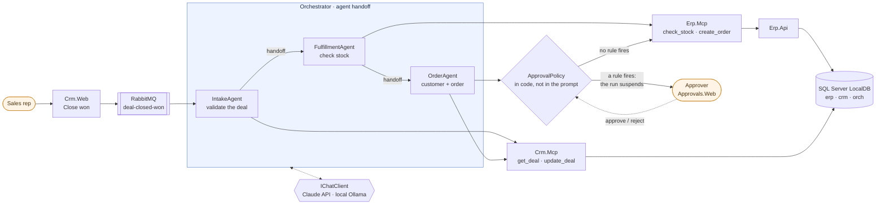
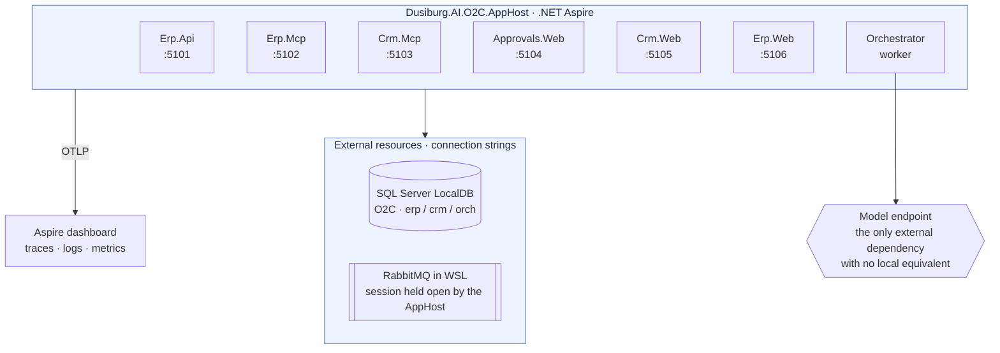
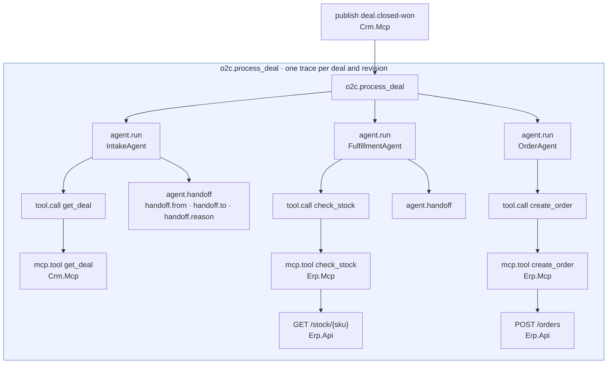

# AI.POC-OrderToCash

> 🇬🇧 **English** · 🇮🇹 [Italiano](README.it.md)

[](https://github.com/Dusi-burg/AI.POC-OrderToCash/actions/workflows/ci.yml)

An **agentic Order-to-Cash** proof of concept: when a deal moves to *Closed Won* in the CRM, three specialised agents (Microsoft Agent Framework) read the deal, check stock availability and create the order in the ERP through two **MCP** servers, pausing for **human approval** above defined risk thresholds.

> **Note on language** — the code, the agent prompts and the commit-level engineering are in English; the long-form documents under `docs/` are written in Italian. This README covers everything you need to build, run and understand the system.

> **Status**: phases 0–6 complete. The flow runs end-to-end from the browser: **Close won** on a deal in `Crm.Web` publishes `deal-closed-won` on RabbitMQ, the IntakeAgent → FulfillmentAgent → OrderAgent workflow calls the MCP tools of `Erp.Mcp` and `Crm.Mcp`, **human approval** suspends and resumes the run from `Approvals.Web`, and the outcome is written back onto the deal. Next up: phase 7 — Azure deployment and observability.



The model proposes, the code decides: the thresholds live in `ApprovalPolicy`, the total is recomputed from the
proposed lines and the stock is re-read by the system, never taken from the agent's own summary.

## Why this POC is interesting

- **Two real MCP servers**, not tool stubs: Streamable HTTP transport, API-key auth, a shared call filter, structured error envelopes and published output schemas.
- **Multi-agent handoff with hard rails**: which tools each agent may call, the stop verdict and the order of the chain live in *code*, so a typo is a compile error — while the instruction text lives in reviewable documents.
- **Human-in-the-loop that actually suspends**: the workflow persists its state, waits for a decision in a web UI, and resumes.
- **Prompt capture and replay**: a tool that replays captured conversations against the model N times and asserts the first tool call, so a prompt change can be *measured* instead of guessed.
- **Correlation and idempotency by construction**: the idempotency key is computed by code and never by the model; a correlation id flows across every HTTP/MCP hop, onto logs and spans.

## Layout

| Path | Role |
|------|------|
| `src/Dusiburg.AI.O2C.AppHost` | .NET Aspire: local composition of every service |
| `src/Dusiburg.AI.O2C.ServiceDefaults` | OpenTelemetry, health checks, service discovery, resilience, correlation id |
| `src/Dusiburg.AI.O2C.Erp.Api` | Minimal API: the mock ERP |
| `src/Dusiburg.AI.O2C.Erp.Data` | EF Core model of the ERP (schema `erp`) |
| `src/Dusiburg.AI.O2C.Erp.Mcp` | MCP server on top of `Erp.Api` |
| `src/Dusiburg.AI.O2C.Crm.Mcp` | MCP server with the mock CRM |
| `src/Dusiburg.AI.O2C.Crm.Data` | EF Core model of the mock CRM (schema `crm`) |
| `src/Dusiburg.AI.O2C.Mcp.Hosting` | Shared MCP server infrastructure: API key, tool-call filter, structured errors |
| `src/Dusiburg.AI.O2C.Orchestrator` | Worker: agents, handoff, approval policy |
| `src/Dusiburg.AI.O2C.Approvals.Web` | Approvals UI |
| `src/Dusiburg.AI.O2C.Crm.Web` | Mock CRM UI: deals, companies, close won / close lost commands |
| `src/Dusiburg.AI.O2C.Erp.Web` | Read-only ERP UI: customers, stock, received orders |
| `src/Dusiburg.AI.O2C.Shared` | Contracts, idempotency and correlation helpers, error codes, telemetry names |
| `tools/Dusiburg.AI.O2C.DbInit` | Creates the `O2C` database from scratch off the EF model (no migrations) |
| `tools/Dusiburg.AI.O2C.PromptReplay` | Replays captured requests against the model and measures the first call of each response |
| `tests/*` | NUnit 4 with `Assert.That` (NUnit runner on Microsoft.Testing.Platform) |

## Local topology

One C# AppHost composes every service, wires service discovery and environment variables between them, and ships
the OpenTelemetry traces to its dashboard. Database and broker join as external resources through connection
strings, so a single `dotnet run` brings the whole POC up.



## Prerequisites

- **.NET SDK 10.0.4xx** (see `global.json`).
- **SQL Server LocalDB**, with the `O2C` database created by the `DbInit` tool:
  ```powershell
  sqllocaldb create localdev -s
  dotnet run --project tools/Dusiburg.AI.O2C.DbInit   # drops and recreates O2C: erp and crm schemas, enum lookups
  ```
  There are no migrations: every model change means re-running the tool. With no arguments it uses `ConnectionStrings__sql`, falling back to `(localdb)\localdev`; against a non-LocalDB server it needs `--allow-non-local`.
- **RabbitMQ** reachable at `amqp://…:5672`, with a vhost and user dedicated to the POC. The reference setup runs `rabbitmq:4.3.5-management` in Docker; the AppHost can start that container for you (see below).

  One-off creation of vhost and user, with the broker running:
  ```bash
  docker exec rabbitmq rabbitmqctl add_vhost o2c
  docker exec rabbitmq rabbitmqctl add_user o2c '<password>'
  docker exec rabbitmq rabbitmqctl set_permissions -p o2c o2c '.*' '.*' '.*'
  ```

### Optional: letting the AppHost start the broker

When Docker runs inside WSL, WSL shuts its VM down a few seconds after the last session closes — taking Docker and the broker with it. The AppHost therefore defines a `rabbitmq-wsl` resource that runs `wsl -d <distro> -- docker start --attach rabbitmq`, keeping the session open for as long as the POC runs and surfacing the broker logs in the dashboard. Set `RabbitMq:WslDistro` and `RabbitMq:Container` in the AppHost user-secrets to match your machine, or point `ConnectionStrings:rabbitmq` at any broker you already run and ignore this.

## Local configuration

No secrets are stored in the repository: values live in the **AppHost user-secrets**, which passes them to the services.

```powershell
dotnet user-secrets --project src/Dusiburg.AI.O2C.AppHost set "ConnectionStrings:sql" "Server=(localdb)\localdev;Database=O2C;Trusted_Connection=True;TrustServerCertificate=True"
dotnet user-secrets --project src/Dusiburg.AI.O2C.AppHost set "ConnectionStrings:rabbitmq" "amqp://o2c:<password>@localhost:5672/o2c"
dotnet user-secrets --project src/Dusiburg.AI.O2C.AppHost set "Parameters:erp-mcp-api-key" "<random value>"
dotnet user-secrets --project src/Dusiburg.AI.O2C.AppHost set "Parameters:crm-mcp-api-key" "<random value>"
dotnet user-secrets --project src/Dusiburg.AI.O2C.AppHost set "Parameters:anthropic-api-key" "<API key from platform.claude.com>"
```

## Running

```powershell
dotnet run --project src/Dusiburg.AI.O2C.AppHost
```

The Aspire dashboard URL (with its login token) is printed to the console.

The AppHost's default profile uses HTTPS and needs a trusted development certificate (once, with a Windows confirmation prompt):

```powershell
dotnet dev-certs https --trust
```

Alternatively, run over HTTP:

```powershell
$env:ASPIRE_ALLOW_UNSECURED_TRANSPORT = "true"; dotnet run --project src/Dusiburg.AI.O2C.AppHost --launch-profile http
```

| Service | Local URL |
|---------|-----------|
| Erp.Api | http://localhost:5101 |
| Erp.Mcp | http://localhost:5102 |
| Crm.Mcp | http://localhost:5103 |
| Approvals.Web | http://localhost:5104 |
| Crm.Web | http://localhost:5105 |
| Erp.Web | http://localhost:5106 |
| RabbitMQ management | http://localhost:15672 |

Every web service exposes `GET /` (informational), plus `/health` and `/alive` in Development only.

## MCP servers

| Server | Endpoint | Tools | API key (AppHost user-secrets) |
|--------|----------|-------|--------------------------------|
| `erp-mcp` | http://localhost:5102/mcp | `get_customer`, `create_customer`, `check_stock`, `create_order`, `get_order` | `Parameters:erp-mcp-api-key` |
| `crm-mcp` | http://localhost:5103/mcp | `get_deal`, `get_company`, `update_deal` | `Parameters:crm-mcp-api-key` |

- **Stateless Streamable HTTP** MCP transport (`ModelContextProtocol.AspNetCore` 2.2.0, protocol `2026-07-28`).
- The `X-Api-Key` header is mandatory: missing or wrong keys get a 401 (ProblemDetails with `code = UNAUTHORIZED`). With no key configured the server refuses to start.
- The optional `x-correlation-id` header is propagated to `Erp.Api`, onto logs, and onto the `mcp.tool {tool.name}` span of every call (attributes `tool.name`, `correlation.id`, `tool.outcome`).
- Successful results go in `structuredContent`, with the schema published in `tools/list`. Errors come back as `isError = true` results carrying `{ "error": { "code", "message" } }` in the text, produced by the shared filter in `Mcp.Hosting` — no exception ever reaches the client. `get_customer` returns `{ "customer": null }` when the customer does not exist.
- `create_order` is annotated `destructive` and carries `_meta` `o2c.sensitive = true`, which is what the approval policy keys off.
- Optional manual check with MCP Inspector (needs Node): `npx @modelcontextprotocol/inspector`, Streamable HTTP transport, the server URL and the `X-Api-Key` header.

## Model provider

The orchestrator depends only on `IChatClient`: the model provider is chosen through configuration.

| Key | Default | Notes |
|-----|---------|-------|
| `MODEL_PROVIDER` | `anthropic` | `anthropic` or `ollama` |
| `ANTHROPIC_API_KEY` | — | Secret: `Parameters:anthropic-api-key` in the AppHost user-secrets |
| `ANTHROPIC_MODEL` | `claude-sonnet-5` | Claude via the Anthropic API (`Anthropic` SDK for C#) |
| `OLLAMA_ENDPOINT`, `OLLAMA_MODEL`, `OLLAMA_NUM_CTX` | `http://localhost:11434`, `qwen3.5:9b`, `16384` | Local model, measured without acceptance criteria |

Local model (optional): `winget install Ollama.Ollama`, then `ollama pull qwen3.5:9b`. On 8 GB of VRAM Ollama would pick a 4096-token context, too small for the agent: the orchestrator raises it to 16384 and disables thinking.

Processing a deal from the command line, with the AppHost running:

```powershell
Invoke-RestMethod -Method Post http://localhost:5103/dev/deals/D-1001/close-won
dotnet run --project src/Dusiburg.AI.O2C.Orchestrator -- process --deal D-1001
# with the local model:
$env:MODEL_PROVIDER = "ollama"; dotnet run --project src/Dusiburg.AI.O2C.Orchestrator -- process --deal D-1001
```

- In Development the CLI reads the API keys (MCP and model) from the AppHost user-secrets and sends telemetry to the dashboard (`O2C_CLI_OTLP_ENDPOINT`, default `https://localhost:21058`): the `o2c.process_deal` trace contains the `tool.call` spans and the MCP → Erp.Api calls.
- It prints the outcome as JSON; exit code `0` order created, `1` deal not closed, `2` error. Status and order number come from the tool results, not from the model's summary.
- With no arguments the orchestrator stays a worker (under the AppHost).

## Multi-agent workflow and trigger

- `POST /dev/deals/{id}/close-won` on the CRM moves the deal to `ClosedWon` and publishes `deal-closed-won` (topic exchange `deal-closed-won`, `message-id = {dealId}:{revision}`). The orchestrator worker consumes from the `o2c.orchestrator.deal-closed-won` queue (`prefetch = 1`, up to 3 retries, then `o2c.orchestrator.deal-closed-won.dlq`).
- Workflow: **IntakeAgent** (`get_deal`, `get_company`; `report_discarded` if the deal is not valid) → **FulfillmentAgent** (`check_stock`; unknown SKU → `report_failed`) → **OrderAgent** (customer, order, `update_deal`). `Discarded` / `Failed` outcomes are verified and written to the CRM by the orchestrator, not the model.
- `O2C_AGENT_MODE=single` re-enables the single agent from phase 3 (for comparison); the default is `multi`.
- State lives in `orch.WorkflowState` (one row per deal and revision): a duplicate event does not start a second workflow, while the CLI reprocesses onto the same row.
- **Repeating the demo**: `POST /dev/reset` on ERP and CRM does **not** clear `orch.WorkflowState`. To re-run the same deal from an event, either run `dotnet run --project tools/Dusiburg.AI.O2C.DbInit` (with the AppHost stopped) or delete the `orch.WorkflowState` rows.
- On a freshly started AppHost, wait for the orchestrator's "listening on o2c.orchestrator.deal-closed-won" log line in the dashboard before the first `close-won`: the queue is declared by the consumer.

One trace covers a whole deal, and every span carries the same `correlation.id`, so a run reads as a waterfall in
the dashboard instead of as scattered logs:



## Demo

Scenarios, demo data and reset are described in [docs/demo.md](docs/demo.md) (Italian). Ready-made requests:

- `src/Dusiburg.AI.O2C.Erp.Api/Erp.Api.http` — ERP API: customers, stock, orders (including the double POST with the same `idempotencyKey`).
- `src/Dusiburg.AI.O2C.Crm.Mcp/Crm.Mcp.dev.http` — dev endpoints of the mock CRM (Development only): deals, `ClosedWon` closure, reset.

To repeat the demo without recreating the database: `POST /dev/reset` on Erp.Api and Crm.Mcp; to start over completely, re-run `DbInit`.

## Agent specifications

The instructions each agent receives do not live in code: they are one document per agent under
`src/Dusiburg.AI.O2C.Orchestrator/Agents/Specs`, meant to be read and discussed by non-developers too.

| File | Agent |
|------|-------|
| `IntakeAgent.agent.md` | Validates the CRM deal |
| `FulfillmentAgent.agent.md` | Checks stock for every line |
| `OrderAgent.agent.md` | Customer, ERP order and deal update |
| `SingleOrderAgent.agent.md` | The single agent from phase 3 (`O2C_AGENT_MODE=single`) |

How to read one:

- the **title** is the agent's name and the **quote** below it is its description;
- every `## Section` is text the model receives: `## Instructions` are the orders, `## Handoff` the condition under which the agent passes the baton to the next one;
- `## Note (non inviate al modello)` is commentary for the reader — it goes nowhere, and it is where the Italian explanations sit while the prompt itself stays in English.

The files ship as **assembly resources**: nothing is read from disk at runtime, so changing the text means recompiling. What keeps the agents on rails — which tools each may call, the stop verdict, the order of the chain — stays in code (`WorkflowAgents`), because a typo there has to remain a compile error. `AgentSpecTests` fails the build if a specification is incomplete or malformed.

Before keeping a change to the text, measure it with the replay described below: it compares the behaviour of the old and new prompt over the same conversations.

## Prompt capture and replay

These exist to find out **what** actually reaches the model when an agent misbehaves, and to measure a fix instead of guessing at it.

- **Capture**: when `O2C_PROMPT_CAPTURE_DIR` is set, the orchestrator writes every request sent to the model into that folder. Without the variable nothing is captured. Like the other demo knobs it is set **on the AppHost**, which forwards it to the orchestrator:

  ```powershell
  $env:O2C_PROMPT_CAPTURE_DIR = 'C:\Temp\o2c-capture'
  dotnet run --project src/Dusiburg.AI.O2C.AppHost
  ```

  > The files contain the run's business data (deals, companies, prices): keep them out of the repository.

- **Replay**: `tools/Dusiburg.AI.O2C.PromptReplay` replays the conversations in `Cases/` against the model and checks which call comes first in each response, repeating N times. It exits 0 if every case always produces the expected call, 1 otherwise.

The provider is the orchestrator's, and **the default is `anthropic`**: set `MODEL_PROVIDER` for a run against the local model.

```powershell
$env:MODEL_PROVIDER = 'ollama'
dotnet run --project tools/Dusiburg.AI.O2C.PromptReplay -- --repeat 5
dotnet run --project tools/Dusiburg.AI.O2C.PromptReplay -- --repeat 5 --no-filter          # without the chain filter
dotnet run --project tools/Dusiburg.AI.O2C.PromptReplay -- --repeat 5 --captured-instructions   # with the captured run's instructions
dotnet run --project tools/Dusiburg.AI.O2C.PromptReplay -- --repeat 5 --case fulfillment-d1003-so-i-can
```

## Build and test

```powershell
dotnet build Dusiburg.AI.O2C.slnx   # warnings as errors
dotnet test --solution Dusiburg.AI.O2C.slnx   # NUnit on Microsoft.Testing.Platform
```

Code coverage: in Visual Studio via **Test → Analyze code coverage for all tests**; from the command line `dotnet test --solution Dusiburg.AI.O2C.slnx --coverage` (`.coverage` files in `TestResults/`, excluded from git).

## Cross-cutting conventions

- **Correlation**: an `x-correlation-id` header on every HTTP/MCP call, read or generated (GUID v7) by the `UseCorrelationId()` middleware, propagated outbound by `CorrelationIdDelegatingHandler`, exposed as the `correlation.id` attribute on spans and log scopes.
- **Idempotency**: `IdempotencyKey.From(dealId, revision)` → `o2c-D-1001-r3`, computed by code and never by the model.
- **Tool errors**: always `{ "error": { "code", "message" } }`, with codes in `ToolErrorCodes`; on the MCP servers as an `isError = true` result carrying the envelope in the text, produced by the shared filter in `Mcp.Hosting`.
- **Telemetry**: sources `Dusiburg.AI.O2C.*`, attributes `agent.name`, `tool.name`, `correlation.id`, `tool.outcome`.
- **Secrets**: user-secrets only, locally.

## Further documentation (Italian)

- [docs/il-progetto-in-breve.md](docs/il-progetto-in-breve.md) — what the system does and why it is built this way, for non-developers.
- [docs/regole-di-approvazione.md](docs/regole-di-approvazione.md) — when an approval is required, rule by rule.
- [docs/architettura.md](docs/architettura.md) — the specification, and the source of truth.
- [docs/demo.md](docs/demo.md) — demo scenarios and data.

## License

[MIT](LICENSE) © Mauro Dusi
