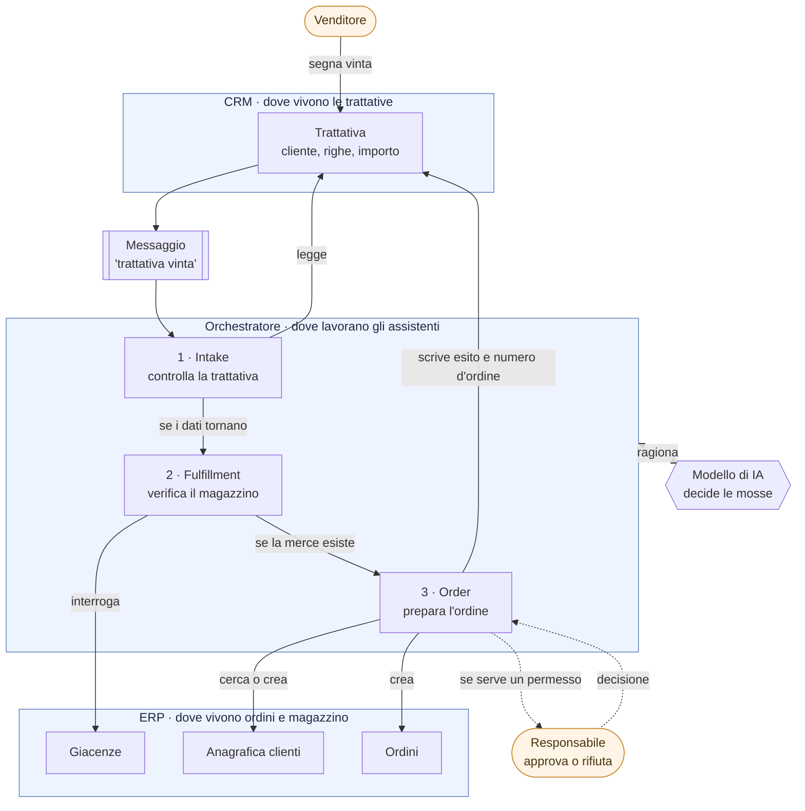

# Il progetto in breve

> Per chi non sviluppa. Spiega **che cosa fa** questo sistema, **come lo fa** e **perché è costruito così**.
> Nessuna riga di codice, nessun termine dato per scontato.

## In una frase

Quando un venditore segna come vinta una trattativa nel gestionale commerciale, il sistema **prepara da solo
l'ordine nel gestionale aziendale** — controllando il magazzino e l'anagrafica del cliente — e si ferma a chiedere
il permesso a una persona quando la situazione lo richiede.

## Il problema che risolve

In molte aziende quel passaggio è manuale. Qualcuno rilegge la trattativa, controlla che i dati tornino, guarda se
la merce c'è, verifica se il cliente è già censito, e solo allora inserisce l'ordine. È un lavoro ripetitivo, ma non
del tutto meccanico: richiede di leggere una situazione e decidere cosa fare, e ogni tanto di fermarsi e chiedere.

Un'automazione tradizionale segue una sequenza fissa decisa in anticipo. Qui invece il lavoro è affidato a **tre
assistenti automatici specializzati** che decidono da soli quali informazioni cercare e in che ordine, appoggiandosi
a un modello di intelligenza artificiale. Restano però dentro binari stretti, stabiliti da chi ha costruito il
sistema: è la parte più importante del progetto ed è spiegata più avanti.

## Come funziona

Il percorso, a parole:

1. **Il venditore chiude la trattativa** come vinta. Da lì in poi non deve fare altro.
2. Parte un messaggio. Il sistema lavora in differita: se qualcosa è spento in quel momento, il messaggio resta in
   attesa e viene ripreso dopo. Nulla va perso.
3. **Il primo assistente controlla la trattativa**: se è davvero chiusa vinta, se è in euro, se ha almeno una riga,
   se l'importo torna con la somma delle righe. Se qualcosa non quadra si ferma e la pratica viene scartata, con
   scritta la ragione.
4. **Il secondo verifica il magazzino**, riga per riga. Se un codice articolo non esiste proprio, il lavoro si ferma
   qui. Se la merce non basta, non è un errore: si andrà in ordine arretrato, ma servirà un permesso.
5. **Il terzo prepara l'ordine**: cerca il cliente nel gestionale, lo crea se non c'è, inserisce l'ordine con le
   stesse righe e gli stessi prezzi della trattativa, e infine riscrive sulla trattativa lo stato e il numero
   d'ordine, così il venditore vede il risultato dove sta già guardando.

## I tre assistenti

Sono tre e non uno solo per la stessa ragione per cui in azienda il lavoro è diviso: ognuno ha un compito stretto e
**può toccare soltanto ciò che gli serve**.

| | Compito | Cosa può fare | Come può fermare il lavoro |
|---|---|---|---|
| **Intake** | Controlla che la trattativa sia lavorabile | Solo leggere la trattativa e l'azienda | Scarta la pratica |
| **Fulfillment** | Verifica la disponibilità di ogni riga | Solo interrogare il magazzino | Ferma tutto se un codice non esiste |
| **Order** | Anagrafica cliente e creazione ordine | Cercare e creare il cliente, creare l'ordine, aggiornare la trattativa | — |

Il secondo non può creare un ordine nemmeno se il modello glielo suggerisse: quella possibilità non ce l'ha proprio.

Quello che ciascuno deve fare è scritto in **quattro documenti leggibili**, uno per assistente, che stanno nel
progetto insieme al codice: si possono leggere e discutere senza saper programmare.

## Il punto in cui serve una persona

L'ordine **non viene creato automaticamente** quando la situazione merita un occhio umano. Succede in quattro casi:

- l'importo supera la soglia stabilita (di base 10.000 €);
- la merce non basta per almeno una riga;
- il cliente non esiste ancora nel gestionale e andrebbe creato;
- il cliente è bloccato — qui il permesso è l'unica strada possibile.

In quei casi il lavoro **si sospende davvero**: nessun ordine viene creato, e una richiesta compare in una pagina
dedicata con tutto il necessario per decidere — righe, totale, giacenze, cliente. Il responsabile approva o rifiuta,
e solo allora il lavoro riprende esattamente da dove si era fermato. Può passare un minuto o un giorno: il sistema
può anche essere riavviato nel frattempo.

## Perché non ci si fida ciecamente dell'intelligenza artificiale

È la parte che conta di più, ed è il motivo per cui questo non è un giocattolo.

Un modello di IA è bravo a capire una situazione, ma **non è affidabile come un contabile**: ogni tanto salta un
passaggio, o riassume male. Il sistema quindi non gli crede sulla parola in nessun punto che abbia conseguenze.

- **Le soglie e le regole non sono scritte nelle istruzioni degli assistenti**, ma nel codice, in un punto solo. Il
  modello non può convincere il sistema che un ordine da 50.000 € non ha bisogno di permessi.
- **Le giacenze su cui si decide le ricontrolla il sistema**, non l'assistente. Se l'assistente salta il controllo,
  l'ordine non passa lo stesso: era successo davvero, e quel buco è stato chiuso.
- **Il totale viene ricalcolato dalle righe**, non letto da quello che dice il modello.
- **Dopo uno stop, agli assistenti viene tolta la penna**: non possono più scrivere né sull'ERP né sul CRM, così una
  pratica fallita non può finire segnata come completata.
- **Gli assistenti si scambiano fatti, non chiacchiere**: il secondo vede *quali dati ha letto* il primo, non il
  discorsetto con cui gliela passa. Sembra un dettaglio, ma una frase del primo assistente bastava a convincere il
  secondo che il magazzino fosse già stato controllato.

In breve: **il modello propone, il sistema verifica.** Gli assistenti fanno risparmiare il lavoro di lettura e
raccolta dati; le decisioni che costano soldi restano in mano a regole scritte da persone, o a una persona.

## Un esempio concreto

Una trattativa da 5.300 € con tre articoli, tra cui **5 motori di cui solo 3 disponibili**:

1. Intake controlla e passa la mano: importo e righe tornano.
2. Fulfillment interroga il magazzino per tutti e tre gli articoli e segnala che i motori non bastano.
3. Order prepara l'ordine **per 5 pezzi, non per 3**: la merce mancante si ordina, non si taglia l'ordine al cliente.
4. Scatta la richiesta di permesso per merce insufficiente. Nessun ordine esiste ancora.
5. Il responsabile approva. L'ordine viene creato in stato "arretrato", con scritto nero su bianco *"2 pezzi da
   ordinare"*, e la trattativa nel CRM si aggiorna con il numero d'ordine.

## Che cosa dimostra il progetto

Tre cose che distinguono un'integrazione con gli agenti da un'automazione tradizionale:

1. **Più assistenti specializzati** che si passano il lavoro, invece di un unico automatismo che fa tutto.
2. **I sistemi aziendali esposti in un formato standard** (si chiama MCP), così che un assistente possa usarli come
   strumenti senza che qualcuno scriva un collegamento su misura per ogni combinazione.
3. **Un punto di approvazione umana reale**, che blocca davvero l'azione prima che avvenga — non un avviso mandato
   dopo.

Tutto è tracciato: per ogni pratica si può ricostruire chi ha fatto cosa, in che ordine, con quali dati, e chi ha
approvato.

## Che cosa non è

- **Non è un prodotto**: è una dimostrazione. Gestionale e CRM sono simulati, con dati di esempio realistici.
- **Non è in cloud**: gira sul computer di chi lo mostra. Il passaggio al cloud è previsto come fase successiva.
- **Non ha ancora login e permessi**: chiunque apra le pagine può usarle. Va bene per una dimostrazione locale,
  non altrove.
- **Il modello di IA è intercambiabile**: si può usare un modello in cloud oppure uno che gira sullo stesso
  computer, senza cambiare nulla del resto. Le prove sono state fatte con entrambi.

## Se vuoi vedere il resto

| Documento | A chi serve |
|-----------|-------------|
| `docs/demo.md` | Chi deve **mostrare** il sistema: gli scenari, uno per uno, con gli esiti attesi |
| `docs/architettura.md` | Chi vuole il dettaglio tecnico completo |
| `README.md` | Chi deve farlo partire sul proprio computer |
| `src/Dusiburg.AI.O2C.Orchestrator/Agents/Specs/` | Chi vuole leggere le istruzioni date ai tre assistenti |
