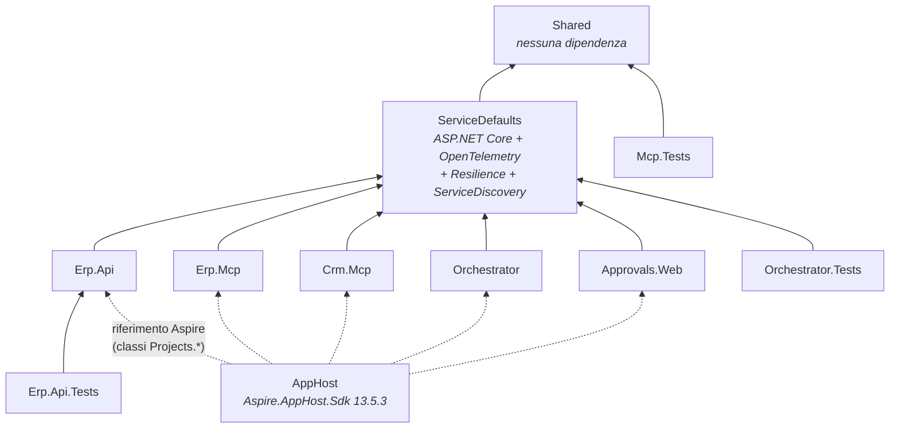
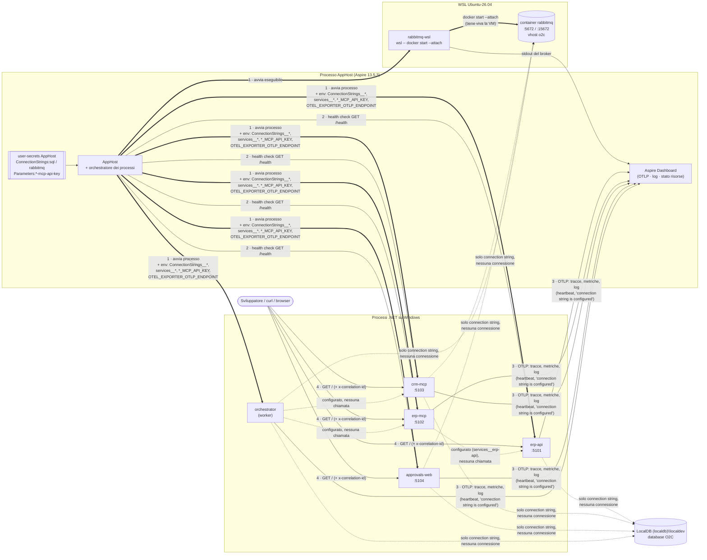
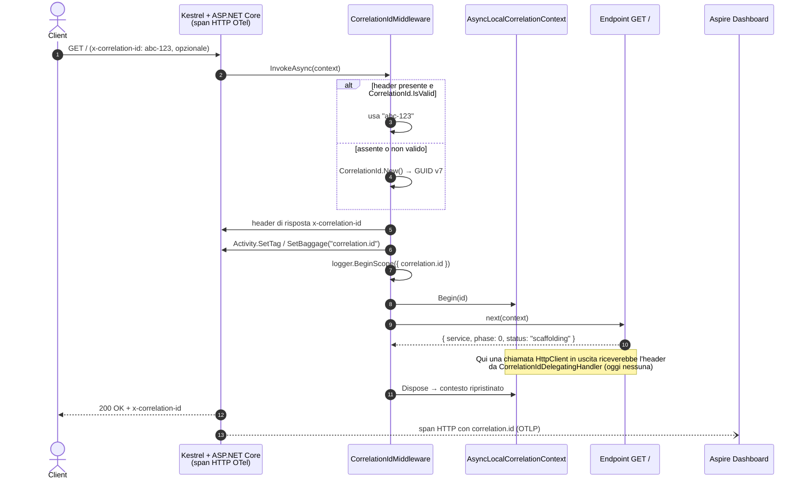

# Panoramica del codice — Fase 0

> **Stato del repo**: branch `develop`, ultimo commit `5871d0f` (passaggio a NUnit 4). Fasi di riferimento: [plan.md](plan/plan.md) · [fase-0-setup-scaffolding.md](plan/fase-0-setup-scaffolding.md) · specifica [architettura.md](architettura.md).
>
> Questo documento descrive **quello che il codice fa oggi**, non quello che farà. Dove un elemento è solo predisposto per le fasi successive, è indicato esplicitamente.

## 1. In sintesi

La Fase 0 ha prodotto lo **scheletro completo** della solution: tutti i progetti previsti da §10 della specifica esistono, compilano con warning trattati come errori e si avviano insieme sotto .NET Aspire. **Non c'è ancora logica di dominio**: nessun database, nessun messaggio, nessun agente, nessun tool MCP.

Quello che invece è già reale e funzionante sono i requisiti trasversali di §12:

| Requisito | Dove vive | Stato |
|-----------|-----------|-------|
| Correlation id `x-correlation-id` | `Shared/Correlation` + `ServiceDefaults/Correlation` | ✅ Attivo su ogni richiesta HTTP in ingresso; handler per le chiamate in uscita già registrato |
| Telemetria OpenTelemetry → Aspire Dashboard | `ServiceDefaults/Extensions.cs` | ✅ Tracce, metriche e log esportati da tutti e 5 i servizi |
| Health check | `ServiceDefaults/Extensions.cs` + `AppHost` | ✅ `/health` e `/alive` (solo Development), sondati da Aspire sui 4 servizi web |
| Gestione segreti | user-secrets dell'`AppHost` | ✅ Connection string e API key passate come variabili d'ambiente, mai loggate |
| Idempotenza | `Shared/Idempotency/IdempotencyKey.cs` | 🟨 Helper pronto e testato, nessuno lo usa ancora (serve a `create_order`, Fase 2–3) |
| Contratti dei tool (§6) ed errori | `Shared/Contracts`, `Shared/Errors` | 🟨 Record pronti e testati in serializzazione, nessun servizio li espone ancora |

> ⚠️ **Punto chiave per leggere i diagrammi**: oggi i servizi **non si chiamano fra loro**. Le uniche interazioni reali sono fra l'AppHost e i processi che avvia (start, variabili d'ambiente, health check, raccolta log/telemetria) e fra un client esterno e gli endpoint `GET /`. Tutti i collegamenti "di dominio" (Orchestrator → MCP, MCP → Erp.Api, servizi → LocalDB/RabbitMQ) sono **solo configurati** tramite `WithReference`, non usati.

## 2. Mappa della solution

`Dusiburg.AI.O2C.slnx` contiene 8 progetti in `src/` e 3 in `tests/`.

| Progetto | SDK / tipo | Ruolo oggi | Ruolo a regime |
|----------|-----------|------------|----------------|
| `Dusiburg.AI.O2C.AppHost` | `Aspire.AppHost.Sdk/13.5.3` | Avvia e compone tutto, inietta configurazione e segreti | Idem + `azd up` in Fase 7 |
| `Dusiburg.AI.O2C.ServiceDefaults` | classlib (`IsAspireSharedProject`) | OTel, health, service discovery, resilienza, correlation id | Idem |
| `Dusiburg.AI.O2C.Shared` | classlib senza dipendenze | Contratti §6, correlazione, idempotenza, errori, nomi di telemetria | Idem |
| `Dusiburg.AI.O2C.Erp.Api` | Web (minimal API) | `GET /` informativo | ERP mock: EF Core su LocalDB, schema `erp` (Fase 1) |
| `Dusiburg.AI.O2C.Erp.Mcp` | Web | `GET /` informativo | Server MCP sopra `Erp.Api` (Fase 2) |
| `Dusiburg.AI.O2C.Crm.Mcp` | Web | `GET /` informativo | CRM mock + server MCP + webhook su RabbitMQ (Fasi 1–2, 4) |
| `Dusiburg.AI.O2C.Orchestrator` | Worker | Heartbeat ogni 30 s | Agenti, handoff, policy di approvazione (Fasi 3–5) |
| `Dusiburg.AI.O2C.Approvals.Web` | Web (Razor Pages) | Pagine del template (Index, Privacy, Error) | UI `/approvals` e callback (Fase 5) |
| `tests/Dusiburg.AI.O2C.Erp.Api.Tests` | NUnit 4 | Smoke test HTTP con `WebApplicationFactory` | Test dell'ERP |
| `tests/Dusiburg.AI.O2C.Mcp.Tests` | NUnit 4 | Serializzazione di contratti ed envelope di errore | Test dei tool MCP |
| `tests/Dusiburg.AI.O2C.Orchestrator.Tests` | NUnit 4 | Helper di `Shared` e correlazione di `ServiceDefaults` | Test dell'orchestratore |

### 2.1 Dipendenze di compilazione



Note:
- Le frecce piene sono `ProjectReference` normali; tutti i servizi arrivano a `Shared` **in modo transitivo** tramite `ServiceDefaults`.
- I riferimenti dell'AppHost (tratteggiati) non portano il codice dei servizi dentro l'AppHost: Aspire genera le classi `Projects.Dusiburg_AI_O2C_*` con il percorso del `.csproj`, usate da `AddProject<T>()` per lanciare il processo.
- `Orchestrator.Tests` non referenzia `Orchestrator` (che oggi non ha nulla da testare) ma `ServiceDefaults`, per testare middleware e handler di correlazione e, transitivamente, gli helper di `Shared`.
- `Shared` non dipende da ASP.NET Core né da EF Core (commento nel `.csproj`): resta usabile da qualunque livello, test compresi.

## 3. File di build condivisi (root del repo)

| File | Contenuto | Effetto |
|------|-----------|---------|
| `global.json` | SDK `10.0.400` con `rollForward: latestFeature`; `test.runner: Microsoft.Testing.Platform` | Qualunque SDK 10.0.4xx va bene; `dotnet test` usa la nuova piattaforma di test (serve `--solution`) |
| `Directory.Build.props` | `net10.0`, `Nullable`, `ImplicitUsings`, `TreatWarningsAsErrors`, `AnalysisLevel=latest` | Impostazioni identiche in tutti gli 11 progetti: un warning rompe la build |
| `Directory.Packages.props` | Central Package Management: versioni fissate per ServiceDefaults (OTel 1.18.0, Resilience/ServiceDiscovery 10.10.0), Hosting 10.0.12, test (NUnit 4.6.1, adapter 6.3.0, analyzer 4.15.0, Mvc.Testing 10.0.12, CodeCoverage 18.11.2) | I `.csproj` dichiarano i pacchetti **senza versione** |
| `dotnet-tools.json` | Tool locale `dotnet-ef` 10.0.12 | Pronto per le migration della Fase 1 (`dotnet tool restore`) |
| `.editorconfig`, `.gitattributes`, `.gitignore` | Stile, fine riga, esclusioni (inclusi `TestResults/` e `*.coverage`) | — |

## 4. Progetto per progetto

### 4.1 AppHost — [`AppHost.cs`](../src/Dusiburg.AI.O2C.AppHost/AppHost.cs)

È il "docker-compose in C#" del POC. In ordine, il file:

1. **Dichiara due risorse esterne** con `AddConnectionString("sql")` e `AddConnectionString("rabbitmq")`. Aspire non crea container (decisione D8): legge i valori dagli user-secrets (`ConnectionStrings:sql`, `ConnectionStrings:rabbitmq`) e li inietterà ai servizi che li referenziano.
2. **Aggiunge la risorsa eseguibile `rabbitmq-wsl`**: lancia `wsl -d Ubuntu-26.04 -- docker start --attach rabbitmq`. Il comando resta in primo piano finché gira l'AppHost, quindi la VM WSL non si spegne e il broker resta vivo; lo stdout del container finisce nei log del dashboard. Distro e nome del container si cambiano con `RabbitMq:WslDistro` / `RabbitMq:Container` (D26).
3. **Dichiara due parametri segreti**, `erp-mcp-api-key` e `crm-mcp-api-key` (`Parameters:*` negli user-secrets).
4. **Registra i 5 servizi** con `AddProject<T>(nome)` e ne definisce i collegamenti:

| Risorsa | `WithReference` | Variabili extra | Health check Aspire |
|---------|-----------------|-----------------|---------------------|
| `erp-api` | `sql` | — | `/health` |
| `erp-mcp` | `erp-api` | `ERP_MCP_API_KEY` | `/health` |
| `crm-mcp` | `sql`, `rabbitmq` | `CRM_MCP_API_KEY` | `/health` |
| `orchestrator` | `sql`, `rabbitmq`, `erp-mcp`, `crm-mcp` | `ERP_MCP_API_KEY`, `CRM_MCP_API_KEY` | — (è un worker senza HTTP) |
| `approvals-web` | `sql`, `rabbitmq` | — | `/health` |

`WithReference` su una connection string produce nel processo figlio la variabile `ConnectionStrings__<nome>`; su un progetto produce le variabili di service discovery (`services__<nome>__http__0=…`), che permettono di scrivere `http://erp-api` in un `HttpClient`. A ogni servizio l'AppHost passa anche `OTEL_EXPORTER_OTLP_ENDPOINT` e il nome della risorsa, così la telemetria arriva al dashboard.

Le porte fisse (5101–5104) non sono nell'AppHost ma nei `launchSettings.json` dei servizi (solo profilo `http`). L'AppHost stesso ha due profili: `https` (default, richiede il certificato di sviluppo trusted) e `http` (con `ASPIRE_ALLOW_UNSECURED_TRANSPORT=true`).

### 4.2 ServiceDefaults — [`Extensions.cs`](../src/Dusiburg.AI.O2C.ServiceDefaults/Extensions.cs)

Il template standard di Aspire, esteso con la correlazione. La classe `Extensions` sta nel namespace `Microsoft.Extensions.Hosting`, così i metodi sono disponibili nei `Program.cs` senza `using`.

| Metodo | Cosa fa |
|--------|---------|
| `AddServiceDefaults()` | Chiama `ConfigureOpenTelemetry` e `AddDefaultHealthChecks`, registra service discovery, `ICorrelationContext` (singleton `AsyncLocalCorrelationContext`) e `CorrelationIdDelegatingHandler`. Configura **tutti** gli `HttpClient` con, dall'esterno all'interno: handler di correlazione → resilienza standard (retry, timeout, circuit breaker) → service discovery |
| `ConfigureOpenTelemetry()` | Log OTel con messaggio formattato e **scope** (così `correlation.id` finisce su ogni log della richiesta); metriche ASP.NET Core, HttpClient, runtime e meter `Dusiburg.AI.O2C.*`; tracce ASP.NET Core (escluse `/health` e `/alive`), HttpClient e sorgenti `Dusiburg.AI.O2C.*` più quella col nome dell'applicazione. Exporter OTLP attivo solo se c'è `OTEL_EXPORTER_OTLP_ENDPOINT` (cioè sotto Aspire; nei test no) |
| `AddDefaultHealthChecks()` | Un solo check `self` sempre Healthy con tag `live` |
| `MapDefaultEndpoints()` | Solo in Development: `/health` (tutti i check) e `/alive` (solo i check `live`) |
| `UseCorrelationId()` | Inserisce `CorrelationIdMiddleware` nella pipeline |
| `LogConnectionStringPresence(names)` | All'avvio logga "Connection string X is configured" oppure un warning "is missing". **Non stampa mai il valore** |

L'handler di correlazione è volutamente il più esterno: l'header viene messo una sola volta, prima che la resilienza eventualmente ritenti la chiamata.

#### Correlation id — [`CorrelationIdMiddleware.cs`](../src/Dusiburg.AI.O2C.ServiceDefaults/Correlation/CorrelationIdMiddleware.cs) e [`CorrelationIdDelegatingHandler.cs`](../src/Dusiburg.AI.O2C.ServiceDefaults/Correlation/CorrelationIdDelegatingHandler.cs)

- **Middleware (ingresso)**: legge `x-correlation-id`; se manca o non supera `CorrelationId.IsValid` ne genera uno nuovo (GUID v7). Poi lo scrive nell'header di risposta, lo mette come **tag e baggage** `correlation.id` sull'`Activity` corrente (lo span HTTP di ASP.NET Core), apre uno **scope di log** con la stessa chiave e lo imposta nel contesto ambientale per tutta la durata della richiesta. Alla fine gli scope si chiudono e il contesto torna al valore precedente.
- **Handler (uscita)**: se il contesto ambientale ha un id e la richiesta non ha già l'header, lo aggiunge. Un header impostato esplicitamente dal chiamante vince.

Oggi il middleware è attivo in `Erp.Api`, `Erp.Mcp`, `Crm.Mcp` e `Approvals.Web`; l'handler è registrato ovunque ma **nessun servizio fa ancora chiamate HTTP in uscita**, quindi entra in gioco solo nei test.

### 4.3 Shared — [`src/Dusiburg.AI.O2C.Shared`](../src/Dusiburg.AI.O2C.Shared)

Codice puro, senza dipendenze esterne.

| Cartella | Tipi | Dettagli |
|----------|------|----------|
| `Correlation/` | `CorrelationId` (statica), `ICorrelationContext`, `AsyncLocalCorrelationContext` | `HeaderName = "x-correlation-id"`, `New()` → GUID v7, `IsValid()` accetta solo stringhe ≤ 128 caratteri con lettere/cifre ASCII e `- _ . :` (niente CR/LF, spazi o markup: un id in ingresso non può iniettare contenuto in log o header). Il contesto usa un `AsyncLocal<string?>`: `Begin(id)` restituisce un `IDisposable` che ripristina il valore precedente, quindi gli scope si annidano correttamente |
| `Idempotency/` | `IdempotencyKey.From(dealId, revision)` | Restituisce `o2c-<dealId>-r<revision>`, es. `o2c-D-1001-r3`. Deterministica, leggibile, max 100 caratteri; rifiuta dealId vuoti o con caratteri diversi da lettere/cifre/`-`/`_` e revisioni negative. Calcolata dal codice, mai dal modello (D17) |
| `Errors/` | `ToolError`, `ToolErrorResponse`, `ToolErrorCodes` | Envelope `{ "error": { "code", "message" } }`; codici `VALIDATION_ERROR`, `NOT_FOUND`, `CONFLICT`, `UNAUTHORIZED`, `UPSTREAM_UNAVAILABLE`, `INTERNAL` |
| `Contracts/Erp/` | `GetCustomerRequest`/`CustomerDto`, `CreateCustomerRequest/Response`, `CheckStockRequest`/`StockCheckDto`, `CreateOrderRequest/Response`, `GetOrderRequest`/`OrderDto`, `OrderLineInput`, `OrderLineDto`, `OrderStatus` | Input/output dei tool `erp-mcp` di §6.1. Id: `CustomerId` int, `OrderId` GUID, `OrderLineId` int. `CreateOrderRequest` porta `ExternalRef` (il dealId) e `IdempotencyKey`. `OrderStatus`: `Confirmed`, `Backorder` (D20) |
| `Contracts/Crm/` | `GetCompanyRequest`/`CompanyDto`, `GetDealRequest`/`DealDto`, `DealLineItemDto`, `UpdateDealRequest/Response`, `DealStatus` | Tool `crm-mcp` di §6.2. `DealDto` include `Revision` (M3). `DealStatus` è un enum chiuso (D23, M4): `ApprovalPending`, `OrderCreated`, `Rejected`, `Expired`, `Discarded`, `Failed` |
| `Serialization/` | `StrictStringEnumConverter<TEnum>` | Applicato con attributo a `OrderStatus` e `DealStatus`: serializza per **nome** e rifiuta sia nomi sconosciuti sia valori interi. Un modello che inventa `"Shipped"` o manda `1` ottiene un errore di deserializzazione, non uno stato silenziosamente sbagliato |
| `Telemetry/` | `O2CTelemetry` | `SourceWildcard = "Dusiburg.AI.O2C.*"` (usato da ServiceDefaults); nomi delle sorgenti `Orchestrator`, `Mcp.Erp`, `Mcp.Crm`, `Erp.Api`, `Approvals`; attributi `agent.name`, `tool.name`, `correlation.id`, `tool.outcome`. Oggi si usa solo `correlation.id`: nessun servizio crea ancora `ActivitySource` proprie |

### 4.4 Erp.Api, Erp.Mcp, Crm.Mcp — `Program.cs`

I tre servizi web "di backend" hanno lo stesso scheletro:

```csharp
builder.AddServiceDefaults();
var app = builder.Build();
app.UseCorrelationId();
app.MapDefaultEndpoints();
app.MapGet("/", () => new { service = "Dusiburg.AI.O2C.Erp.Api", phase = 0, status = "scaffolding" });
app.LogConnectionStringPresence("sql");   // Crm.Mcp: "sql", "rabbitmq"; Erp.Mcp: nessuna
app.Run();
```

| Servizio | Porta | Endpoint | Connection string verificate all'avvio | Configurazione ricevuta ma non ancora usata |
|----------|-------|----------|----------------------------------------|---------------------------------------------|
| `Erp.Api` | 5101 | `GET /`, `/health`, `/alive` | `sql` | — |
| `Erp.Mcp` | 5102 | idem | — (non accede al DB: parlerà con `Erp.Api`) | Service discovery di `erp-api`, `ERP_MCP_API_KEY` |
| `Crm.Mcp` | 5103 | idem | `sql`, `rabbitmq` | `CRM_MCP_API_KEY` |

"Verificate" significa solo che il valore è presente in configurazione: **nessun servizio apre connessioni** verso LocalDB o RabbitMQ.

### 4.5 Orchestrator — [`Program.cs`](../src/Dusiburg.AI.O2C.Orchestrator/Program.cs), [`HeartbeatService.cs`](../src/Dusiburg.AI.O2C.Orchestrator/HeartbeatService.cs)

Worker (`Host.CreateApplicationBuilder`), senza pipeline HTTP e quindi senza middleware di correlazione né endpoint di health. Contiene:
- `AddServiceDefaults()` (telemetria, HttpClient già configurati per quando serviranno);
- `HeartbeatService`: `BackgroundService` con `PeriodicTimer` che logga `"{ServiceName} heartbeat"` subito all'avvio e poi ogni 30 secondi. È un segnaposto: in Fase 3–4 verrà sostituito dal consumer dei deal;
- log di presenza di `sql` e `rabbitmq`.

Riceve anche le variabili di service discovery di `erp-mcp` e `crm-mcp` e le due API key, che non usa ancora.

### 4.6 Approvals.Web — [`Program.cs`](../src/Dusiburg.AI.O2C.Approvals.Web/Program.cs)

Template Razor Pages con `AddServiceDefaults()`, `UseCorrelationId()`, `MapDefaultEndpoints()` e log di presenza di `sql` e `rabbitmq`. Le pagine sono quelle del template (`Index`, `Privacy`, `Error`, layout Bootstrap): `GET /` restituisce la pagina HTML `Index`, non un JSON come gli altri servizi. HTTPS redirect e HSTS sono stati tolti per l'uso locale; `UseAuthorization()` è presente ma senza autenticazione configurata.

## 5. Interazioni attuali a runtime

Cosa succede **davvero** quando si lancia `dotnet run --project src/Dusiburg.AI.O2C.AppHost`.



Legenda:
- **Frecce doppie** (`==>`): avvio dei processi da parte dell'AppHost.
- **Frecce piene** (`-->`): traffico reale che avviene oggi.
- **Frecce tratteggiate** (`-.->`): collegamenti **solo configurati** tramite `WithReference`; il servizio riceve l'indirizzo o la connection string ma non la usa. Diventeranno reali dalla Fase 1 (DB), Fase 2 (MCP → Erp.Api), Fase 3 (Orchestrator → MCP) e Fase 4 (RabbitMQ).

| # | Interazione | Chi → chi | Protocollo | Note |
|---|-------------|-----------|------------|------|
| 1 | Avvio e configurazione | AppHost → 5 servizi + `rabbitmq-wsl` | processo + variabili d'ambiente | I segreti viaggiano solo come variabili del processo figlio |
| 1b | Mantenimento del broker | `rabbitmq-wsl` → container `rabbitmq` | `wsl.exe` + Docker CLI | Unico motivo per cui RabbitMQ resta acceso; nessun client AMQP nel codice |
| 2 | Health check | AppHost → `/health` dei 4 servizi web | HTTP | Stato Healthy nel dashboard; l'Orchestrator appare solo Running. Le chiamate a `/health` non generano span (filtrate) |
| 3 | Telemetria | 5 servizi → Dashboard | OTLP | Span HTTP con `correlation.id`, metriche runtime/HTTP, log con scope |
| 4 | Richiesta informativa | client esterno → `GET /` | HTTP | Unico traffico "applicativo"; vedi §6 |

## 6. Flusso di una richiesta con correlation id

L'unico percorso applicativo che attraversa codice del POC oggi: una `GET /` su uno dei servizi web (esempio su `Erp.Api`).



Questo è esattamente il comportamento verificato a fine Fase 0 con `x-correlation-id: fase0-verifica-510x` sui 4 servizi web.

## 7. Test

41 test NUnit 4 (`Assert.That`) sul runner Microsoft.Testing.Platform, con code coverage disponibile (`dotnet test --solution Dusiburg.AI.O2C.slnx --coverage`).

| Progetto | Classe | Test | Cosa verifica |
|----------|--------|------|---------------|
| `Orchestrator.Tests` | `Shared/IdempotencyKeyTests` | 14 | Determinismo, formato `o2c-D-1001-r3`, chiavi diverse per deal/revisione diversi, dealId mancante o con caratteri non ammessi, revisione negativa, limite esatto dei 100 caratteri |
| | `Shared/CorrelationTests` | 10 | `New()` restituisce GUID v7 distinti; `IsValid` rifiuta null, vuoto, spazi, CR/LF, markup, lunghezza > 128; annidamento e ripristino degli scope; `Begin` con id non valido |
| | `ServiceDefaults/CorrelationIdMiddlewareTests` | 5 | Generazione se assente, rispetto dell'id valido, rigenerazione se l'header tenta un'iniezione, tag e baggage sull'`Activity`, contesto ripulito a fine richiesta |
| | `ServiceDefaults/CorrelationIdDelegatingHandlerTests` | 3 | Propagazione dal contesto, nessun header senza contesto, header esplicito non sovrascritto |
| `Mcp.Tests` | `ContractSerializationTests` | 6 | Envelope di errore, `DealStatus`/`OrderStatus` per nome, rifiuto di `"Shipped"` e di `1`, `revision` presente in `DealDto` |
| `Erp.Api.Tests` | `RootEndpointTests` | 3 | Con `WebApplicationFactory<Program>` (nessun AppHost, nessun exporter OTLP): `GET /` rimanda l'id ricevuto, ne genera uno valido se assente, `/health` risponde 200 |

## 8. Cosa non c'è ancora (e dove arriva)

| Elemento | Fase |
|----------|------|
| EF Core, schema `erp`, seed dei deal D-1001…D-1008, API REST dell'ERP; CRM mock dietro `ICrmClient` | 1 |
| Tool MCP di §6 su `Erp.Mcp` e `Crm.Mcp`, autenticazione con API key, uso dei contratti di `Shared` | 2 |
| `IChatClient` e primo agente end-to-end da CLI, uso di `IdempotencyKey` | 3 |
| Agenti Intake/Fulfillment/Order con handoff; trigger `deal-closed-won` su RabbitMQ al posto dell'heartbeat | 4 |
| UI `/approvals`, sospensione e ripresa del workflow | 5 |
| Deploy Azure e Application Insights | 6 |
