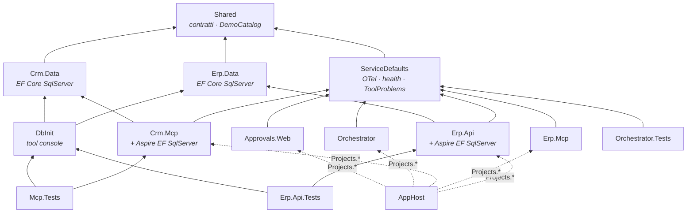
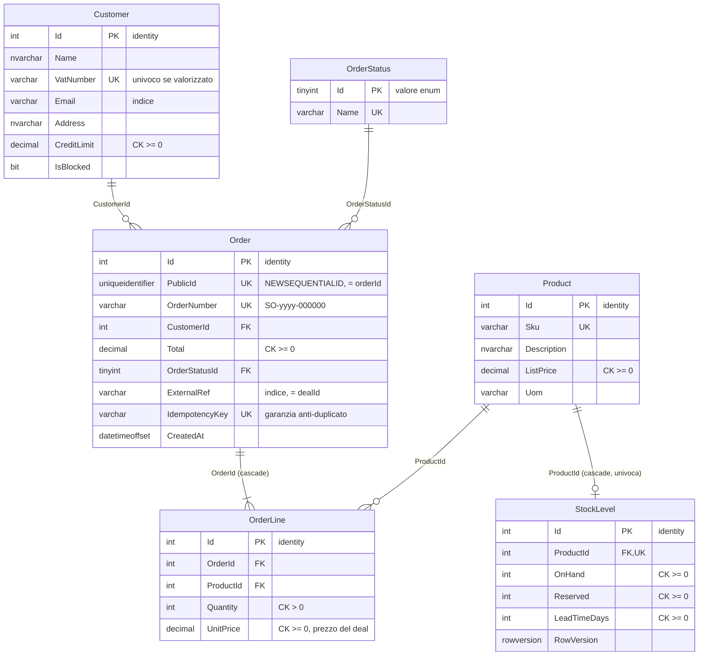
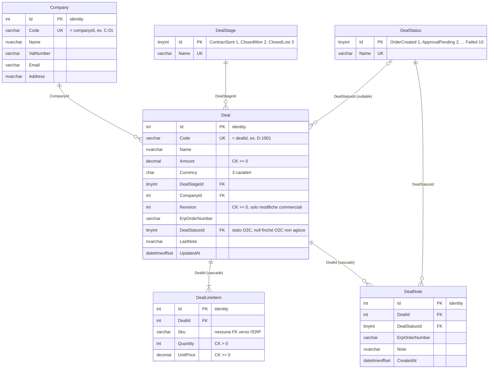
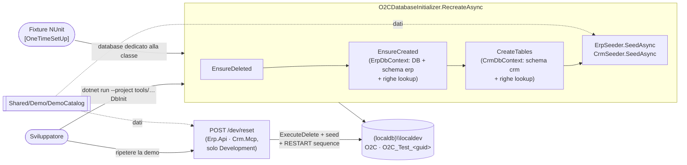
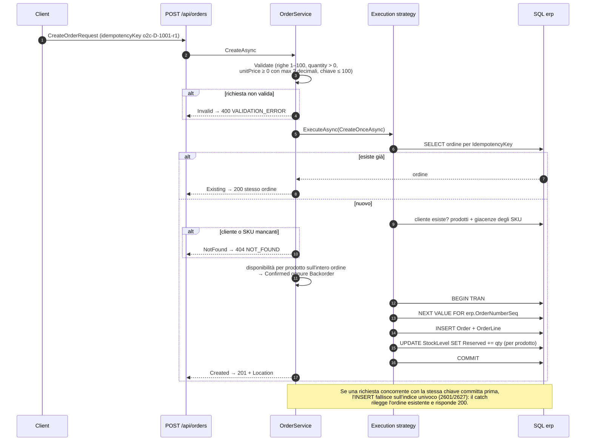
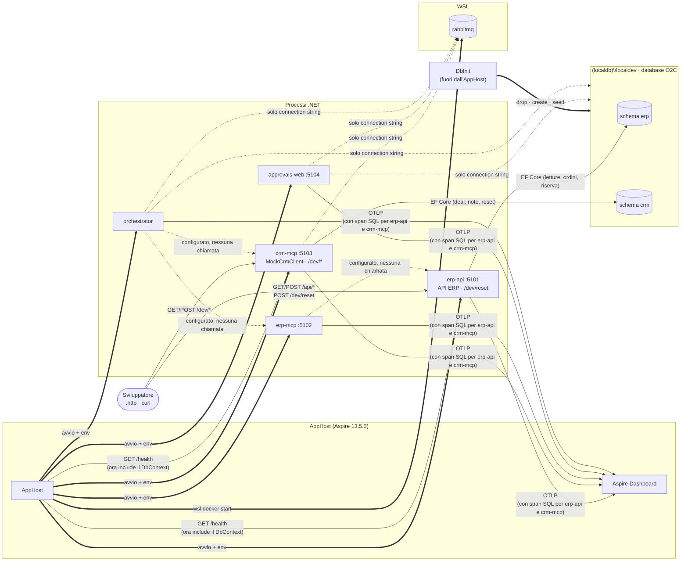
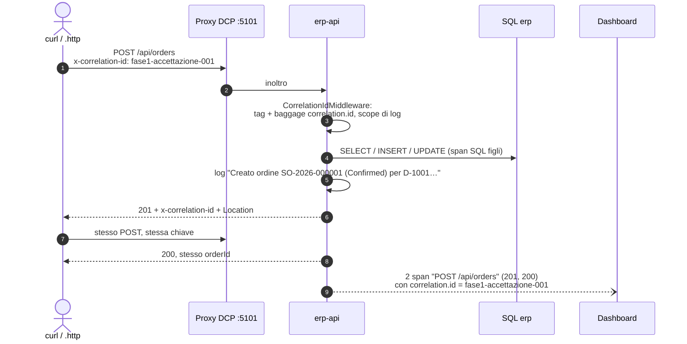

# Panoramica del codice — Fase 1

> **Stato**: working copy del branch `develop` al 2026-09-14, Fase 1 completata ([fase-1-sistemi-base.md](plan/fase-1-sistemi-base.md)). Riferimenti: [plan.md](plan/plan.md) · specifica [architettura.md](architettura.md) · scenari [demo.md](demo.md) · documento precedente [panoramica-codice-fase0.md](panoramica-codice-fase0.md).
>
> Come per la Fase 0, qui si descrive **quello che il codice fa oggi**. Ciò che è solo predisposto per le fasi successive è indicato esplicitamente.

## 1. In sintesi

La Fase 1 ha reso reali i due "sistemi aziendali" del POC, senza agenti:

- **ERP mock** (`Erp.Api` + `Erp.Data`): clienti, giacenze e ordini via HTTP, con creazione dell'ordine **idempotente** e riserva dello stock.
- **CRM mock** (`Crm.Mcp` + `Crm.Data`): deal, aziende e storico delle note O2C dietro `ICrmClient`, più endpoint dev per la demo.
- **Database `O2C`** su `(localdb)\localdev`, creato **da zero dal modello** con il tool `DbInit`: nessuna migration.
- **Dati demo** da un'unica tabella di scenari (`DemoCatalog`), coerenti fra ERP e CRM.

| Area | Fase 0 | Fase 1 |
|------|--------|--------|
| Database | Solo connection string | Schemi `erp` e `crm` reali, 12 tabelle, dati demo |
| Erp.Api | `GET /` informativo | 5 endpoint `/api` + `POST /dev/reset` |
| Crm.Mcp | `GET /` informativo | `ICrmClient`/`MockCrmClient` + 4 endpoint `/dev` |
| Contratti in `Shared` | Solo definiti | Usati dall'ERP (risposte HTTP) e dal client CRM |
| Idempotenza | Helper `IdempotencyKey` | Garantita da `OrderService` + indice univoco |
| Errori | Catalogo `ToolErrorCodes` | ProblemDetails con estensione `code` su tutti gli errori HTTP |
| Test | 41 | **86** (di cui 54 su database LocalDB dedicati) |

Restano **solo configurati**, come in Fase 0: Erp.Mcp → Erp.Api, Orchestrator → server MCP, uso di RabbitMQ, Approvals.Web.

## 2. Mappa della solution

`Dusiburg.AI.O2C.slnx` contiene ora 10 progetti in `src/`, 1 in `tools/` e 3 in `tests/`. Rispetto alla Fase 0 sono nuovi `Erp.Data`, `Crm.Data` e `DbInit`.

| Progetto | Tipo | Ruolo oggi |
|----------|------|------------|
| `src/Dusiburg.AI.O2C.AppHost` | Aspire AppHost | Invariato: avvia servizi, inietta connection string e segreti |
| `src/Dusiburg.AI.O2C.ServiceDefaults` | classlib | Invariato + **`ToolProblems`** (ProblemDetails con `code`) |
| `src/Dusiburg.AI.O2C.Shared` | classlib | Contratti, correlazione, idempotenza, errori + **`Demo/DemoCatalog`** |
| `src/Dusiburg.AI.O2C.Erp.Data` | classlib **(nuovo)** | `ErpDbContext`, entità e configurazioni dello schema `erp`, `ErpSeeder` |
| `src/Dusiburg.AI.O2C.Crm.Data` | classlib **(nuovo)** | `CrmDbContext`, entità, enum `DealStage`, configurazioni dello schema `crm`, `CrmSeeder` |
| `src/Dusiburg.AI.O2C.Erp.Api` | Web | **API dell'ERP mock** |
| `src/Dusiburg.AI.O2C.Crm.Mcp` | Web | **CRM mock** (client + endpoint dev); i tool MCP arrivano in Fase 2 |
| `src/Dusiburg.AI.O2C.Erp.Mcp` | Web | Invariato (`GET /`) |
| `src/Dusiburg.AI.O2C.Orchestrator` | Worker | Invariato (heartbeat) |
| `src/Dusiburg.AI.O2C.Approvals.Web` | Razor Pages | Invariato (template) |
| `tools/Dusiburg.AI.O2C.DbInit` | Console **(nuovo)** | Crea da zero il database `O2C` e inserisce i dati demo |
| `tests/Dusiburg.AI.O2C.Erp.Api.Tests` | NUnit 4 | API ERP su database di test dedicato |
| `tests/Dusiburg.AI.O2C.Mcp.Tests` | NUnit 4 | Contratti, catalogo demo, `MockCrmClient` |
| `tests/Dusiburg.AI.O2C.Orchestrator.Tests` | NUnit 4 | Invariato (correlazione, idempotenza) |

### 2.1 Dipendenze di compilazione



Note:
- I modelli dati stanno in **librerie separate** e non dentro i servizi (D30): il tool `DbInit` e i test devono poter creare tutto lo schema, e un eseguibile non può referenziare in modo pulito due progetti web (due `Program` pubblici, due `appsettings.json` nella stessa cartella di output).
- `Erp.Data` e `Crm.Data` dipendono solo da EF Core e da `Shared`: nessuna dipendenza da ASP.NET Core. L'integrazione Aspire (tracce SQL, health check, retry) la aggiungono i servizi.
- `DemoCatalog` sta in `Shared` perché lo usano entrambi i seeder e i test.
- `DbInit` non è una risorsa dell'AppHost: si lancia a mano, prima dell'avvio.

## 3. File di build condivisi — cosa è cambiato

| File | Modifica in Fase 1 |
|------|--------------------|
| `Directory.Packages.props` | Gruppo **Data**: `Microsoft.EntityFrameworkCore.SqlServer` 10.0.12 e `Aspire.Microsoft.EntityFrameworkCore.SqlServer` 13.5.3 |
| `dotnet-tools.json` | **Rimosso**: senza migration non serve `dotnet-ef` (D30) |
| `Dusiburg.AI.O2C.slnx` | Aggiunti `Erp.Data`, `Crm.Data` (`/src/`) e la cartella `/tools/` con `DbInit` |

`global.json` e `Directory.Build.props` sono invariati: `TreatWarningsAsErrors` resta attivo e la build è a 0 avvisi.

## 4. Il database

### 4.1 Convenzioni applicate (D29–D31)

| Regola | Esempio nel POC |
|--------|-----------------|
| Tabelle al **singolare**, anche nei check constraint | `erp.Order`, `crm.DealStatus`, `CK_Order_Total` |
| PK numerica sempre **`Id`**, FK qualificate | `Customer.Id` ← `Order.CustomerId` |
| **Niente PK GUID**: il GUID pubblico è una colonna univoca | `Order.PublicId` = `orderId` dei contratti |
| Chiavi di business stringa come **colonne univoche** | `Product.Sku`, `Company.Code` (`C-01`), `Deal.Code` (`D-1001`) |
| **Enum come FK verso lookup** con PK `tinyint` = valore esplicito nel codice | `Order.OrderStatusId` → `OrderStatus.Id` (`Confirmed = 1`) |
| Codici in `varchar`, testi liberi in `nvarchar`, importi `decimal(18,2)` | `VatNumber varchar(20)`, `Name nvarchar(200)` |
| **Niente migration**: schema creato da zero dal modello | `tools/Dusiburg.AI.O2C.DbInit` |

Le entità C# non seguono i nomi delle tabelle: `DbSet` al plurale (`Orders`), proprietà enum con nome di dominio (`Order.Status` → colonna `OrderStatusId`). I nomi di tabella e colonna sono impostati esplicitamente nelle configurazioni (`ToTable`, `HasColumnName`).

### 4.2 Schema `erp`



Più la sequence **`erp.OrderNumberSeq`** (bigint, da 1), da cui `OrderService` compone `SO-<anno>-<000000>`.

### 4.3 Schema `crm`



`crm.DealLineItem.Sku` volutamente **non** referenzia `erp.Product`: ERP e CRM sono sistemi separati che condividono solo il database locale, e lo scenario D-1007 ha bisogno di uno SKU che nell'ERP non esiste.

### 4.4 Tabelle di lookup generate dagli enum

Una sola classe generica per schema, `EnumLookup<TEnum>` (`Id`, `Name`), e una configurazione astratta `EnumLookupConfiguration<TEnum>` che imposta tabella, PK `tinyint` non identity, `Name` univoco e **righe da `Enum.GetValues`** (`HasData`). Aggiungere un enum persistito vuol dire una riga:

```csharp
internal sealed class OrderStatusConfiguration() : EnumLookupConfiguration<OrderStatus>("OrderStatus");
```

| Tabella | Enum | Dove sta l'enum | Valori |
|---------|------|-----------------|--------|
| `erp.OrderStatus` | `OrderStatus : byte` | `Shared/Contracts/Erp` | `Confirmed` 1, `Backorder` 2 |
| `crm.DealStatus` | `DealStatus : byte` | `Shared/Contracts/Crm` | `OrderCreated` 1, `ApprovalPending` 2, `Rejected` 3, `Expired` 4, `Discarded` 5, `Failed` 10 |
| `crm.DealStage` | `DealStage : byte` | `Crm.Data/Entities` | `ContractSent` 1, `ClosedWon` 2, `ClosedLost` 3 |

Nel JSON gli enum restano **per nome** (`StrictStringEnumConverter` per quelli dei contratti; lo stage del deal è esposto come stringa).

### 4.5 Ciclo di vita del database



- `EnsureCreated` crea tabelle **solo se il database è vuoto**: per il secondo DbContext sullo stesso database si usa `IRelationalDatabaseCreator.CreateTables()`. È il motivo per cui l'ordine è ERP e poi CRM.
- Il tool **rifiuta server che non siano LocalDB** senza `--allow-non-local` (cancella il database); `--no-seed` crea solo lo schema.
- I servizi **non creano né modificano lo schema** all'avvio: se il database manca, falliscono le query e l'health check del DbContext.

## 5. Progetto per progetto

### 5.1 Shared — cosa si aggiunge

- **`Demo/DemoCatalog.cs`**: record `DemoProduct`, `DemoCustomer`, `DemoCompany`, `DemoDeal`, `DemoDealLine` e le quattro liste del catalogo, più `ApprovalThresholdEur = 10.000`. `DemoDeal.Amount` è calcolato dalle righe. Il dettaglio degli scenari è in [demo.md](demo.md).
- Gli enum `OrderStatus` e `DealStatus` hanno ora valori espliciti e tipo sottostante `byte`, perché sono PK delle lookup.

### 5.2 ServiceDefaults — `Problems/ToolProblems.cs`

Traduce gli errori HTTP nel catalogo dei tool di §6:

| Metodo | Status | `code` |
|--------|--------|--------|
| `ToolProblems.Validation(detail)` | 400 | `VALIDATION_ERROR` |
| `ToolProblems.NotFound(detail)` | 404 | `NOT_FOUND` |
| `ToolProblems.Conflict(detail)` | 409 | `CONFLICT` |
| `ToolProblems.Configure` (per `AddProblemDetails`) | qualunque | aggiunge `code` anche ai ProblemDetails generati dal framework: 400 binding, 401, 404, 409, 500 → `INTERNAL` |

Esempio di risposta: `{"type":"…","title":"Risorsa non trovata","status":404,"detail":"SKU IND-XXX-000 non trovato.","code":"NOT_FOUND","traceId":"…"}`. In Fase 2 i server MCP leggeranno `code` per costruire `{ error: { code, message } }`.

### 5.3 Erp.Data e Crm.Data

| | Erp.Data | Crm.Data |
|--|----------|----------|
| DbContext | `ErpDbContext` (schema `erp`, sequence `OrderNumberSeq`) | `CrmDbContext` (schema `crm`) |
| Entità | `Customer`, `Product`, `StockLevel`, `Order`, `OrderLine`, `EnumLookup<T>` | `Company`, `Deal`, `DealLineItem`, `DealNote`, `EnumLookup<T>`, enum `DealStage` |
| Configurazioni | `Configurations/ErpConfigurations.cs` (una classe `IEntityTypeConfiguration` per entità, applicate con `ApplyConfigurationsFromAssembly`) | `Configurations/CrmConfigurations.cs` (stessa struttura) |
| Seeder | `ErpSeeder.SeedAsync` / `ResetAsync` | `CrmSeeder.SeedAsync(now)` / `ResetAsync(now)` |

I seeder inseriscono solo se le tabelle sono vuote. Il reset avviene **in un'unica transazione dentro l'execution strategy** (compatibile con i retry dell'integrazione Aspire): `ExecuteDelete` delle tabelle in ordine di dipendenza, `ALTER SEQUENCE … RESTART WITH 1` per l'ERP, poi seed. Le lookup non vengono toccate.

`EnumLookup<T>` e la sua configurazione astratta sono **duplicate** nelle due librerie (circa 30 righe): un progetto comune solo per questo non valeva la dipendenza in più.

### 5.4 DbInit — `tools/Dusiburg.AI.O2C.DbInit`

```text
dotnet run --project tools/Dusiburg.AI.O2C.DbInit [-- "<connection string>"] [--no-seed] [--allow-non-local]
```

- Connection string: argomento, oppure `ConnectionStrings__sql`, oppure `(localdb)\localdev`/`O2C` con autenticazione integrata (nessun segreto).
- `O2CDatabaseInitializer` è pubblico: `RecreateAsync(cs, seed)`, `DropAsync(cs)`, `LocalConnectionStringFor(database)`. Lo usano anche le fixture dei test.

### 5.5 Erp.Api

```text
src/Dusiburg.AI.O2C.Erp.Api/
├─ Program.cs               AddServiceDefaults · AddSqlServerDbContext<ErpDbContext>("sql") · ProblemDetails · endpoint
├─ Customers/CustomerEndpoints.cs
├─ Stock/StockEndpoints.cs
├─ Orders/OrderEndpoints.cs + OrderService.cs
├─ Dev/ErpDevEndpoints.cs   solo Development
├─ Data/SqlErrors.cs        riconoscimento violazioni di unicità (2601/2627)
└─ Erp.Api.http
```

| Endpoint | Tool §6 | Risposte |
|----------|---------|----------|
| `GET /api/customers?vatNumber=&email=` | `get_customer` | 200 `CustomerDto` · 400 se mancano entrambi · 404. Con entrambi vale prima la partita IVA, poi l'email |
| `POST /api/customers` | `create_customer` | 201 `{ customerId }` · 400 · 409 partita IVA esistente. Nuovo cliente: `CreditLimit` 0, non bloccato |
| `GET /api/stock/{sku}?quantity=` | `check_stock` | 200 `{ sku, available, onHand, leadTimeDays }` con `available = OnHand − Reserved ≥ quantity` · 400 · 404 |
| `POST /api/orders` | `create_order` | **201** ordine creato · **200** ordine già esistente con la stessa chiave · 400 · 404 cliente o SKU sconosciuti |
| `GET /api/orders/{orderId:guid}` | `get_order` | 200 `OrderDto` con righe · 404 |
| `POST /dev/reset` | — | 204, solo Development |

La pipeline: `UseCorrelationId` → `UseExceptionHandler` → endpoint. Le risposte usano i record di `Shared/Contracts/Erp`, quindi il JSON è già quello dei tool: `orderId` è `Order.PublicId`, `orderLineId` è `OrderLine.Id`, `status` per nome.

#### Creazione dell'ordine (`OrderService.CreateAsync`)



Punti di progetto:
- **Garanzia finale = indice univoco** su `Order.IdempotencyKey`. Il controllo iniziale evita solo il lavoro inutile; la corsa è gestita dall'eccezione.
- **Riserva con `UPDATE` atomico** (`ExecuteUpdate`) nella stessa transazione dell'ordine: niente letture-modifica-scrittura sulla giacenza. Una riga non disponibile non blocca l'ordine, che nasce in `Backorder` (D20); `Reserved` può superare `OnHand`.
- **Totale dai prezzi del deal** (`quantity × unitPrice` delle righe), non dal listino (D21).
- Transazione esplicita **dentro l'execution strategy**, obbligatorio con i retry automatici dell'integrazione Aspire.
- `RowVersion` su `StockLevel` è presente ma oggi non serve: la riserva non passa dal change tracker.

### 5.6 Crm.Mcp

```text
src/Dusiburg.AI.O2C.Crm.Mcp/
├─ Program.cs              AddServiceDefaults · AddSqlServerDbContext<CrmDbContext>("sql") · ICrmClient → MockCrmClient
├─ Crm/ICrmClient.cs + MockCrmClient.cs
├─ Dev/CrmDevEndpoints.cs  solo Development
└─ Crm.Mcp.dev.http
```

**`ICrmClient`** è il punto su cui in Fase 2 si appoggeranno i tool `crm-mcp` (e, in futuro, un adapter HubSpot):

| Metodo | Tool §6.2 | Comportamento |
|--------|-----------|---------------|
| `GetDealAsync(dealId)` | `get_deal` | `DealDto` con `revision`, stage per nome, `companyId` = `Company.Code`, righe ordinate; `null` se assente |
| `GetCompanyAsync(companyId)` | `get_company` | `CompanyDto`; `null` se assente |
| `UpdateDealAsync(request)` | `update_deal` | Scrive stato O2C, `LastNote`, `ErpOrderNumber` (se passato) e aggiunge una `DealNote`; **non cambia `Revision`** (G1.3); `null` se il deal non esiste; `ArgumentException` per stato fuori enum, nota > 1000 o numero ordine > 20 caratteri |

**Endpoint dev** (non fanno parte dei contratti, servono alla demo):

| Endpoint | Effetto |
|----------|---------|
| `GET /dev/deals` | Elenco con stage, revisione, stato O2C, numero ordine |
| `GET /dev/deals/{dealId}` | Dettaglio con azienda, righe, note (caricate con `AsSplitQuery`) · 404 |
| `POST /dev/deals/{dealId}/close-won` | Stage `ClosedWon`, revisione invariata; idempotente · 404. La pubblicazione su RabbitMQ arriva in Fase 4 |
| `POST /dev/reset` | 204: aziende, deal e note tornano al seed |

### 5.7 Invariati

`AppHost`, `Erp.Mcp`, `Orchestrator` e `Approvals.Web` sono come in Fase 0: vedi [panoramica-codice-fase0.md](panoramica-codice-fase0.md). L'AppHost passava già `sql` a Erp.Api e Crm.Mcp: la Fase 1 ha solo iniziato a usarla.

## 6. Interazioni attuali a runtime



Legenda: **doppie** = avvio o creazione · **piene** = traffico reale · **tratteggiate** = solo configurato.

| # | Interazione | Novità rispetto alla Fase 0 |
|---|-------------|-----------------------------|
| 1 | `DbInit` → LocalDB | **Nuova**: crea `O2C` e i dati demo, prima dell'avvio |
| 2 | Client → `erp-api` `/api/*`, `/dev/reset` | **Nuova**: unico traffico applicativo reale verso l'ERP |
| 3 | Client → `crm-mcp` `/dev/*` | **Nuova**: gestione dei deal per la demo |
| 4 | `erp-api`, `crm-mcp` → schemi `erp`/`crm` | **Nuova**: query EF Core con retry sugli errori transitori |
| 5 | AppHost → `/health` | Ora `erp-api` e `crm-mcp` sono Healthy solo se il database risponde |
| 6 | Servizi → dashboard (OTLP) | Si aggiungono gli span SQL figli delle richieste HTTP |
| — | Erp.Mcp → Erp.Api, Orchestrator → MCP, RabbitMQ | Ancora solo configurati (Fasi 2–4) |

## 7. Correlazione e telemetria su una richiesta reale

Verifica di accettazione eseguita con l'AppHost avviato:



## 8. Test

86 test NUnit 4 (`dotnet test --solution Dusiburg.AI.O2C.slnx`). I test che toccano il database usano **un database per classe** su `(localdb)\localdev` (`O2C_Test_<guid>`), creato con `O2CDatabaseInitializer` e cancellato a fine classe; **prima di ogni test** i dati tornano allo stato del seed.

| Progetto | Classe | Test | Cosa verifica |
|----------|--------|------|---------------|
| `Erp.Api.Tests` | `ErpApiTestBase` | — | Fixture: database dedicato, `WebApplicationFactory<Program>` con `ConnectionStrings:sql`, reset con `ErpSeeder` in `[SetUp]` |
| | `RootEndpointTests` | 3 | Correlation id restituito o generato; `/health` 200 con il database |
| | `StockEndpointTests` | 6 | Giacenza SKU noto; `available` con `Reserved` > 0; SKU sconosciuto 404; `quantity` mancante, 0 o negativa → 400 |
| | `CustomerEndpointTests` | 7 | Ricerca per partita IVA ed email; 400 senza filtri; 404; creazione e rilettura; partita IVA duplicata 409; email mancante 400 |
| | `OrderEndpointTests` | 14 | Ordine `Confirmed` con totale, numero, righe e riserva; `Backorder` (D-1003); **doppio POST** → 200 e riserva una sola volta; **8 POST paralleli** → un solo ordine; SKU sconosciuto (D-1007) e cliente sconosciuto 404; 6 richieste non valide 400; ordine sconosciuto 404; `/dev/reset` |
| `Mcp.Tests` | `ContractSerializationTests` | 6 | Invariati dalla Fase 0 |
| | `DemoCatalogTests` | 10 | Ogni deal rispetta il suo scenario (cliente nuovo o bloccato, valuta, soglia, righe non disponibili, SKU inesistenti); gli ordini della demo non si rubano stock; forma del catalogo |
| | `MockCrmClientTests` | 8 | Deal con righe e revisione; deal e azienda; `UpdateDealAsync` non cambia la revisione, scrive note e numero ordine; deal sconosciuto; nota troppo lunga; reset |
| `Orchestrator.Tests` | 4 classi | 32 | Invariati dalla Fase 0 (correlazione e idempotenza) |

## 9. Limiti noti e cosa manca

| Tema | Stato | Quando |
|------|-------|--------|
| Header `x-correlation-id` su un 500 | Può essere rimosso da `UseExceptionHandler` quando pulisce la risposta (lo span conserva `correlation.id`) | Da rivedere se servirà |
| Richiesta idempotente con payload diverso | Con la stessa chiave si restituisce l'ordine esistente anche se le righe sono diverse (come da piano) | Da valutare con la policy |
| `RowVersion` su `StockLevel` | Presente ma non usato | Se servirà concorrenza ottimistica |
| Autenticazione su Erp.Api | Nessuna in locale (G1.6) | API key sui server MCP in Fase 2 |
| Tool MCP su Erp.Mcp e Crm.Mcp | Non ancora: esistono solo le API e `ICrmClient` | **Fase 2** |
| Agente, `IChatClient` | — | Fase 3 |
| Trigger RabbitMQ su `close-won`, handoff | `close-won` cambia solo lo stage | Fase 4 |
| Approvazioni, schema `orch` | — | Fase 5 |
