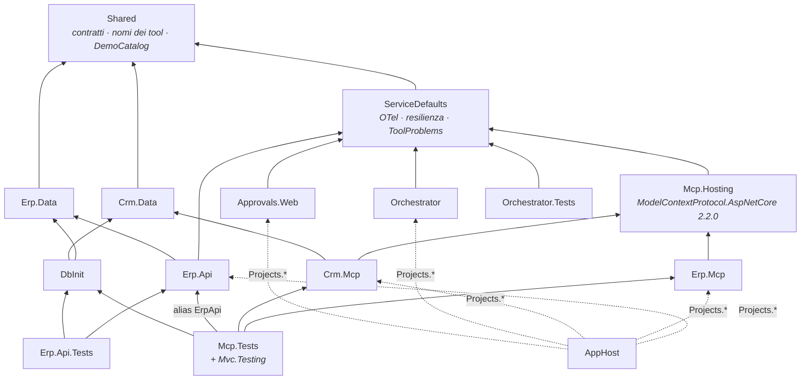
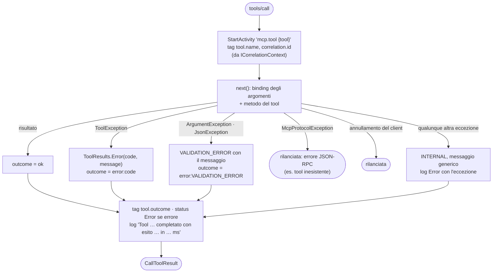
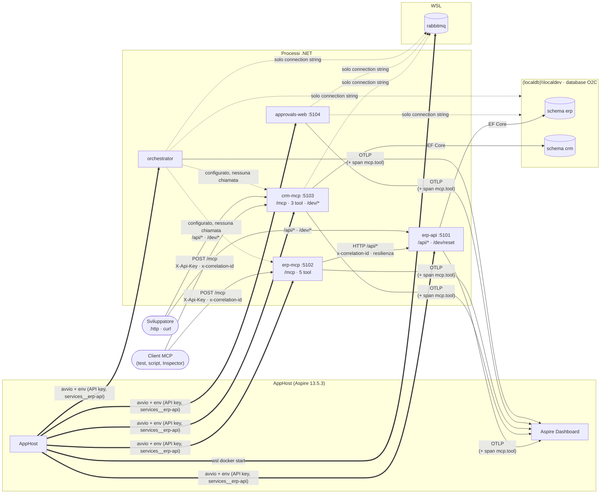
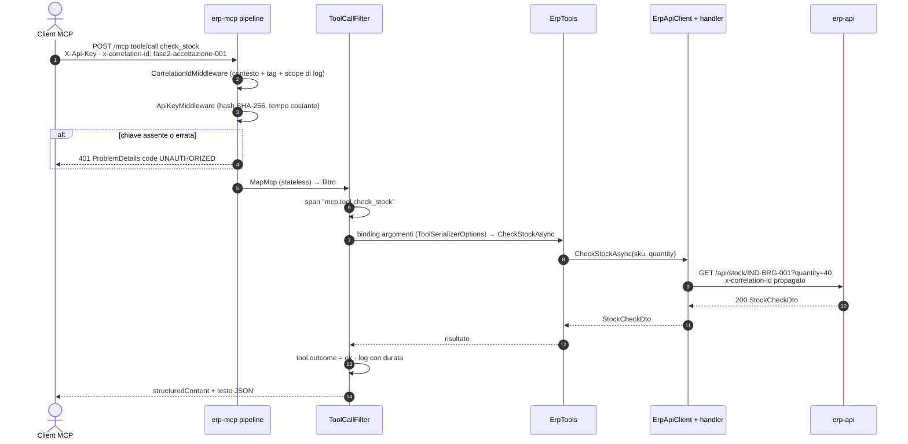
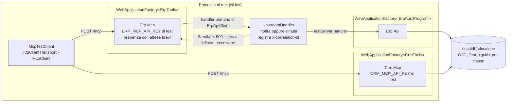

# Panoramica del codice — Fase 2

> **Stato**: working copy del branch `develop` al 2026-09-15, Fase 2 completata ([fase-2-server-mcp.md](plan/fase-2-server-mcp.md)). Riferimenti: [plan.md](plan/plan.md) · specifica [architettura.md](architettura.md) · scenari [demo.md](demo.md) · documenti precedenti [panoramica-codice-fase0.md](panoramica-codice-fase0.md), [panoramica-codice-fase1.md](panoramica-codice-fase1.md).
>
> Come per le fasi precedenti, qui si descrive **quello che il codice fa oggi**. Ciò che è solo predisposto per le fasi successive è indicato esplicitamente.

## 1. In sintesi

La Fase 2 ha trasformato i due sistemi della Fase 1 in **tool MCP**, ancora senza agenti:

- **`erp-mcp`** (`Erp.Mcp`): 5 tool sopra `Erp.Api`, raggiunto via HTTP con service discovery.
- **`crm-mcp`** (`Crm.Mcp`): 3 tool sopra `ICrmClient`, nello stesso host del CRM mock e degli endpoint dev.
- **`Mcp.Hosting`** (nuovo): tutto ciò che i due server hanno in comune — trasporto HTTP stateless, API key, filtro sulle chiamate che produce span e log e traduce ogni eccezione negli errori di §6.
- **Contratti** allineati a quello che il modello vedrà: output strutturato con `outputSchema`, errori `{ error: { code, message } }`, `get_customer` → `{ customer }`.

| Area | Fase 1 | Fase 2 |
|------|--------|--------|
| Erp.Mcp | `GET /` informativo | **5 tool MCP** su `/mcp` + `ErpApiClient` verso Erp.Api |
| Crm.Mcp | `MockCrmClient` + endpoint `/dev` | Invariati + **3 tool MCP** su `/mcp` |
| Infrastruttura MCP | — | Progetto **`Mcp.Hosting`**: API key, filtro, errori, opzioni JSON |
| Traffico fra servizi | Nessuno | **Erp.Mcp → Erp.Api** (HTTP, correlation id, resilienza) |
| Errori | ProblemDetails con `code` | + risultato MCP `isError` con l'envelope come testo JSON |
| Sicurezza | Nessuna | Header `X-Api-Key` obbligatorio su `/mcp` (401 altrimenti) |
| Telemetria | Span HTTP e SQL | + span **`mcp.tool {tool}`** con `tool.name`, `correlation.id`, `tool.outcome` |
| Test | 86 | **129** (+42 sui server MCP, +1 di serializzazione) |

Restano **solo configurati**: Orchestrator → server MCP, uso di RabbitMQ, Approvals.Web.

## 2. Mappa della solution

`Dusiburg.AI.O2C.slnx` contiene ora 11 progetti in `src/`, 1 in `tools/` e 3 in `tests/`. Rispetto alla Fase 1 è nuovo `Mcp.Hosting`.

| Progetto | Tipo | Ruolo oggi |
|----------|------|------------|
| `src/Dusiburg.AI.O2C.AppHost` | Aspire AppHost | Invariato: passava già `ERP_MCP_API_KEY`/`CRM_MCP_API_KEY` e il riferimento Erp.Mcp → Erp.Api dalla Fase 0 |
| `src/Dusiburg.AI.O2C.ServiceDefaults` | classlib | Invariato + `ToolProblems.Unauthorized` |
| `src/Dusiburg.AI.O2C.Shared` | classlib | + `GetCustomerResponse`, `ErpToolNames`, `CrmToolNames`, `ToolMetadata` |
| `src/Dusiburg.AI.O2C.Mcp.Hosting` | classlib **(nuovo)** | Infrastruttura comune dei server MCP (D35) |
| `src/Dusiburg.AI.O2C.Erp.Mcp` | Web | **Server MCP dell'ERP** |
| `src/Dusiburg.AI.O2C.Crm.Mcp` | Web | CRM mock + endpoint dev + **server MCP del CRM** |
| `src/Dusiburg.AI.O2C.Erp.Api` | Web | Invariato: ora chiamato da Erp.Mcp |
| `src/Dusiburg.AI.O2C.Erp.Data`, `Crm.Data` | classlib | Invariati |
| `src/Dusiburg.AI.O2C.Orchestrator` | Worker | Invariato (heartbeat) |
| `src/Dusiburg.AI.O2C.Approvals.Web` | Razor Pages | Invariato (template) |
| `tools/Dusiburg.AI.O2C.DbInit` | Console | Invariato |
| `tests/Dusiburg.AI.O2C.Erp.Api.Tests` | NUnit 4 | Invariati (marcatori `//SETUP`/`//SUT`) |
| `tests/Dusiburg.AI.O2C.Mcp.Tests` | NUnit 4 | + tool ERP e CRM via client MCP reale |
| `tests/Dusiburg.AI.O2C.Orchestrator.Tests` | NUnit 4 | Invariati (marcatori `//SETUP`/`//SUT`) |

### 2.1 Dipendenze di compilazione



Note:
- **`Erp.Mcp` non referenzia `Erp.Api`**: lo chiama solo via HTTP, come farebbe con un ERP reale. I DTO in comune sono quelli di `Shared/Contracts/Erp`.
- Il pacchetto dell'SDK MCP entra **solo** nei due server tramite `Mcp.Hosting` (D35): Orchestrator e Approvals.Web non lo ricevono. L'Orchestrator aggiungerà il lato client in Fase 3.
- Nomi dei tool e chiave `o2c.sensitive` stanno in **`Shared`** e non in `Mcp.Hosting`: servono anche all'orchestratore, che non deve dipendere dall'infrastruttura server.
- `Mcp.Tests` referenzia tre progetti web. Per non avere due `Program` ambigui, `Erp.Api` è referenziato con **`Aliases="ErpApi"`** (`WebApplicationFactory<ErpApi::Program>`), mentre per i server MCP la factory usa come tipo d'ingresso le classi dei tool (`WebApplicationFactory<ErpTools>`, `WebApplicationFactory<CrmTools>`).

## 3. File di build condivisi — cosa è cambiato

| File | Modifica in Fase 2 |
|------|--------------------|
| `Directory.Packages.props` | Gruppo **Mcp**: `ModelContextProtocol.AspNetCore` 2.2.0 |
| `Dusiburg.AI.O2C.slnx` | Aggiunto `src/Dusiburg.AI.O2C.Mcp.Hosting` |

`global.json` e `Directory.Build.props` invariati: build a 0 avvisi con `TreatWarningsAsErrors`.

## 4. MCP in breve, come lo usa il POC

| Aspetto | Scelta | Conseguenza |
|---------|--------|-------------|
| SDK | `ModelContextProtocol.AspNetCore` **2.2.0** | Protocollo negoziato `2026-07-28`: niente handshake `initialize`, ogni richiesta è autonoma |
| Trasporto | Streamable HTTP, **stateless** (`POST /mcp`) | Nessuna sessione in memoria, nessuna affinità: pronto per più istanze in Container Apps (Fase 6) |
| Nomi dei tool | Quelli di §6, **senza prefisso** | Compatibili con i nomi di funzione dei modelli (R5); il nome qualificato `erp.create_order` lo comporrà l'orchestratore |
| Risultato positivo | `structuredContent` conforme all'`outputSchema` + stesso JSON come testo | Il client può leggere l'oggetto senza parsing; lo schema è pubblicato in `tools/list` |
| Errore | `isError = true`, envelope **solo come testo JSON** (D33) | Nessuna violazione dell'`outputSchema`; l'agente legge `code` e `message` |
| Sensibilità | `annotations.destructiveHint` + `_meta."o2c.sensitive": true` su `create_order` | Informazioni per la policy di approvazione (Fase 5); nessun blocco lato server |

Un risultato come arriva al client (dalla verifica con l'AppHost):

```json
{ "content": [ { "type": "text", "text": "{\"sku\":\"IND-BRG-001\",\"available\":true,\"onHand\":500,\"leadTimeDays\":3}" } ],
  "structuredContent": { "sku": "IND-BRG-001", "available": true, "onHand": 500, "leadTimeDays": 3 } }
```

```json
{ "content": [ { "type": "text", "text": "{\"error\":{\"code\":\"NOT_FOUND\",\"message\":\"Deal D-9999 non trovato.\"}}" } ],
  "isError": true }
```

## 5. Progetto per progetto

### 5.1 Mcp.Hosting — `src/Dusiburg.AI.O2C.Mcp.Hosting`

```text
src/Dusiburg.AI.O2C.Mcp.Hosting/
├─ O2CMcpServerExtensions.cs   AddO2CMcpServer · MapO2CMcp · ToolSerializerOptions · costanti /mcp e X-Api-Key
├─ ToolCallFilter.cs           filtro su tools/call: span, log, traduzione delle eccezioni
├─ ToolException.cs            errore di dominio di un tool (code + message)
├─ ToolResults.cs              CallToolResult di errore (isError + envelope JSON)
└─ Security/
   ├─ ApiKeyMiddleware.cs      401 se X-Api-Key assente o errata
   └─ McpApiKeyOptions.cs      chiave attesa, validata all'avvio
```

Uso in un server (è tutto quello che `Program.cs` deve fare):

```csharp
builder.AddO2CMcpServer(O2CTelemetry.Sources.McpErp, "ERP_MCP_API_KEY")
    .WithTools<ErpTools>(O2CMcpServerExtensions.ToolSerializerOptions);
// …
app.UseCorrelationId();
app.MapO2CMcp();
```

| Elemento | Cosa fa |
|----------|---------|
| `AddO2CMcpServer(source, keyName)` | `AddMcpServer().WithHttpTransport(Stateless = true)`, filtro `ToolCallFilter` sulle chiamate, `McpApiKeyOptions` letta da `keyName` con **`ValidateOnStart`**: senza chiave il servizio non parte |
| `MapO2CMcp()` | `UseWhen(/mcp)` con `ApiKeyMiddleware`, poi `MapMcp("/mcp")`. `/`, `/health`, `/alive` e `/dev/*` restano fuori dal controllo |
| `ApiKeyMiddleware` | Confronta gli **hash SHA-256** della chiave ricevuta e di quella attesa con `CryptographicOperations.FixedTimeEquals` (tempo indipendente da contenuto e lunghezza); se non coincidono log di warning e 401 ProblemDetails `code = UNAUTHORIZED` |
| `ToolSerializerOptions` | Opzioni JSON dei tool (D38): `JsonSerializerDefaults.Web` con resolver a reflection e null mantenuti, **non** le opzioni di default dell'SDK (vedi 5.1.2) |
| `ToolException(code, message)` | Il modo in cui un tool segnala un errore di dominio |
| `ToolResults.Error(code, message)` | `CallToolResult { IsError = true, Content = [testo JSON] }`, con escaping rilassato così le lettere accentate restano leggibili |

#### 5.1.1 Il filtro sulle chiamate ai tool



Perché serve: senza filtro l'SDK trasforma **ogni** eccezione in `isError` con il testo generico `An error occurred invoking '<tool>'.` (spike S2), anche quando manca un parametro. Il filtro avvolge il binding degli argomenti, quindi vede anche quegli errori e li restituisce come `VALIDATION_ERROR` con un messaggio utile al modello.

| Origine | Esempio | Esito per il client |
|---------|---------|---------------------|
| `ToolException` lanciata dal tool | deal inesistente, Erp.Api 404/409/5xx | `isError`, `code` della `ToolException` |
| Binding degli argomenti | `lines` mancante, `status: 1`, `orderId` non GUID | `isError`, `VALIDATION_ERROR` |
| `ArgumentException` dal codice | nota del deal oltre 1000 caratteri | `isError`, `VALIDATION_ERROR` |
| Tool inesistente | `tools/call no_such_tool` | Errore JSON-RPC, non un risultato |
| Qualunque altra eccezione | bug, dipendenza guasta | `isError`, `INTERNAL` con `Errore interno durante l'esecuzione del tool.` (i dettagli solo nel log) |

#### 5.1.2 Perché opzioni JSON proprie (D38)

Emerso dai primi test, non dallo spike. Con `McpJsonUtilities.DefaultOptions`:

| Problema | Effetto | Con `ToolSerializerOptions` |
|----------|---------|-----------------------------|
| `DefaultIgnoreCondition = WhenWritingNull` | `{ customer: null }` usciva come `{}` | Le proprietà null restano |
| Il resolver dell'SDK gestisce gli enum per conto proprio | `StrictStringEnumConverter` ignorato: `status: 1` e `"1"` accettati | Interi e stringhe numeriche rifiutati (`VALIDATION_ERROR`) |

Le opzioni valgono per argomenti, output strutturato e schemi generati. Come nei contratti HTTP, in lettura i nomi degli enum non distinguono le maiuscole.

### 5.2 Shared — cosa si aggiunge

| Tipo | File | Ruolo |
|------|------|-------|
| `GetCustomerResponse(CustomerDto? Customer)` | `Contracts/Erp/CustomerContracts.cs` | Output di `get_customer` (M20) |
| `ErpToolNames` | `Contracts/Erp/ErpToolNames.cs` | `get_customer`, `create_customer`, `check_stock`, `create_order`, `get_order` |
| `CrmToolNames` | `Contracts/Crm/CrmToolNames.cs` | `get_deal`, `get_company`, `update_deal` |
| `ToolMetadata.Sensitive` | `Contracts/ToolMetadata.cs` | Chiave `_meta` `o2c.sensitive` |

### 5.3 ServiceDefaults

Solo `ToolProblems.Unauthorized(detail)` → 401 con `code = UNAUTHORIZED`, usato dal middleware della API key.

### 5.4 Erp.Mcp

```text
src/Dusiburg.AI.O2C.Erp.Mcp/
├─ Program.cs          AddServiceDefaults · ProblemDetails · HttpClient<ErpApiClient> · AddO2CMcpServer + ErpTools · MapO2CMcp
├─ Erp/ErpApiClient.cs client tipizzato verso Erp.Api
└─ Tools/ErpTools.cs   i 5 tool di §6.1
```

#### I tool

Tutti con `OpenWorld = false` e `UseStructuredContent = true`; descrizioni scritte per il modello, con i vincoli espliciti.

| Tool | Annotazioni | Input (obbligatori in grassetto) | Output | Chiamata a Erp.Api |
|------|-------------|----------------------------------|--------|--------------------|
| `get_customer` | read-only, idempotente | `vatNumber`, `email` (almeno uno) | `{ customer }` o `{ customer: null }` | `GET /api/customers` (404 → `null`) |
| `create_customer` | scrittura additiva | **`name`**, **`vatNumber`**, **`email`**, **`address`** | `{ customerId }` | `POST /api/customers` |
| `check_stock` | read-only, idempotente | **`sku`**, **`quantity`** | `{ sku, available, onHand, leadTimeDays }` | `GET /api/stock/{sku}?quantity=` |
| `create_order` | **destructive**, idempotente, `_meta` **`o2c.sensitive`** | **`customerId`**, **`lines[{sku, quantity, unitPrice}]`**, **`externalRef`**, **`idempotencyKey`** | `{ orderId, orderNumber, total, status }` | `POST /api/orders` (201 o 200 con la stessa chiave) |
| `get_order` | read-only, idempotente | **`orderId`** (uuid) | ordine completo con righe | `GET /api/orders/{orderId}` |

Validazioni nel tool prima della chiamata: `get_customer` senza partita IVA né email e `check_stock` con `sku` vuoto → `VALIDATION_ERROR`. Tutto il resto lo valida Erp.Api, come in Fase 1.

#### `ErpApiClient`

- `BaseAddress` = `ErpApi:BaseAddress` se configurato, altrimenti **`https+http://erp-api`** risolto dalla service discovery (variabili `services__erp-api__*` iniettate dall'AppHost).
- La pipeline HTTP è quella di ServiceDefaults: `CorrelationIdDelegatingHandler` (header `x-correlation-id`) → `StandardResilienceHandler` (retry, timeout, circuit breaker) → service discovery.

| Risposta di Erp.Api | Diventa |
|---------------------|---------|
| 400 | `VALIDATION_ERROR` con il `detail` del ProblemDetails |
| 404 | `NOT_FOUND` con il `detail` (per `get_customer`: `customer: null`) |
| 409 | `CONFLICT` con il `detail` |
| 5xx | `UPSTREAM_UNAVAILABLE`, messaggio generico (`Erp.Api non disponibile (HTTP 500).`) |
| Altri status | `INTERNAL`, messaggio generico |
| Connessione fallita, timeout, circuito aperto (`HttpRequestException`, `ExecutionRejectedException` di Polly) | `UPSTREAM_UNAVAILABLE` |
| Corpo 2xx non leggibile | `INTERNAL` |

Solo gli errori di dominio portano al modello il dettaglio dell'ERP; quelli di infrastruttura restano generici.

### 5.5 Crm.Mcp — cosa si aggiunge

```text
src/Dusiburg.AI.O2C.Crm.Mcp/
├─ Program.cs             + AddO2CMcpServer(McpCrm, "CRM_MCP_API_KEY") + CrmTools · MapO2CMcp
├─ Tools/CrmTools.cs      i 3 tool di §6.2 sopra ICrmClient   (nuovo)
├─ Crm/…, Dev/…           invariati
```

| Tool | Annotazioni | Input (obbligatori in grassetto) | Output | `ICrmClient` |
|------|-------------|----------------------------------|--------|--------------|
| `get_deal` | read-only, idempotente | **`dealId`** | `{ dealId, revision, name, amount, currency, stage, companyId, lineItems }` | `GetDealAsync`; `null` → `NOT_FOUND` |
| `get_company` | read-only, idempotente | **`companyId`** | `{ companyId, name, vatNumber, email, address }` | `GetCompanyAsync`; `null` → `NOT_FOUND` |
| `update_deal` | destructive, non idempotente (aggiunge una nota a ogni chiamata) | **`dealId`**, **`status`** (enum `DealStatus` nello schema), `erpOrderNumber`, `note` | `{ ok }` | `UpdateDealAsync`; `null` → `NOT_FOUND`, `ArgumentException` → `VALIDATION_ERROR` |

Gli endpoint `/dev/*` convivono con `/mcp` nello stesso host e **non** richiedono la API key (solo Development, come in Fase 1).

### 5.6 AppHost e configurazione

Nessuna modifica al codice: dalla Fase 0 l'AppHost dichiarava i parametri segreti e i riferimenti.

| Chiave | Dove | Usata da |
|--------|------|----------|
| `Parameters:erp-mcp-api-key` | user-secrets dell'AppHost | `ERP_MCP_API_KEY` → Erp.Mcp (e Orchestrator, dalla Fase 3) |
| `Parameters:crm-mcp-api-key` | user-secrets dell'AppHost | `CRM_MCP_API_KEY` → Crm.Mcp (e Orchestrator, dalla Fase 3) |
| `WithReference(erpApi)` su `erp-mcp` | `AppHost.cs` | service discovery di `https+http://erp-api` |

## 6. Interazioni attuali a runtime



Legenda: **doppie** = avvio · **piene** = traffico reale · **tratteggiate** = solo configurato.

| # | Interazione | Novità rispetto alla Fase 1 |
|---|-------------|-----------------------------|
| 1 | Client MCP → `erp-mcp` / `crm-mcp` `POST /mcp` | **Nuova**: `tools/list` e `tools/call` con API key |
| 2 | `erp-mcp` → `erp-api` | **Nuova**: primo traffico fra servizi, con correlation id e resilienza |
| 3 | `crm-mcp` → schema `crm` | Ora anche dai tool, non solo dagli endpoint dev |
| 4 | Servizi → dashboard | + span `mcp.tool` e log `Dusiburg.AI.O2C.Mcp.ToolCalls` |
| — | Orchestrator → MCP, RabbitMQ | Ancora solo configurati (Fasi 3–4) |

### 6.1 Una chiamata a `check_stock`, dentro Erp.Mcp



## 7. Correlazione e telemetria

Verifica di accettazione eseguita con l'AppHost avviato e un client MCP reale (flusso completo di D-1001 più tre casi d'errore), letta dall'API di telemetria del dashboard:

| Risorsa | Span | `tool.outcome` |
|---------|------|----------------|
| `crm-mcp` | `mcp.tool get_deal` · `get_company` · `update_deal` | `ok` |
| `erp-mcp` | `mcp.tool get_customer` · 4 × `check_stock` · `create_order` · `get_order` · `get_customer` (cliente inesistente) | `ok` |
| `crm-mcp` | `mcp.tool get_deal` (D-9999) · `update_deal` (`status: 1`) | `error:NOT_FOUND` · `error:VALIDATION_ERROR` |
| `erp-api` | `GET /api/customers` · `GET /api/stock/{sku}` · `POST /api/orders` · `GET /api/orders/{orderId}` | — |

Tutti gli span portano **`correlation.id = fase2-accettazione-001`**, e quelli di `erp-api` stanno nella stessa traccia degli span `mcp.tool` che li hanno causati:

```text
POST /mcp                                  erp-mcp   (ASP.NET Core)
└─ mcp.tool create_order                   erp-mcp   tool.name · correlation.id · tool.outcome
   └─ POST                                 erp-mcp   (HttpClient)
      └─ POST /api/orders                  erp-api   correlation.id
         └─ SQL (SELECT · INSERT · UPDATE) erp-api
```

| Elemento | Valore |
|----------|--------|
| `ActivitySource` | `Dusiburg.AI.O2C.Mcp.Erp`, `Dusiburg.AI.O2C.Mcp.Crm` (già raccolte da `AddSource("Dusiburg.AI.O2C.*")`) |
| Nome dello span | `mcp.tool {tool}` |
| Attributi | `tool.name`, `correlation.id`, `tool.outcome` (`ok` · `error:<code>`); status `Error` sugli errori |
| Log | categoria `Dusiburg.AI.O2C.Mcp.ToolCalls`: `Tool {ToolName} completato con esito {ToolOutcome} in {ElapsedMs} ms` (Information se ok, Warning se errore); `Error` con l'eccezione per `INTERNAL`. Lo scope di log porta `correlation.id` |

## 8. Test

129 test NUnit 4 (`dotnet test --solution Dusiburg.AI.O2C.slnx`). Ogni metodo di test separa la preparazione e la chiamata sotto test con i marcatori **`//SETUP`** e **`//SUT`** (regola della skill `code-operations`).

### 8.1 Harness dei server MCP



- **Erp.Mcp sopra Erp.Api reale** (D36): i casi felici e di dominio verificano davvero la coerenza con il seed. `UpstreamHandler.Simulate` sostituisce la risposta solo nei test di guasto.
- La resilienza di ServiceDefaults resta attiva, ma con un solo retry senza attesa e un timeout per tentativo di 2 secondi (opzioni `ErpApiClient-standard`).
- Prima di ogni test: reset dell'ERP (`ErpSeeder.ResetAsync`) o del CRM (`CrmSeeder.ResetAsync`) e azzeramento dell'`UpstreamHandler`.
- `McpTestClient` crea un client MCP per chiamata (il server è stateless) e offre `ReadStructured<T>()`, `ReadError()` (verifica anche l'assenza di `structuredContent`), `RequiredParameters()` e `PostToolsListAsync` per i test di autenticazione senza client MCP.

### 8.2 Casi

| Progetto | Classe | Test | Cosa verifica |
|----------|--------|------|---------------|
| `Mcp.Tests` | `ErpMcpTestBase` | — | Fixture: database dedicato, due factory collegate, `UpstreamHandler` |
| | `ErpMcpToolTests` | 27 | Insieme esatto dei 5 tool, parametri obbligatori, `outputSchema`, `destructive` e `o2c.sensitive` solo su `create_order`; cliente per partita IVA, bloccato per email, inesistente → `{"customer":null}`, senza parametri → 400; creazione e rilettura cliente, partita IVA esistente → `CONFLICT`, email non valida → `VALIDATION_ERROR` dall'ERP; giacenza disponibile e a zero, SKU inesistente, quantità 0; ordine D-1001 `Confirmed` letto con `get_order`, D-1003 `Backorder`, stessa chiave due volte → stesso ordine, SKU inesistente, `lines` mancante (binding) e vuoto (ERP); ordine inesistente e `orderId` non GUID; Erp.Api 500 e timeout → `UPSTREAM_UNAVAILABLE`, eccezione → `INTERNAL` senza dettagli; correlation id propagato a Erp.Api; 401 senza chiave e con chiave errata |
| | `CrmMcpToolTests` | 15 | Insieme esatto dei 3 tool, parametri obbligatori, enum di `status` nello schema; deal con righe e revisione, deal inesistente (messaggio esatto), `dealId` mancante; azienda esistente e inesistente; `update_deal` scrive stato, numero ordine e nota senza cambiare la revisione, senza campi facoltativi; `status` `"Shipped"` e `1` → `VALIDATION_ERROR`; nota troppo lunga; deal inesistente; **span `mcp.tool get_deal`** con `tool.name`, `correlation.id`, `tool.outcome` e durata; 401 senza chiave e con chiave errata |
| | `ContractSerializationTests` | 7 | + `GetCustomerResponse(null)` → `{"customer":null}` |
| | `DemoCatalogTests` · `MockCrmClientTests` | 10 · 8 | Invariati dalla Fase 1 |
| `Erp.Api.Tests` | 4 classi | 30 | Invariati dalla Fase 1 |
| `Orchestrator.Tests` | 4 classi | 32 | Invariati dalla Fase 0 |

## 9. Limiti noti e cosa manca

| Tema | Stato | Quando |
|------|-------|--------|
| Messaggi degli errori di binding | In inglese, da System.Text.Json (es. `The JSON value could not be converted to …DealStatus`); restano `VALIDATION_ERROR` | Da rivedere se il modello li gestisce male (Fase 3) |
| Retry della resilienza su `POST` | Sicuro per `create_order` (idempotente); per `create_customer` un retry dopo una risposta persa dà `CONFLICT` | Accettato per il POC |
| `agent.name` sugli span | Assente: il server non conosce l'agente | Span dell'orchestratore in Fase 3 |
| Span di `tools/list` | Solo lo span HTTP `POST /mcp` | Se servirà |
| Endpoint non protetti | `/`, `/health`, `/alive`, `/dev/*` senza API key (tutti tranne `/` solo in Development) | Identità Entra in Fase 6 |
| API key condivisa | Una chiave per server, uguale per ogni client | Identità dedicata dell'agente in Fase 6 |
| MCP Inspector | Documentato nel README, non usato nelle verifiche | Opzionale (G2.4) |
| Enforcement di `o2c.sensitive` | Solo metadata: il server esegue `create_order` a ogni chiamata valida | **Fase 5** (policy di approvazione) |
| Client MCP nell'orchestratore, agente, `IChatClient` | — | **Fase 3** (stesse regole JSON di D38 lato client) |
| Trigger RabbitMQ, handoff | — | Fase 4 |
| Approvazioni, schema `orch` | — | Fase 5 |
