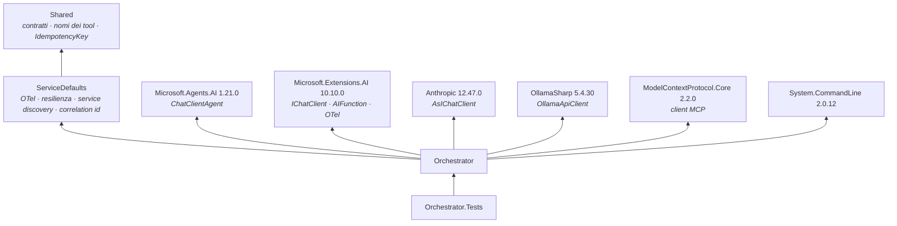
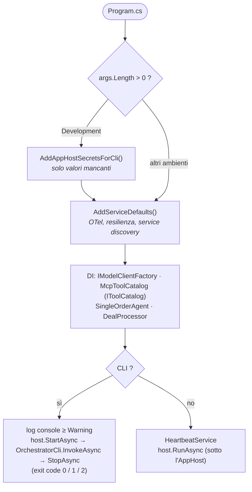
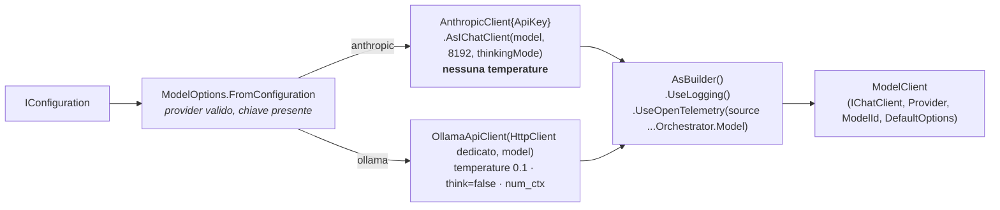
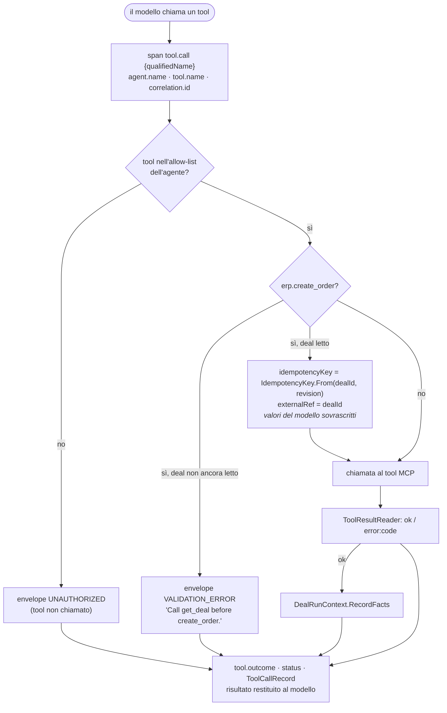
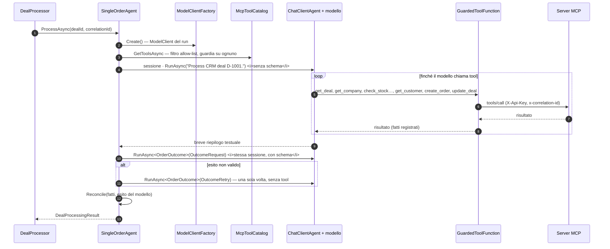
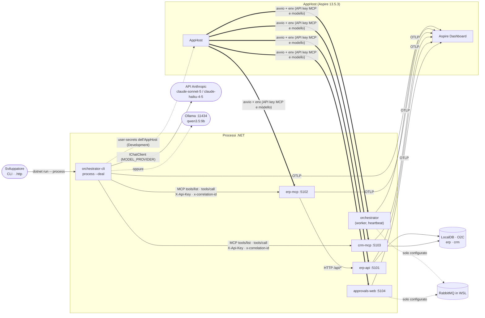

# Panoramica del codice — Fase 3

> **Stato**: working copy del branch `develop` al 2026-09-15, Fase 3 completata ([fase-3-agente-singolo.md](plan/fase-3-agente-singolo.md)). Riferimenti: [plan.md](plan/plan.md) · specifica [architettura.md](architettura.md) · scenari [demo.md](demo.md) · documenti precedenti [fase 0](panoramica-codice-fase0.md), [fase 1](panoramica-codice-fase1.md), [fase 2](panoramica-codice-fase2.md).
>
> Come per le fasi precedenti, qui si descrive **quello che il codice fa oggi**. Ciò che è solo predisposto per le fasi successive è indicato esplicitamente.

## 1. In sintesi

La Fase 3 ha acceso l'**agente**: un solo agente che, dato un deal, usa i tool MCP della Fase 2 per creare l'ordine in ERP e aggiornare il CRM, lanciato da riga di comando.

- **Modello da configurazione**: `MODEL_PROVIDER=anthropic` (Claude, default `claude-sonnet-5`) oppure `ollama` (locale, default `qwen3.5:9b`); il resto dell'orchestratore vede solo `IChatClient`.
- **Guardia sui tool**: allow-list, `idempotencyKey` ed `externalRef` di `create_order` calcolati dal codice e nascosti al modello, fatti del run presi dai risultati reali, uno span `tool.call` per chiamata.
- **Esito dai fatti**: stato e numero d'ordine finali vengono da ERP e CRM, non dal riassunto del modello.
- **CLI** `process --deal D-1001` con correlation id nuovo, traccia `o2c.process_deal` fino alle query SQL di Erp.Api, esito JSON ed exit code.

| Area | Fase 2 | Fase 3 |
|------|--------|--------|
| Orchestrator | Worker con heartbeat | + agente, factory del modello, catalogo MCP, guardia, CLI |
| Modello | — | Claude via API Anthropic o Ollama, scelto da configurazione (M23) |
| Traffico fra servizi | Erp.Mcp → Erp.Api | + **Orchestrator → Erp.Mcp / Crm.Mcp** (MCP con API key e correlation id) e → modello |
| Telemetria | Span `mcp.tool`, HTTP, SQL | + `o2c.process_deal`, `tool.call` (verificati nel dashboard); sorgente del client del modello registrata |
| AppHost | Parametri MCP | + parametro segreto `anthropic-api-key` |
| Test | 129 | **151** (+22 in `Orchestrator.Tests`, nessuna chiamata reale) |

Restano **solo configurati**: RabbitMQ (trigger in Fase 4), Approvals.Web e policy di approvazione (Fase 5).

## 2. Mappa della solution

Stessi 11 progetti in `src/`, 1 in `tools/`, 3 in `tests/`: nessun progetto nuovo, cresce l'Orchestrator.

| Progetto | Ruolo oggi |
|----------|------------|
| `src/Dusiburg.AI.O2C.Orchestrator` | **Agente singolo + CLI**; senza argomenti resta il worker con heartbeat |
| `src/Dusiburg.AI.O2C.AppHost` | + parametro `anthropic-api-key` → `ANTHROPIC_API_KEY` dell'orchestratore |
| `src/Dusiburg.AI.O2C.Shared` | + attributi di telemetria `deal.id`, `o2c.outcome` |
| `tests/Dusiburg.AI.O2C.Orchestrator.Tests` | + factory del modello, guardia, agente con modello a copione |
| Tutti gli altri | Invariati dalla Fase 2 (vedi [panoramica fase 2](panoramica-codice-fase2.md)) |

### 2.1 Dipendenze dell'Orchestrator



- L'Orchestrator **non** referenzia i server MCP né `Mcp.Hosting`: usa solo il pacchetto client (`ModelContextProtocol.Core`) e i contratti di `Shared`.
- I tipi dei provider (`AnthropicClient`, `OllamaApiClient`) compaiono **solo** in `ModelClientFactory`.
- `InternalsVisibleTo` verso `Orchestrator.Tests` per testare regole interne (es. la scelta della modalità di thinking).

## 3. File di build condivisi — cosa è cambiato

| File | Modifica in Fase 3 |
|------|--------------------|
| `Directory.Packages.props` | Gruppo **Mcp**: + `ModelContextProtocol.Core` 2.2.0. Nuovo gruppo **Agents**: `Microsoft.Agents.AI` 1.21.0, `Microsoft.Extensions.AI` 10.10.0, `Anthropic` 12.47.0, `OllamaSharp` 5.4.30, `System.CommandLine` 2.0.12 |

Tutti i pacchetti richiedono `Microsoft.Extensions.AI.Abstractions` fino alla 10.10.0: nessun conflitto con la gestione centrale delle versioni. `global.json`, `Directory.Build.props` e la solution sono invariati.

## 4. Orchestrator — struttura

```text
src/Dusiburg.AI.O2C.Orchestrator/
├─ Program.cs                        CLI se ci sono argomenti, altrimenti worker; registrazioni DI
├─ HeartbeatService.cs               invariato (solo in modalità worker)
├─ appsettings.json                  MODEL_PROVIDER, modelli di default, URL MCP via service discovery
├─ appsettings.Development.json      porte fisse dei server MCP per la CLI, O2C_CLI_OTLP_ENDPOINT
├─ Configuration/AppHostSecrets.cs   CLI in Development: segreti e OTLP dagli user-secrets dell'AppHost
├─ Model/ModelOptions.cs             lettura e validazione della configurazione del modello
├─ Model/ModelClientFactory.cs       IModelClientFactory → ModelClient (IChatClient + opzioni di default)
├─ Tools/AgentTool.cs                AgentTool, IToolCatalog, AgentToolNames (nomi qualificati)
├─ Tools/McpToolCatalog.cs           client MCP verso erp-mcp e crm-mcp, elenco dei tool
├─ Tools/GuardedToolFunction.cs      guardia attorno a ogni tool
├─ Tools/DealRunContext.cs           fatti del run e registro delle chiamate
├─ Tools/ToolResultReader.cs         interpretazione dei risultati MCP (structuredContent, isError, envelope)
├─ Agents/SingleOrderAgent.cs        agente, OrderOutcome, DealProcessingResult, riconciliazione
├─ Agents/SingleOrderPrompt.cs       istruzioni in inglese (G3.3)
├─ Agents/DealProcessor.cs           ingresso del workflow: correlation id, span radice, log
├─ Cli/OrchestratorCli.cs            comando process --deal
└─ Telemetry/OrchestratorTelemetry.cs ActivitySource Dusiburg.AI.O2C.Orchestrator, nome dello span radice
```

### 4.1 Avvio: CLI o worker



- La scelta avviene sugli argomenti, prima di costruire l'host: in CLI non parte l'heartbeat e la console mostra solo avvisi ed errori (i log completi vanno comunque al dashboard).
- Il modello **non** viene validato all'avvio: il worker della Fase 3 non lo usa, quindi un provider mal configurato fallisce solo quando si elabora un deal.

### 4.2 Configurazione

| Chiave | Default | Dove si imposta | Note |
|--------|---------|-----------------|------|
| `MODEL_PROVIDER` | `anthropic` | appsettings / variabile | `anthropic` o `ollama`; altro → errore |
| `ANTHROPIC_API_KEY` | — | user-secrets dell'AppHost (`Parameters:anthropic-api-key`) | Obbligatoria con `anthropic` |
| `ANTHROPIC_MODEL` | `claude-sonnet-5` | appsettings / variabile | Accettazione eseguita con `claude-haiku-4-5` (D43) |
| `OLLAMA_ENDPOINT`, `OLLAMA_MODEL`, `OLLAMA_NUM_CTX` | `http://localhost:11434`, `qwen3.5:9b`, `16384` | appsettings / variabile | Contesto alzato: con 8 GB Ollama sceglierebbe 4096 |
| `ERP_MCP_URL`, `CRM_MCP_URL` | `http://erp-mcp/mcp`, `http://crm-mcp/mcp` | appsettings | Service discovery: sotto l'AppHost dalle variabili `services__*`, in CLI dalle porte fisse di `appsettings.Development.json` |
| `ERP_MCP_API_KEY`, `CRM_MCP_API_KEY` | — | user-secrets dell'AppHost | Già presenti dalla Fase 2 |
| `O2C_CLI_OTLP_ENDPOINT` | `https://localhost:21058` | appsettings.Development | Dashboard per la CLI; header da `AppHost:OtlpApiKey` |

**`AppHostSecrets`** (solo Development): legge gli user-secrets dell'AppHost (`UserSecretsId` noto) e aggiunge `ERP_MCP_API_KEY`, `CRM_MCP_API_KEY`, `ANTHROPIC_API_KEY` e, se manca un endpoint OTLP, `OTEL_EXPORTER_OTLP_ENDPOINT` + `OTEL_EXPORTER_OTLP_HEADERS` + `OTEL_SERVICE_NAME=orchestrator-cli`. Non sovrascrive nulla: sotto l'AppHost gli stessi valori arrivano già come variabili d'ambiente. Risultato: **i segreti stanno in un solo posto** e la CLI lanciata a mano ha la stessa configurazione del worker.

## 5. Modello — `ModelClientFactory`



| Scelta | Motivo |
|--------|--------|
| Nessuna `temperature` per Claude | Claude Sonnet 5 rifiuta i parametri di sampling con HTTP 400; il determinismo viene da istruzioni, guardia e fatti dei tool |
| `ThinkingModeFor(model)`: `Extended` per `claude-haiku-4-5`, `Adaptive` per gli altri | Haiku 4.5 non supporta l'adaptive thinking; con `Extended` e senza `ChatOptions.Reasoning` il client non invia configurazione di thinking |
| Ollama: `OllamaOption.Think = false` | Qwen 3.5 con il thinking attivo a volte lascia la tool call dentro il ragionamento |
| Ollama: `OllamaOption.NumCtx = 16384` | Istruzioni, 7 schemi di tool e storico superano i 4096 token scelti da Ollama con 8 GB di VRAM |
| Ollama: `HttpClient` dedicato, timeout 10 minuti | La resilienza di ServiceDefaults (10 s per tentativo) non regge la generazione locale |
| Sorgente `Dusiburg.AI.O2C.Orchestrator.Model` | Rientra nel filtro `Dusiburg.AI.O2C.*` di ServiceDefaults, quindi gli span del client del modello sono raccolti con il resto della traccia (non verificati nel dashboard in questa fase: la verifica ha filtrato `o2c.process_deal` e `tool.call`) |

`ModelClient` è `IDisposable` e viene creato **per run**: la configurazione si rilegge ogni volta, quindi un cambio di modello non richiede codice.

## 6. Tool — catalogo, guardia, fatti

### 6.1 `McpToolCatalog`

- Si collega **una volta** ai due server (con semaforo) e mette in cache l'elenco dei tool.
- Per ogni server: `HttpClientTransport` con header `X-Api-Key` e un `HttpClient` da `IHttpClientFactory` (`erp-mcp`, `crm-mcp`), quindi con `CorrelationIdDelegatingHandler`, resilienza e service discovery di ServiceDefaults.
- Ogni tool diventa un `AgentTool(QualifiedName, Function, Sensitive)`: la funzione espone al modello il nome del server (`create_order`, senza punto: R5), `QualifiedName` (`erp.create_order`) serve ad allow-list e telemetria, `Sensitive` viene dal `_meta` `o2c.sensitive` (oggi solo `create_order`, usato in Fase 5).

### 6.2 `GuardedToolFunction`

Un `DelegatingAIFunction` attorno a ogni tool offerto all'agente.



- **Schema**: per `create_order` lo schema esposto al modello non contiene `idempotencyKey` ed `externalRef` (tolti anche da `required`); gli altri tool restano identici all'originale.
- **Difesa in profondità**: l'agente offre già solo i tool consentiti, ma la guardia controlla comunque l'allow-list.
- **Errori**: le eccezioni del tool vengono registrate (`error:INTERNAL`) e rilanciate; il ciclo di invocazione di Agent Framework le riporta al modello.

### 6.3 `ToolResultReader` e `DealRunContext`

`ToolResultReader` interpreta quello che restituisce un tool MCP o un tool in memoria:

| Forma del risultato | Interpretazione |
|---------------------|-----------------|
| Oggetto con `error: { code, message }` | Errore con quel codice |
| `isError: true` con envelope nel testo (D33) | Errore con il codice dell'envelope |
| `structuredContent` oggetto | Successo, dati strutturati |
| `content` testuale con JSON | Successo con il JSON del testo |
| Oggetto semplice (tool in memoria nei test) | Successo |

`DealRunContext` raccoglie **solo** i fatti dei risultati positivi, con i contratti di `Shared`:

| Tool | Fatto registrato |
|------|------------------|
| `crm.get_deal` | `Deal` (con `Revision`, necessaria alla chiave di idempotenza) |
| `crm.get_company` | `Company` |
| `erp.check_stock` | una voce di `Stock` per chiamata |
| `erp.get_customer`, `erp.create_customer` | `CustomerId` |
| `erp.create_order` | `Order` (numero, totale, stato) |
| `crm.update_deal` | `CrmStatus` dall'argomento `status` |

Un risultato che non rispetta il contratto (JSON non deserializzabile) non diventa un fatto.

## 7. Agente — `SingleOrderAgent`

Allow-list: `crm.get_deal`, `crm.get_company`, `erp.check_stock`, `erp.get_customer`, `erp.create_customer`, `erp.create_order`, `crm.update_deal` (non `erp.get_order`).



**Perché due fasi**: se lo schema dell'esito arriva già nella prima richiesta, con Ollama diventa il parametro `format`, che vincola la generazione al JSON: nello spike Qwen non ha chiamato **nessun** tool e ha inventato `OrderCreated` con un numero d'ordine. Ora il lavoro avviene senza schema e l'esito strutturato si chiede alla fine, nella stessa sessione; vale per tutti i provider.

**Riconciliazione (esito dai fatti)**:

| Fatti del run | Stato finale | `ErpOrderNumber` |
|---------------|--------------|------------------|
| Ordine creato **e** deal CRM aggiornato a `OrderCreated` | `OrderCreated` | numero dell'ordine creato |
| Qualunque altro caso | `Failed` | numero dell'ordine se esiste, altrimenti `null` |

I motivi (`Reasons`) spiegano cosa manca: nessun ordine, CRM non aggiornato, esito del modello non valido dopo due tentativi, esito del modello diverso dai fatti ("prevalgono i tool"). `ModelOutcomeValid` dice se il modello ha restituito un esito valido. Scostamento dal piano originale: un esito non valido non rende il deal `Failed` se ERP e CRM dicono il contrario.

## 8. Riga di comando e ingresso del workflow

`DealProcessor` è l'ingresso di un deal, pensato per essere riusato dal consumer RabbitMQ della Fase 4:

1. `CorrelationId.New()` (GUID v7) — **una sola volta** per run;
2. `ICorrelationContext.Begin` (quindi `x-correlation-id` su ogni chiamata HTTP/MCP) e scope di log;
3. span radice `o2c.process_deal` con `correlation.id` (tag e baggage), `deal.id`, `agent.name`;
4. esecuzione dell'agente; `o2c.outcome` sullo span, status di errore se non `OrderCreated`; log di riepilogo.

```powershell
Invoke-RestMethod -Method Post http://localhost:5103/dev/deals/D-1001/close-won
dotnet run --project src/Dusiburg.AI.O2C.Orchestrator -- process --deal D-1001
$env:ANTHROPIC_MODEL = "claude-haiku-4-5"   # oppure $env:MODEL_PROVIDER = "ollama"
```

Esito (estratto del run di accettazione con Haiku):

```json
{
  "dealId": "D-1001",
  "correlationId": "01a0a546-d1d9-7872-bf8d-3783aef64ab5",
  "status": "OrderCreated",
  "erpOrderNumber": "SO-2026-000001",
  "reasons": [],
  "modelOutcomeValid": true,
  "provider": "anthropic",
  "model": "claude-haiku-4-5",
  "toolCalls": [ { "tool": "crm.get_deal", "outcome": "ok", "durationMs": 67.9 }, "…" ]
}
```

| Exit code | Significato |
|-----------|-------------|
| `0` | `OrderCreated` |
| `1` | Deal non concluso (`Failed`) |
| `2` | Errore: configurazione, rete, modello (messaggio su stderr) |

## 9. Interazioni a runtime



| # | Interazione | Novità rispetto alla Fase 2 |
|---|-------------|-----------------------------|
| 1 | CLI → server MCP | **Nuova**: il primo client MCP reale del POC |
| 2 | CLI → modello (Anthropic o Ollama) | **Nuova**: unica dipendenza esterna nel caso cloud |
| 3 | CLI → dashboard (OTLP) | **Nuova**: risorsa `orchestrator-cli` |
| 4 | Worker dell'AppHost | Riceve anche `ANTHROPIC_API_KEY`, ma in Fase 3 non elabora deal |
| — | Trigger RabbitMQ, approvazioni | Fasi 4–5 |

### 9.1 Una traccia `o2c.process_deal`

Verificata dall'API di telemetria del dashboard sui due run di accettazione (una traccia per run). Sono stati controllati `o2c.process_deal`, i 9 `tool.call` e, nella stessa traccia, gli span di `erp-mcp`, `crm-mcp` ed `erp-api`; gli span intermedi del client HTTP e del client del modello non sono stati ispezionati uno per uno.

```text
o2c.process_deal                                   orchestrator-cli  correlation.id · deal.id · agent.name · o2c.outcome
├─ tool.call crm.get_deal                          orchestrator-cli  agent.name · tool.name · correlation.id · tool.outcome
│  └─ (client HTTP)                                orchestrator-cli
│     └─ POST /mcp                                 crm-mcp
│        └─ mcp.tool get_deal → SELECT …           crm-mcp
├─ tool.call erp.check_stock  (× 4)
│  └─ POST /mcp → mcp.tool check_stock             erp-mcp
│     └─ GET /api/stock/{sku} → SELECT …           erp-api   correlation.id
├─ tool.call erp.create_order
│  └─ … → POST /api/orders → SELECT / INSERT / UPDATE   erp-api
└─ tool.call crm.update_deal → … → UPDATE          crm-mcp
```

## 10. Test

151 test NUnit 4 (`dotnet test --solution Dusiburg.AI.O2C.slnx`). In `Orchestrator.Tests` **nessuna chiamata reale** né al modello né ai server MCP.

| Supporto | Ruolo |
|----------|-------|
| `ScriptedChatClient` | Modello a copione: ogni richiesta consuma il passo successivo (chiamata a funzione o testo); registra le `ChatOptions` ricevute |
| `ScriptedModelClientFactory`, `InMemoryToolCatalog` | Sostituiscono factory e catalogo MCP |
| `FakeO2CTools` | Tool ERP e CRM in memoria con le stesse firme dei server MCP; registrano gli argomenti di `create_order` e lo stato di `update_deal` |

| Classe | Test | Cosa verifica |
|--------|------|---------------|
| `ModelClientFactoryTests` | 10 | Anthropic con modello configurato e senza `temperature`; default Anthropic Sonnet 5; Ollama con temperatura 0.1, `think=false`, `num_ctx`; modalità di thinking per Haiku/Sonnet/Opus; Haiku solo da configurazione; provider sconosciuto e chiave mancante → errore |
| `GuardedToolFunctionTests` | 7 | Schema di `create_order` senza argomenti iniettati; schema degli altri tool invariato; chiave `o2c-D-1001-r3` e `externalRef` sovrascritti; `create_order` prima di `get_deal` → `VALIDATION_ERROR` senza chiamata; tool fuori allow-list → `UNAUTHORIZED`; errore MCP registrato come esito e non come fatto; span `tool.call` con gli attributi |
| `SingleOrderAgentTests` | 5 | Percorso felice (`OrderCreated` dai fatti, chiave iniettata, sequenza, schema solo nella richiesta finale); solo i tool consentiti offerti e argomenti nascosti; esito non valido → una sola nuova richiesta senza rifare i tool; esito mai valido → stato comunque dai fatti; modello che dichiara successo senza tool → `Failed` |
| Altri progetti | 129 | Invariati dalla Fase 2 (con i marcatori `//SETUP` e `//SUT`) |

## 11. Modelli misurati

Strumento di misura fuori dal repo: stesso agente sui server MCP reali, N run per deal ripartendo dai dati demo, argomenti di `create_order` e note CRM controllati a posteriori.

| Deal | Scenario | Qwen 3.5 9B (Ollama, RTX 5060 Laptop 8 GB) | Claude Haiku 4.5 |
|------|----------|--------------------------------------------|------------------|
| D-1001 | percorso felice | **10/10**, 9 chiamate, 33,8 s | **5/5**, 9 chiamate, 18,0 s |
| D-1004 | cliente nuovo | **5/5**, 9–10 chiamate, 37,3 s | **3/3**, 9 chiamate, 17,7 s |
| D-1007 | SKU inesistente | **5/5** `Failed` corretto, 32 s | **3/3** `Failed` corretto, 10,5 s |

- Token per run di D-1001: Qwen ~27k in input / ~1k in output; Haiku ~33,6k / ~1,3k (circa 0,04 $).
- Qwen su 8 GB funziona **con** tre accorgimenti: contesto a 16K, thinking disattivato, esito strutturato chiesto dopo il lavoro.
- Il limite pratico del locale è la **memoria di sistema**: il processo di Ollama arriva a 9–14 GB oltre alla VRAM; con AppHost e Visual Studio aperti il sistema ha interrotto i processi in background.

## 12. Limiti noti e cosa manca

| Tema | Stato | Quando |
|------|-------|--------|
| Scenari diversi da D-1001 | Funzionano nelle misure, ma senza policy di approvazione: D-1002 (sopra soglia), D-1003 (backorder), D-1005 (cliente bloccato) creerebbero l'ordine | **Fase 5** |
| `o2c.sensitive` | Letto dal catalogo, non ancora usato | **Fase 5** |
| Coerenza fra righe del deal e di `create_order` | Non controllata dalla guardia (le misure non hanno mostrato scostamenti) | Da valutare con la policy |
| Deal non in EUR | Non gestito: né il codice né le istruzioni controllano la valuta, quindi D-1006 (USD) non viene scartato | **Fase 4** (`Discarded`) |
| Trigger automatico | Solo CLI; il worker non consuma eventi | **Fase 4** |
| Retry di `update_deal` | Una nuova esecuzione aggiunge un'altra nota al deal (visto nel test di idempotenza) | Accettato |
| Modello locale e memoria | 9–14 GB oltre alla VRAM su 31 GB | Hardware / configurazione |
| Dati dopo le prove | La CLI lascia ordine e stato sul deal: si ripristina con `POST /dev/reset` | — |
| Parametro `anthropic-api-key` nell'AppHost | Obbligatorio: senza valore l'orchestratore non parte sotto l'AppHost | — |
