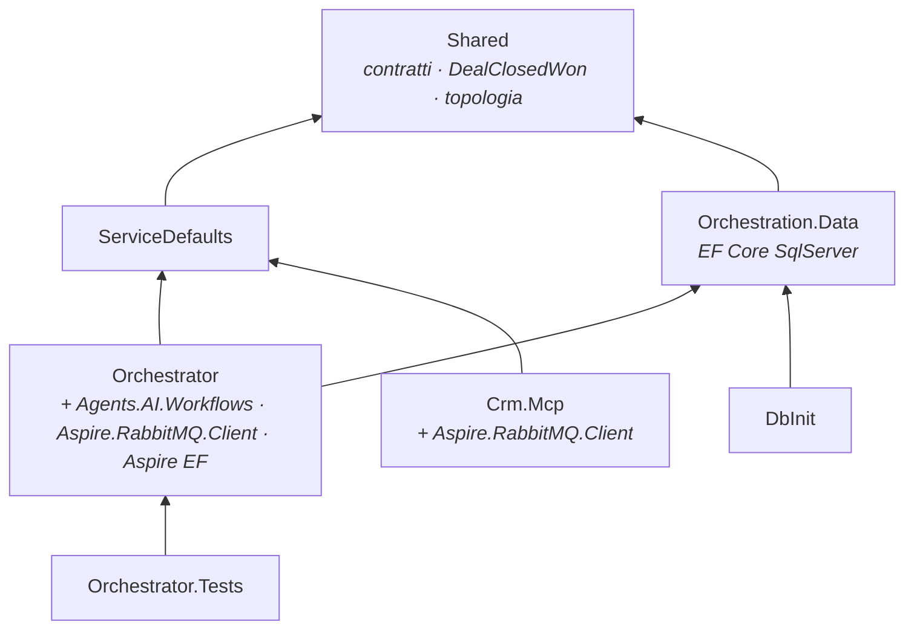
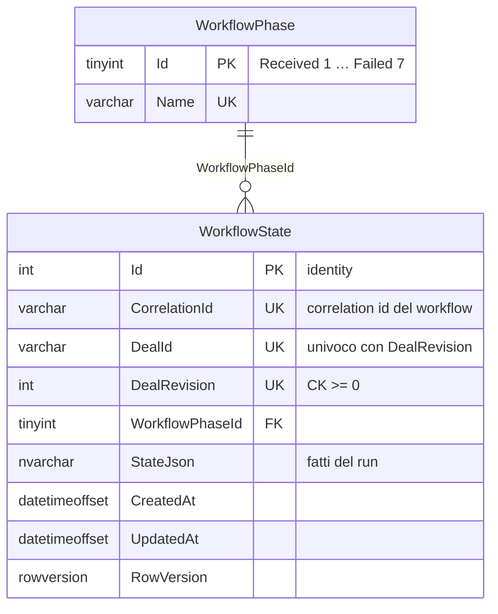
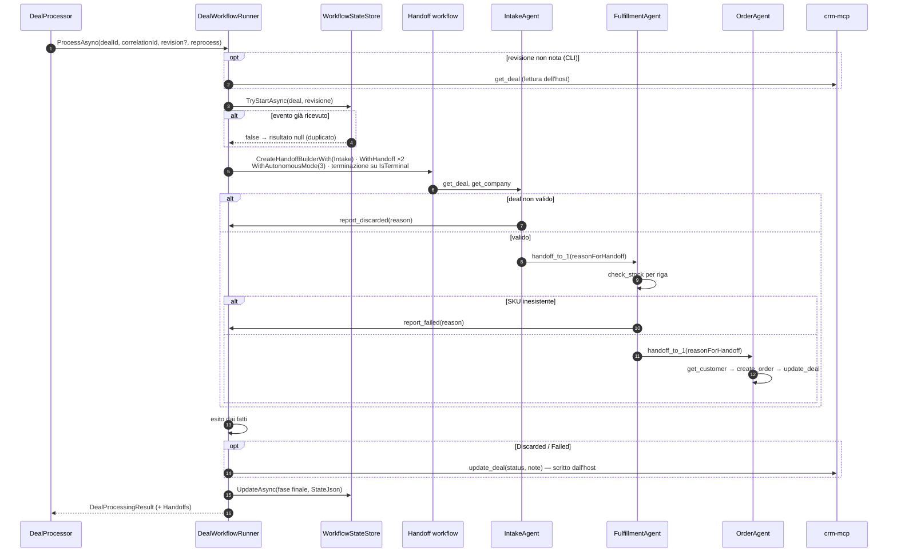
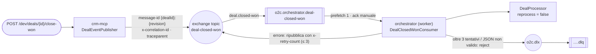
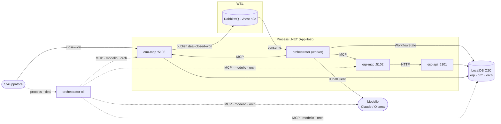

# Panoramica del codice — Fase 4

> **Stato**: working copy del branch `develop` al 2026-09-15, Fase 4 completata ([fase-4-multi-agente.md](plan/fase-4-multi-agente.md)). Riferimenti: [plan.md](plan/plan.md) · specifica [architettura.md](architettura.md) · documenti precedenti [fase 2](panoramica-codice-fase2.md), [fase 3](panoramica-codice-fase3.md).
>
> Come per le fasi precedenti, qui si descrive **quello che il codice fa oggi**. Ciò che è solo predisposto per le fasi successive è indicato esplicitamente.

## 1. In sintesi

La Fase 4 ha sostituito l'agente singolo con **tre agenti collegati da handoff** e ha reso il flusso **guidato da eventi**:

- `POST /dev/deals/{id}/close-won` sul CRM pubblica `deal-closed-won` su RabbitMQ; il worker dell'orchestratore lo consuma e avvia il workflow, senza interventi manuali.
- **IntakeAgent → FulfillmentAgent → OrderAgent** con l'handoff di Agent Framework (D44): sono gli agenti a passarsi la mano, l'orchestratore resta il garante degli esiti.
- **Stato del workflow** nello schema `orch` (`WorkflowState`): una riga per deal e revisione, che rende idempotente il consumer.
- Esiti `Discarded` e `Failed` **verificati e scritti sul CRM dall'orchestratore** (G4.1), non dagli agenti.

| Area | Fase 3 | Fase 4 |
|------|--------|--------|
| Agenti | `SingleOrderAgent` | Workflow a tre agenti con handoff (default); agente singolo dietro `O2C_AGENT_MODE=single` |
| Trigger | Solo CLI | + evento `deal-closed-won` su RabbitMQ (consumer nel worker) |
| Stato | In memoria per run | + `orch.WorkflowState` persistito, fase aggiornata a ogni agente |
| Esiti | `OrderCreated` / `Failed` | + `Discarded`; `Discarded`/`Failed` scritti dall'orchestratore |
| Telemetria | `o2c.process_deal`, `tool.call` | + `agent.run`, `agent.handoff`, traccia collegata al publisher |
| Progetti | 11 in `src/` | **12** (+ `Orchestration.Data`) |
| Test | 151 | **169** (+18 in `Orchestrator.Tests`) |

Restano **solo predisposti**: approvazione umana, `Approvals.Web`, `AwaitingApproval` (Fase 5).

## 2. Mappa della solution

| Progetto | Cosa cambia |
|----------|-------------|
| `src/Dusiburg.AI.O2C.Orchestration.Data` | **Nuovo** (D45): `OrchestrationDbContext`, schema `orch`, `WorkflowState`, lookup `WorkflowPhase` |
| `src/Dusiburg.AI.O2C.Orchestrator` | + workflow a tre agenti, stato, consumer RabbitMQ, modalità agente |
| `src/Dusiburg.AI.O2C.Crm.Mcp` | + `DealEventPublisher`; `close-won` pubblica l'evento |
| `src/Dusiburg.AI.O2C.Shared` | + `DealClosedWon`, `DealEventsTopology`, attributi `handoff.*` |
| `tools/Dusiburg.AI.O2C.DbInit` | + creazione delle tabelle `orch` |
| `tests/Dusiburg.AI.O2C.Orchestrator.Tests` | + test del workflow, dell'intake, dei messaggi e della modalità |
| AppHost e altri | Invariati: `crm-mcp` e `orchestrator` avevano già il riferimento a `rabbitmq` dalla Fase 0 |



`Orchestration.Data` è una libreria separata perché in Fase 5 servirà anche ad `Approvals.Web` e perché `DbInit` non può referenziare i progetti eseguibili (stessa scelta di `Erp.Data` e `Crm.Data`, D30).

**Pacchetti nuovi** (`Directory.Packages.props`): `Microsoft.Agents.AI.Workflows` 1.21.0, `Aspire.RabbitMQ.Client` 13.5.3. L'Orchestrator sopprime `MAAI001`/`MEAI001`, gli avvisi sulle API sperimentali di Workflows (handoff, modalità autonoma).

## 3. Schema `orch`



| Fase | Valore | Quando |
|------|--------|--------|
| `Received` | 1 | Workflow registrato, prima degli agenti |
| `Intake` / `Fulfillment` / `Order` | 2 / 3 / 4 | Al primo messaggio di quell'agente |
| `Completed` / `Discarded` / `Failed` | 5 / 6 / 7 | Esito finale |

Convenzioni D29–D31 (PK `Id`, niente PK sul `CorrelationId`, lookup generata dall'enum, nomi al singolare); tabelle create da `DbInit` insieme a `erp` e `crm`, senza migration. `AwaitingApproval` arriva con la Fase 5.

## 4. Il workflow a tre agenti

### 4.1 Agenti (`Agents/WorkflowAgents.cs`)

| Agente | Tool MCP consentiti | Tool locale di verdetto | Passa la mano a |
|--------|---------------------|-------------------------|-----------------|
| `IntakeAgent` | `crm.get_deal`, `crm.get_company` | `report_discarded(reason)` | `FulfillmentAgent` |
| `FulfillmentAgent` | `erp.check_stock` | `report_failed(reason)` | `OrderAgent` |
| `OrderAgent` | `erp.get_customer`, `erp.create_customer`, `erp.create_order`, `crm.update_deal` | — | nessuno (terminale) |

- Istruzioni in inglese, come costanti C# (non file `.md` incorporati come prevedeva il piano).
- Topologia a **soli archi in avanti** (`WorkflowAgents.NextOf`); nessun ritorno all'agente precedente.
- I tool di verdetto sono **funzioni locali dell'host** (non MCP): registrano un `AgentVerdict` nel `DealRunContext` e dicono al modello di fermarsi.

### 4.2 `DealWorkflowRunner`



**Osservazione degli eventi**: il framework non emette un evento di handoff. Il runner legge lo stream `AgentResponseUpdateEvent`:
- cambio di executor → chiude lo span `agent.run` precedente, ne apre uno nuovo e aggiorna la fase in `WorkflowState`;
- chiamata a `handoff_to_*` (una sola volta per `CallId`) → span `agent.handoff` con `handoff.from`, `handoff.to` (dalla topologia) e `handoff.reason` (argomento `reasonForHandoff` scritto dal modello).

**Terminazione**: `DealRunContext.IsTerminal` è vero quando c'è un verdetto registrato oppure un ordine creato con il deal aggiornato a `OrderCreated`. Il limite di **3 turni autonomi** per agente evita i loop: nello spike, con la terminazione basata sul testo e il limite di default, IntakeAgent su D-1006 era stato rilanciato 104 volte.

### 4.3 Esito dai fatti

| Fatti del run | Esito | Scrittura sul CRM |
|---------------|-------|-------------------|
| Ordine creato e deal aggiornato a `OrderCreated` | `OrderCreated` | Già fatta da OrderAgent |
| Verdetto `Discarded` **e** regole di intake violate sui dati del deal (stage, valuta EUR, righe, importo = somma righe) | `Discarded` | `update_deal(Discarded)` dall'host |
| Verdetto `Discarded` non confermato dai dati | `Failed` ("verdetto non confermato") | `update_deal(Failed)` dall'host |
| Verdetto `Failed`, oppure nessun ordine | `Failed` | `update_deal(Failed)` dall'host |

La scrittura dell'host passa comunque dalla guardia, con ambito `Host` e allow-list limitata a `crm.update_deal`: compare come span `tool.call crm.update_deal` con `agent.name = Host`.

### 4.4 Guardia e contesto: cosa cambia

- `GuardedToolFunction` accetta un `AgentScope` (nome e allow-list **per agente**); senza ambito usa quello del contesto, come l'agente singolo.
- `DealRunContext` registra anche verdetto, handoff e agente di ogni chiamata (`ToolCallRecord.Agent`); `ToStateJson()` produce il contenuto di `WorkflowState.StateJson`: deal, azienda, giacenze, cliente, ordine, stato CRM, verdetto, handoff, chiamate.
- `DealProcessingResult` espone `Handoffs`.

### 4.5 Modalità e ingresso (`AgentModes`, `DealProcessor`)

- `O2C_AGENT_MODE` = `multi` (default) | `single`; valore sconosciuto → errore.
- `DealProcessor` apre come prima `o2c.process_deal` (ora con `o2c.agent_mode` e, per gli eventi, **genitore dal `traceparent`** del messaggio), poi delega al runner o all'agente singolo. Un duplicato produce `o2c.outcome = duplicate` e nessun risultato.
- CLI: nuovo correlation id, revisione letta dal CRM, **rielaborazione consentita** (la riga di `WorkflowState` per quel deal e revisione viene riusata).

## 5. Trigger RabbitMQ



| Elemento | Comportamento |
|----------|---------------|
| Publisher (`Crm.Mcp`) | Dichiara l'exchange e pubblica a **ogni** chiamata di `close-won` (anche se il deal era già `ClosedWon`): una seconda chiamata è un evento duplicato |
| Consumer (`Orchestrator`, solo worker) | Dichiara exchange, coda, DLX e DLQ in modo idempotente; `prefetch = 1`; **ack dopo l'elaborazione** (stato già persistito) |
| Duplicato | `TryStartAsync` trova deal e revisione → ack senza workflow, log "duplicato" |
| Errore | Copia ripubblicata con `x-retry-count` + ack dell'originale (gli header non si modificano con il nack); dopo 3 tentativi `reject` → dead-letter |
| Messaggio illeggibile | `reject` diretto in dead-letter |
| `IDealEventSource` | Interfaccia marcatore del consumer, punto di sostituzione per Service Bus (Fase 6) |

La connessione arriva da `AddRabbitMQClient("rabbitmq")` (integrazione Aspire, D46). La CLI non apre connessioni al broker. In Development legge `ConnectionStrings:sql` (e `rabbitmq`) dagli user-secrets dell'AppHost come le API key.

## 6. Interazioni a runtime



Rispetto alla Fase 3 sono nuovi: **CRM → RabbitMQ**, **RabbitMQ → worker dell'orchestratore**, **orchestratore → schema `orch`**.

## 7. Traccia verificata

Dall'API di telemetria del dashboard, evento su D-1001 (Claude Haiku 4.5):

```text
publish deal.closed-won                         crm-mcp
└─ o2c.process_deal                             orchestrator   deal.id · correlation.id · o2c.agent_mode · o2c.outcome=OrderCreated
   ├─ agent.run  IntakeAgent
   │  ├─ tool.call crm.get_deal · crm.get_company
   │  └─ agent.handoff  IntakeAgent → FulfillmentAgent   handoff.reason (scritto dal modello)
   ├─ agent.run  FulfillmentAgent
   │  ├─ tool.call erp.check_stock
   │  └─ agent.handoff  FulfillmentAgent → OrderAgent
   └─ agent.run  OrderAgent
      └─ tool.call erp.get_customer · erp.create_order · crm.update_deal
```

- D-1007: un solo `agent.handoff`, poi `tool.call crm.update_deal` dell'host; D-1006: nessun handoff; duplicato: `o2c.process_deal` con `o2c.outcome = duplicate`, senza agenti.
- Sono stati verificati nome, agente, attributi e appartenenza alla traccia degli span elencati; la nidificazione esatta di `agent.handoff` sotto `agent.run` segue dal codice (span aperto mentre `agent.run` è corrente) e non è stata ispezionata span per span.

## 8. Test

169 test (`dotnet test --solution Dusiburg.AI.O2C.slnx`); in `Orchestrator.Tests` nessuna chiamata reale.

| Supporto nuovo | Ruolo |
|----------------|-------|
| `AgentScriptChatClient` | Modello a copione **per agente** (riconosciuto dalle istruzioni), con streaming; a copione finito risponde "Done."; registra i tool offerti a ogni richiesta |
| `RecordingWorkflowStateStore` | Stato in memoria: avvii, fasi, `StateJson`; simula l'evento già ricevuto |
| `FakeO2CTools(deal, unknownSku)` | Deal e SKU inesistente configurabili; `update_deal` con parametri facoltativi come il server reale |
| `ScriptedChatClient` | Ora supporta anche lo streaming |

| Classe | Test | Cosa verifica |
|--------|------|---------------|
| `DealWorkflowRunnerTests` | 11 | Deal valido: due handoff con motivi, chiave iniettata, `create_order` eseguito da OrderAgent, fasi `Intake → Fulfillment → Order → Completed`; tool offerti a ogni agente; USD → `Discarded` scritto dall'host senza ordine; `Discarded` non confermato → `Failed`; SKU inesistente → `Failed` dopo un handoff; evento già ricevuto → nessun workflow e nessuna chiamata al modello; regole di intake (4 casi); solo archi in avanti |
| `MessagingAndModeTests` | 7 | Lettura degli header (byte e stringhe), contatore dei tentativi, `message-id` dell'evento, modalità agente (3 casi) e valore sconosciuto |
| Altri | 151 | Invariati |

Il consumer RabbitMQ e il publisher non hanno test automatici: sono verificati dal vivo (sezione 9).

## 9. Verifiche dal vivo

| Prova | Esito |
|-------|-------|
| Evento D-1001 | `Completed` in 22 s senza interventi; un solo ordine `SO-2026-000001`; deal `OrderCreated` |
| Secondo `close-won` su D-1001 | Log "duplicato: confermato senza nuovo workflow"; `WorkflowState` invariato; sempre 1 ordine e 1 nota |
| Evento D-1006 | `Discarded` in 8 s, nota "IntakeAgent: Currency is USD, required EUR" |
| Evento D-1007 | `Failed` in 12 s dopo un handoff, nota "FulfillmentAgent: SKU IND-SEN-999 not found in ERP" |
| Code | Coda principale 0 messaggi / 1 consumer; DLQ 0 messaggi |
| CLI dopo gli eventi | D-1001 → exit 0, stesso ordine, 2 handoff; 1 ordine, 1 riga di workflow |

## 10. Limiti noti e cosa manca

| Tema | Stato | Quando |
|------|-------|--------|
| Ripetere la demo da evento | `POST /dev/reset` non pulisce `orch.WorkflowState`: la stessa revisione risulta duplicata. Ripartire con `DbInit` o cancellando le righe | Da valutare un reset dell'orchestrazione |
| Evento prima del consumer | Il publisher dichiara solo l'exchange: senza coda già dichiarata l'evento va perso | Attendere "In ascolto su …"; eventuale dichiarazione della coda anche dal publisher |
| Nuovi tentativi e dead-letter | Implementati, non provati dal vivo (nessun errore transitorio nelle prove) | — |
| Handoff e modelli piccoli | Misurati solo con Claude Haiku 4.5; Qwen locale non provato sul workflow a tre agenti | Da misurare se serve |
| Approvazione | D-1002, D-1003, D-1004, D-1005, D-1008 creano l'ordine senza approvazione | **Fase 5** |
| `IDealEventSource` | Solo marcatore | **Fase 6** (Service Bus) |
