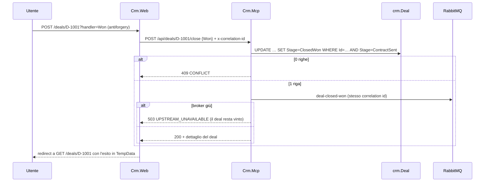

# Panoramica del codice — Fase 6

> **Stato**: working copy del branch `develop` al 2026-09-17, Fase 6 completata ([fase-6-ui-crm-erp.md](plan/fase-6-ui-crm-erp.md)). Riferimenti: [plan.md](plan/plan.md) · specifica [architettura.md](architettura.md) (§6.3, M26, M27) · documento precedente [fase 5](panoramica-codice-fase5.md) · script della demo [demo.md](demo.md).
>
> La Fase 6 è stata aggiunta al piano il 2026-09-17 (D57): il deploy su Azure è diventato la Fase 7.

## 1. In sintesi

La Fase 6 ha dato un'interfaccia ai due sistemi di contorno, così la demo si fa tutta dal browser.

- **`Crm.Web`** (porta 5105) è il front-end del CRM mock: deal, aziende, storico delle scritture di O2C e i comandi **Chiudi vinto** / **Chiudi perso**. Chiudi vinto è ora il vero ingresso del flusso.
- **`Erp.Web`** (porta 5106) è il front-end dell'ERP, **in sola lettura**: clienti, magazzino, ordini ricevuti.
- Le due UI **non vedono il database**: parlano HTTP con `Crm.Mcp` ed `Erp.Api`, che restano gli unici proprietari degli schemi `crm` ed `erp` (D18, D58).
- Le tre UI (con `Approvals.Web`) sono collegate fra loro: deal → ordine, deal → richieste di approvazione, ordine → deal, richiesta → deal.

| Area | Fase 5 | Fase 6 |
|------|--------|--------|
| Ingresso del flusso | `POST /dev/deals/{id}/close-won` | `POST /api/deals/{id}/close` (`Won` \| `Lost`), dalla UI; l'endpoint dev resta per ripubblicare |
| Letture del CRM | `GET /dev/deals`, `/dev/deals/{id}` | `GET /api/views/deals`, `/deals/{id}`, `/companies`, `/companies/{id}` (le GET dev sono state tolte) |
| Letture dell'ERP | Solo endpoint dei tool | + `GET /api/views/customers`, `/stock`, `/orders` e dettagli |
| UI | `Approvals.Web` | + `Crm.Web`, `Erp.Web`; filtro per deal in `/approvals` |
| Link fra le UI | `Approvals:CrmDevBaseUrl` verso l'endpoint dev | `PortalLinks` (`Links:*`) dagli endpoint delle risorse Aspire |
| Telemetria | `approval.*` | + `crm.deal.close` |
| Test | 200 | **279** (+26 in `Mcp.Tests`, +11 in `Erp.Api.Tests`, +2 su `Approvals.Web`, +40 nel nuovo `Web.Tests`) |

## 2. Mappa della solution (novità)

| Progetto | Cosa è cambiato |
|----------|-----------------|
| `Shared` | `Contracts/Views/Crm` e `Contracts/Views/Erp`: record delle viste, `CloseDealRequest`, enum `DealCloseOutcome`. `DealStage` si è spostato qui da `Crm.Data`, perché serve tipizzato anche alle viste |
| `ServiceDefaults` | `Portal/PortalLinks`: indirizzi delle tre UI e composizione dei link. `ToolProblems.UpstreamUnavailable` (503) e `ConfigureExceptionHandler` |
| `Crm.Mcp` | `Views/CrmViewQueries`, `Views/CrmApiEndpoints`, `Deals/DealClosingService`, `Messaging/IDealEventPublisher` |
| `Erp.Api` | `Views/ErpViewQueries`, `Views/ErpViewEndpoints` |
| `Crm.Web` | **Nuovo.** `Api/CrmApiClient`, `Api/DealPresentation` (regole e cruscotto), pagine `/`, `/deals`, `/deals/{id}`, `/companies`, `/companies/{id}` |
| `Erp.Web` | **Nuovo.** `Api/ErpApiClient`, `Api/ErpPresentation`, pagine `/`, `/customers`, `/customers/{id}`, `/stock`, `/orders`, `/orders/{numero}` |
| `Approvals.Web` | `?dealId=` sulla coda, link al deal verso `Crm.Web`, barra verso le altre UI |
| `Orchestration.Data` | `ApprovalRepository.ListAsync` accetta il filtro per deal |
| `AppHost` | Risorse `crm-web` (riferimento a `crm-mcp`) ed `erp-web` (riferimento a `erp-api`), senza `sql` né `rabbitmq`; `Links__*` sulle tre UI |
| `tests/Web.Tests` | **Nuovo.** Le due UI in-process con un handler HTTP finto al posto delle API a valle |

## 3. Il comando di chiusura (`Deals/DealClosingService.cs`)



- **Transizione solo da `ContractSent`, con un UPDATE condizionale**: cinque chiusure simultanee producono un solo 200 e un solo evento (test `Close_ConcurrentWonRequests_PublishOnlyOnce`). È la stessa idea del possesso della ripresa (D56).
- **La revisione non cambia** (G1.3): lo stage non è una modifica commerciale.
- **`Lost`** chiude senza pubblicare nulla: nessun workflow, nessuna nota di O2C.
- **Nessuna riapertura**: da uno stage chiuso la risposta è 409. Per ripetere la demo c'è il reset.
- **Broker giù**: lo stage resta `ClosedWon` e la risposta è 503; senza outbox (come in G5.3) il rimedio è `POST /dev/deals/{id}/close-won`, che per un deal già vinto **ripubblica** l'evento. L'orchestratore riconosce i duplicati su `(DealId, DealRevision)`.
- **Correlazione**: il middleware legge `x-correlation-id` (o lo genera) nella richiesta di `Crm.Web`; il client HTTP lo propaga a `Crm.Mcp` e il publisher lo mette sul messaggio. Dal vivo, un id mandato a `Crm.Web` si ritrova identico in `orch.WorkflowState.CorrelationId`.

### Niente retry sulla chiusura

ServiceDefaults registra il resilience handler standard **per tutti i client** con `ConfigureHttpClientDefaults`. Le sue opzioni non portano il nome del client: configurarle come `"crm-api-standard"` non ha effetto, e il test `Close_EventNotPublished_ShowsAnErrorAndIsNotRetried` l'ha mostrato (quattro POST al posto di una, con il 503 trasformato in 409 dal secondo tentativo). `Crm.Web` usa quindi `ConfigureAll<HttpStandardResilienceOptions>(… DisableForUnsafeHttpMethods())`: vale per tutti i client dell'app, che ne ha uno solo. `RemoveAllResilienceHandlers` avrebbe risolto per il singolo client, ma è un'API sperimentale (`EXTEXP0001`).

## 4. Le viste

- `CrmViewQueries` ed `ErpViewQueries` sono classi di sola lettura (`AsNoTracking`), con **limite fisso di 200 righe** e ordinamento stabile (G6.6): niente paginazione, il seed è piccolo.
- **Filtri**: deal per `stage`, `o2cStatus`, `companyId`; ordini per `status`, `customerId`; magazzino con `shortOnly`. Gli enum si accettano per nome (senza distinzione di maiuscole) e **mai come numero**: un valore sconosciuto è 400 `VALIDATION_ERROR`.
- **Disponibile** = `OnHand − Reserved`, calcolato in SQL e lasciato anche negativo: la riserva di un backorder è incondizionata (D55), e `Erp.Web` evidenzia in rosso le righe con riservato oltre la giacenza. Il filtro `shortOnly` sta prima della proiezione, sulle colonne dell'entità, per non dipendere dalla traduzione di un filtro su un record posizionale già proiettato.
- **Ordine per numero** (`/api/views/orders/{orderNumber}`): è l'unico riferimento che il CRM conosce.
- Le viste sono separate dai contratti dei tool di §6: `GET /api/customers` resta la ricerca di `get_customer`.

## 5. Le due UI

| Scelta | Dove | Perché |
|--------|------|--------|
| Logica fuori dalle pagine | `DealPresentation`, `CrmDashboardService`, `ErpPresentation`, `ErpDashboardService` | Le PageModel si limitano a chiamare il client e a scegliere la risposta; le regole si provano senza HTTP |
| Refresh senza JavaScript | `_Layout` + `ViewData["AutoRefreshSeconds"]` | `<meta refresh>` ogni 5 s solo se il deal è vinto e lo stato O2C è vuoto o `ApprovalPending` (G6.7) |
| Post-redirect-get | `Deals/Details` | Il messaggio di esito passa in TempData; il refresh automatico non ripete la POST |
| Comandi solo su deal aperti | `DealPresentation.CanClose` | Sui deal chiusi il form non c'è; se una POST arriva comunque, il CRM risponde 409 e la pagina lo mostra come avviso |
| Sola lettura garantita | Middleware in `Erp.Web/Program.cs` | Una POST verso una Razor Page senza handler verrebbe eseguita come la GET: ogni metodo diverso da GET/HEAD riceve 405 |
| Lettere accentate leggibili | `WebEncoderOptions` con `UnicodeRanges.All` | Senza, Razor scrive `è` come `&#xE8;` nei valori dinamici |
| Link fra le UI | `PortalLinks` + `Links__*` dall'AppHost | Indirizzi presi dagli endpoint delle risorse; senza valore il link non si mostra |
| Errori | Client tipizzati | 404 → pagina "non trovato"; 409/503 della chiusura → messaggio col dettaglio del CRM; il resto è un'eccezione |

## 6. Telemetria

| Span | Sorgente | Attributi |
|------|----------|-----------|
| `crm.deal.close` | `Dusiburg.AI.O2C.Mcp.Crm` | `deal.id`, `deal.close.outcome` (`Won`/`Lost`), `correlation.id`, `tool.outcome` (`Closed`, `Republished`, `AlreadyClosed`, `EventNotPublished`) |

Le due UI hanno la telemetria standard di ServiceDefaults (richieste in ingresso e client HTTP): la traccia di un flusso parte dalla POST su `crm-web`.

## 7. Correzione trasversale: JSON illeggibile → 400

In Development le Minimal API lanciano `BadHttpRequestException` quando il corpo non si legge (es. `{ "outcome": 1 }`), e `UseExceptionHandler` la trasformava in **500**. `ToolProblems.ConfigureExceptionHandler` imposta uno `StatusCodeSelector` che rispetta il codice dell'eccezione; è registrato su `Crm.Mcp` ed `Erp.Api`, dove lo stesso difetto era latente su `POST /api/orders` (test `CreateOrder_UnreadableJson_ReturnsValidationErrorInsteadOfServerError`).

## 8. Test

| Progetto | Nuovi casi |
|----------|------------|
| `Mcp.Tests` → `CrmApiEndpointTests` | Viste e filtri, 404, chiusura vinta (un evento, correlation id del chiamante), persa (nessun evento), già chiusa (409, tre combinazioni), concorrente (un solo evento), esito non valido (400), broker giù (503 con deal vinto), endpoint dev (ripubblicazione, 409 su deal perso, GET rimosse), `/api` senza API key e `/mcp` ancora protetto, span |
| `Erp.Api.Tests` → `ErpViewEndpointTests` | Clienti con blocco e conteggio ordini, dettaglio, magazzino col disponibile negativo dopo un backorder, ordini filtrati e ordinati, stato non valido, dettaglio per numero con descrizioni e nota di backorder; JSON illeggibile su `POST /api/orders` |
| `Orchestrator.Tests` → `ApprovalsWebTests` | Filtro `?dealId=`, link al deal in `Crm.Web` |
| `Web.Tests` (nuovo) | `Crm.Web`: cruscotto, filtri passati all'API, comandi e refresh secondo lo stato, link, POST con antiforgery (esito, 409, 503 **senza retry**, 404, token mancante). `Erp.Web`: cruscotto, evidenze del magazzino, filtri, dettaglio ordine e cliente, 405 su ogni POST senza chiamate all'ERP. Regole di presentazione |

Le UI si provano con `WebApplicationFactory` e uno `StubApiHandler` come handler primario del client: nessun database né broker.

## 9. Correzione D61: SKU inesistente fermato dall'host

Dal vivo, su D-1007, il modello locale non ha segnalato lo SKU `IND-SEN-999` e ha proposto l'ordine; `ApprovalGate` ha contato il `NOT_FOUND` della propria verifica come "riga non disponibile" e ha chiesto un'approvazione `InsufficientStock`. Ora:

- `ApprovalGate.VerifyStockAsync` separa gli SKU inesistenti dagli altri errori; con almeno uno SKU inesistente `EvaluateAsync` restituisce `ApprovalGateVerdict.Stopped(...)`, un verdetto `Failed` dell'host (`AgentScope.HostName`).
- `DealWorkflowEngine.HandleApprovalRequestAsync` registra il verdetto (il workflow diventa terminale) e **rifiuta** la chiamata: `create_order` non parte e non nasce nessuna richiesta. L'esito `Failed` lo scrive `CompleteAsync` sul CRM, come per gli altri arresti.
- `GuardedToolFunction`: dopo un verdetto di arresto, `create_customer`, `create_order` e `update_deal` chiamati da un agente ricevono `CONFLICT`; l'host continua a poter scrivere.

Test nuovi: `ProcessAsync_ModelProposesAnUnknownSku_HostFailsWithoutApprovalAndWithoutOrder` e i casi della guardia (totale **284**). Dal vivo D-1007 arriva a `Failed` in 36 s.

## 10. Correzione D62: la catena fra agenti

Con l'handoff di Agent Framework il testo con cui un agente accompagna il passaggio di mano resta nella conversazione e arriva al successivo come **messaggio dell'utente**. Il modello lo legge come un'istruzione: su `qwen3.5:9b` frasi di `IntakeAgent` come "…so I can hand off to FulfillmentAgent" o "…immediately" facevano passare la mano a `OrderAgent` senza che `FulfillmentAgent` avesse chiamato `check_stock`. Il guardrail teneva comunque, perché le giacenze le riverifica l'host (D54), ma un agente non faceva il proprio lavoro.

Irrobustire le istruzioni non basta: quel testo lo scrive un altro modello e cambia a ogni run.

- `Agents/ForeignAgentTextFilter.cs` è un `DelegatingChatClient` che, prima di ogni richiesta al modello, toglie il **solo testo** dei messaggi il cui `AuthorName` è un altro agente del workflow (`WorkflowAgents.Names`). Restano le loro chiamate ai tool e i risultati, che sono i fatti; un messaggio rimasto vuoto si scarta. I messaggi senza autore (la richiesta iniziale, le continuazioni del framework) e quelli dell'agente stesso non si toccano.
- `DealWorkflowEngine` avvolge così il client di ogni agente. Il filtro agisce solo su ciò che si manda al modello: la conversazione del workflow e i checkpoint restano completi, quindi la traccia e la ripresa non cambiano.
- Le descrizioni dei tool di handoff (`IntakeHandoffCondition`, `FulfillmentHandoffCondition`) sono scritte come **condizioni d'uso** e non come fatti già avvenuti: "Stock was checked…" faceva passare la mano senza verificare.

Con il filtro attivo le istruzioni difensive aggiunte agli agenti ("Earlier messages from IntakeAgent may appear as user messages…") sono state tolte: descrivevano messaggi che non arrivano più.

### Cattura e replay dei prompt

Per misurare invece di indovinare, due strumenti:

- `Model/PromptCaptureChatClient.cs` scrive su file ogni richiesta inviata al modello quando `O2C_PROMPT_CAPTURE_DIR` è valorizzata (`ModelClientFactory` lo aggancia solo in quel caso). **I file contengono dati di business e non vanno nel repository.**
- `tools/Dusiburg.AI.O2C.PromptReplay` rimanda al modello le conversazioni catturate in `Cases/` e controlla quale sia la **prima chiamata** di ogni risposta, ripetendo N volte. Per default usa le istruzioni attuali degli agenti e il filtro; `--no-filter` e `--captured-instructions` servono a riprodurre il comportamento di prima. Exit code 0 se ogni caso dà sempre la chiamata attesa, 1 altrimenti.

Il provider è quello dell'orchestratore e il default è `anthropic`: per il giro sul modello locale serve `MODEL_PROVIDER=ollama`.

```powershell
$env:MODEL_PROVIDER = 'ollama'
dotnet run --project tools/Dusiburg.AI.O2C.PromptReplay -- --repeat 5
dotnet run --project tools/Dusiburg.AI.O2C.PromptReplay -- --repeat 5 --no-filter
```

Misure su `qwen3.5:9b`, sei conversazioni per cinque ripetizioni (2026-09-18): **30/30** con il filtro e le istruzioni semplificate; senza filtro falliscono **quattro casi su sei**, 0/5 ciascuno e sempre con l'handoff al posto di `check_stock`. Passano anche senza filtro solo la conversazione in cui `IntakeAgent` elenca le righe senza annunciare il passaggio di mano e quella di `OrderAgent`. Test unitari del filtro: `ForeignAgentTextFilterTests` (4), totale **288/288**.

Dal vivo, un giro per deal su D-1001, D-1002, D-1003 e D-1006 con il modello locale: `check_stock` chiamato su ogni riga prima di ogni handoff, righe di `create_order` identiche a quelle del deal (compresa la riga scoperta di D-1003, ordinata per la quantità del deal e non per quella disponibile), esiti come in `docs/demo.md`. La copertura dal vivo è di un giro a deal: la ripetizione la fa il replay, che è deterministico.

## 11. Limiti noti

- **Nessuna autenticazione** su UI e API utente (G6.5): accettato in locale, da risolvere in Fase 7 (G7.4, G7.7).
- **Nessuna outbox** fra salvataggio dello stage e pubblicazione: un deal può restare vinto senza workflow finché qualcuno non ripubblica.
- **Le UI non mostrano lo stato del workflow** (G6.10): del flusso si vede solo ciò che O2C scrive sul CRM e ciò che crea in ERP.
- **Nessuna paginazione**: oltre 200 righe le liste si troncano.
