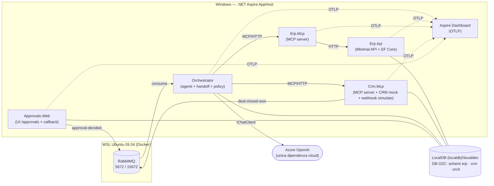

# 📋 Piano POC Order-to-Cash Agentico — Indice

> **Fonte**: `C:\Dev\Architettura\Architettura Integrazione Agentica ERP-CRM.md` (nel seguito "la specifica", sezioni citate come §N).
> **Repo di destinazione**: `C:\Dev\NetCode\AI.POC-OrderToCash` (da creare in Fase 0).
> **Piano approvato il**: 2026-09-11 — gate socratico chiuso (tutte le proposte accettate, con i dettagli su Docker/RabbitMQ, LocalDB `localdev` e git di Fork).

## Come usare questo piano

- Si implementa **una fase alla volta**, nell'ordine, senza saltare avanti (regola della specifica).
- Ogni file di fase si apre con un **Gate di fase**: domande da chiudere con l'utente **prima** di scrivere codice per quella fase. Le proposte indicate sono il default se l'utente non dice altro.
- Le fasi 2–5 iniziano con uno **spike di verifica API** (Agent Framework / MCP SDK): se l'API reale diverge dalla specifica, si usa l'equivalente e si registra la modifica nella specifica (vedi "Registro modifiche alla specifica").
- A fine fase: Definition of Done comune (sotto) + aggiornamento della tabella **Stato delle fasi**.
- Prompt suggerito per partire: `esegui la fase N del piano in C:\WorkspaceAI\PLANS\2026-09-11-o2c-agentic-poc\fase-N-<nome>.md`

## Stato delle fasi

| Fase | File | Obiettivo | Stato |
|------|------|-----------|-------|
| 0 | [fase-0-setup-scaffolding.md](fase-0-setup-scaffolding.md) | Tooling, repo, solution, AppHost, ServiceDefaults, Shared | ✅ Completata (2026-09-14) |
| 1 | [fase-1-sistemi-base.md](fase-1-sistemi-base.md) | Erp.Api + EF Core + seed; CRM mock | ✅ Completata (2026-09-14) |
| 2 | [fase-2-server-mcp.md](fase-2-server-mcp.md) | Erp.Mcp e Crm.Mcp con i tool di §6 | ✅ Completata (2026-09-15) |
| 3 | [fase-3-agente-singolo.md](fase-3-agente-singolo.md) | Un agente end-to-end da CLI | ✅ Completata (2026-09-15) |
| 4 | [fase-4-multi-agente.md](fase-4-multi-agente.md) | Intake/Fulfillment/Order con handoff + trigger RabbitMQ | ✅ Completata (2026-09-15) |
| 5 | [fase-5-human-in-the-loop.md](fase-5-human-in-the-loop.md) | Approvazione, sospensione e ripresa | ✅ Completata (2026-09-16) |
| 6 | [fase-6-deploy-osservabilita.md](fase-6-deploy-osservabilita.md) | Azure (outline, da dettagliare) | ⬜ Outline |

Legenda: ⬜ da iniziare · 🟨 in corso · ✅ completata · ⛔ bloccata

## Ambiente rilevato (2026-09-11)

| Voce | Stato | Conseguenza |
|------|-------|-------------|
| .NET SDK | 10.0.400 (nessun .NET 11) | Target `net10.0` (D7) |
| Docker | Engine 29.7.2 in WSL `Ubuntu-26.04`; nessuna CLI docker lato Windows | Aspire non gestisce container: risorse esterne via connection string (D8) |
| RabbitMQ | Container `rabbitmq:4.3.5-management` in WSL, porte 5672/15672 | Broker locale per il trigger (D6) |
| SQL Server LocalDB | Presente (`MSSQLLocalDB`); si crea l'istanza dedicata `localdev` | DB locale (D9) |
| git | Istanza di Fork: `C:\Users\dusim\AppData\Local\Fork\gitInstance\2.50.1\cmd\git.exe` (2.50.1) — non nel PATH | Da aggiungere al PATH utente o usare il path assoluto (D15) |
| Aspire CLI/template | Assenti | Installazione in Fase 0 |
| azd / az | Assenti | Servono solo in Fase 6 |
| Ollama | Assente; GPU RTX 5060 Laptop 8 GB VRAM, 31 GB RAM | Modello locale solo smoke test (D12) |

## Architettura locale (Fasi 0–5)

## Decisioni del gate socratico

| ID | Decisione | Fase |
|----|-----------|------|
| D1 | Aggiunta una **Fase 0 — Setup e scaffolding** prima delle 6 fasi di §11: i NFR di §12 valgono dalla prima riga | 0 |
| D2 | Struttura: `plan.md` indice + un file per fase con Gate di fase, spike, step, test, accettazione, rischi, DoD | — |
| D3 | Fonte di verità del piano: `C:\WorkspaceAI\PLANS\2026-09-11-o2c-agentic-poc\`; copia in `docs/plan/` del repo in Fase 0 | 0 |
| D4 | Fase 6 solo outline; si dettaglia al suo avvio | 6 |
| D5 | Scenari demo nel seed (deal D-1001…D-1008) + README di demo | 1, 5 |
| D6 | Trigger: CLI con `dealId` in Fase 3; in Fase 4 **RabbitMQ** (container esistente in WSL) dietro `IDealEventSource`; Service Bus solo in Fase 6 | 3, 4, 6 |
| D7 | Runtime **`net10.0`** (LTS installato), percorso di upgrade a .NET 11 successivo | 0 |
| D8 | Nessun container gestito da Aspire: RabbitMQ e LocalDB entrano come **risorse esterne via connection string** | 0 |
| D9 | DB locale: **SQL Server LocalDB, istanza dedicata `localdev`**, database `O2C` (stesso provider EF di Azure SQL) | 0, 1 |
| D10 | CRM: **mock persistente** dietro `ICrmClient` dentro `Crm.Mcp` (schema `crm`) + endpoint dev; adapter HubSpot opzionale | 1 |
| D11 | `MODEL_PROVIDER=azure-openai` di default | 3 |
| D12 | Provider Ollama implementato ma solo smoke test su modello piccolo; nessuna accettazione dipende dal modello locale | 3 |
| D13 | Ogni fase che usa Agent Framework / MCP SDK inizia con uno **spike di verifica API**; divergenze → equivalente + aggiornamento specifica | 2–5 |
| D14 | Test con **NUnit 4** (`Assert.That`) su Microsoft.Testing.Platform (in origine xUnit v3, sostituito: D28); progetto aggiuntivo `tests/Dusiburg.AI.O2C.Mcp.Tests` | 0, 2 |
| D15 | git: istanza di **Fork** (2.50.1, nel PATH utente); repo **`C:\Dev\NetCode\AI.POC-OrderToCash`** (clone di `github.com/Dusi-burg/AI.POC-OrderToCash`), branch `develop`, **solo commit locali — il push lo fa l'utente** (rivista al Gate F0, 2026-09-14) | 0 |
| D16 | Ripresa dopo approvazione: spike su **(A) checkpointing nativo** del workflow persistito su SQL; fallback **(B) resume deterministico** dalla proposta persistita | 5 |
| D17 | `ApprovalPolicy` deterministica in C#; **`idempotencyKey` e `CorrelationId` calcolati e iniettati dal codice, mai generati dal modello** | 3, 5 |
| D18 | Schemi e DbContext separati: `erp` (Erp.Api), `crm` (Crm.Mcp), `orch` (Orchestrator) | 1, 4 |
| D19 | `get_deal` espone anche `revision` (serve alla `idempotencyKey` di §12) | 1, 2 |
| D20 | Riga non disponibile → approvazione con ordine completo in **backorder**; SKU inesistente in ERP ("bloccato") → stop con `Failed`, senza approvazione | 4, 5 |
| D21 | Vale lo `unitPrice` del deal (`ListPrice` informativo); `available = OnHand − Reserved ≥ quantity`; `create_order` riserva lo stock nella stessa transazione; `creditLimit` non usato (§7 non lo prevede) | 1 |
| D22 | Solo deal in **EUR**; altre valute → `Discarded` con nota | 4 |
| D23 | `update_deal.status` è l'enum chiuso `ApprovalPending \| OrderCreated \| Rejected \| Expired \| Discarded \| Failed`; si scrive anche `ApprovalPending` alla sospensione | 1, 5 |
| D24 | Scadenza: hosted service nell'Orchestrator → `Expired` + `update_deal` + log (nessuna email) | 5 |
| D25 | Approvatore da configurazione in locale (`DecidedBy`); Entra/Teams in Fase 6; regole "non chiedere più" fuori scope | 5, 6 |
| D26 | WSL spegne la VM (e Docker) pochi secondi dopo l'ultima sessione: l'AppHost tiene aperta una sessione con la risorsa eseguibile `rabbitmq-wsl` (`wsl -d Ubuntu-26.04 -- docker start --attach rabbitmq`). Nessuna configurazione di macchina né script al riavvio; il broker è attivo solo mentre gira l'AppHost (Gate F0, 2026-09-14) | 0, 4 |
| D27 | Root name **`Dusiburg.AI.O2C`**: progetti, cartelle, assembly e namespace si chiamano `Dusiburg.AI.O2C.<Nome>` (es. `src/Dusiburg.AI.O2C.Erp.Api/Dusiburg.AI.O2C.Erp.Api.csproj`), solution `Dusiburg.AI.O2C.slnx`, sorgenti di telemetria `Dusiburg.AI.O2C.*`. Restano invariati i valori di dominio (`o2c-…` della chiave di idempotenza, vhost `o2c`, database `O2C`) e i nomi delle risorse Aspire (`erp-api`, …). Correzione di G0.4 chiesta dall'utente dopo la Fase 0 (2026-09-14) | tutte |
| D28 | Framework di test **NUnit 4** con modello a vincoli `Assert.That` e NUnit.Analyzers, runner NUnit su Microsoft.Testing.Platform (`EnableNUnitRunner`), coverage con `Microsoft.Testing.Extensions.CodeCoverage` (anche da Visual Studio). Sostituisce xUnit v3 dopo un confronto sugli stessi test (stessi risultati); scelto per familiarità dell'utente. Da ricordare: un'istanza per classe di test (stato da reinizializzare in `[SetUp]`) ed esecuzione sequenziale per default (2026-09-14) | tutte |
| D29 | **Convenzioni di modello dati** (utente, Gate F1): PK numerica sempre `Id`, mai `<Entity>Id`; FK qualificate (`CustomerId`); **niente PK GUID** — se serve un GUID è una colonna dedicata con vincolo univoco (`erp.Order.PublicId` = `orderId` dei contratti); chiavi di business stringa come colonne univoche con PK `Id` int (`erp.Product.Sku`, `crm.Company.Code` = `companyId`, `crm.Deal.Code` = `dealId`). I contratti di §6 e i record di `Shared` restano invariati, mapping nel codice. Convenzione riportata nella skill `db-operations` (copia in `C:Dev.claude`, vedi D31) (2026-09-14) | 1, 4, 5 |
| D30 | **Enum e creazione dello schema** (utente, Gate F1): (a) ogni enum persistito è una **FK verso una tabella di lookup** con PK `tinyint` = valore esplicito del membro nel codice e `Name` univoco, righe generate da `Enum.GetValues` (`erp.OrderStatus`, `crm.DealStage`, `crm.DealStatus`; nuovo enum `DealStage`); (b) **niente migration EF**: il database si crea da zero dal modello con il tool `tools/Dusiburg.AI.O2C.DbInit` (drop + create, `EnsureCreated` per `erp` e `CreateTables` per `crm`), riusabile dalle fixture dei test; niente `dotnet-ef` né pacchetto Design; (c) modelli dati in librerie dedicate `src/Dusiburg.AI.O2C.Erp.Data` e `src/Dusiburg.AI.O2C.Crm.Data` (il tool non può referenziare i progetti web). Entrambe le regole (a) e (b) riportate nella skill `db-operations` (copia in `C:Dev.claude`, vedi D31) (2026-09-14) | 1, 4, 5 |
| D31 | **Nomi di tabella al singolare** (utente, Gate F1): niente pluralizzazioni, la tabella si chiama come il singolo elemento riga (`erp.Order`, `erp.OrderStatus`, `crm.Deal`, `crm.DealStatus`, e in Fase 5 `orch.ApprovalRequest`); stesso nome nei check constraint (`CK_Order_Total`) e negli indici generati. Con EF il nome si imposta con `ToTable` (i `DbSet` restano al plurale nel codice). Le convenzioni D29–D31 stanno nella copia `C:\Dev\.claude\skills\db-operations\SKILL.md` (scelta dell'utente; nessuna modifica sotto `C:\DevOther`) (2026-09-14) | 1, 4, 5 |
| D32 | **Dati demo, reset e accesso ai dati** (utente, Gate F1): (a) una sola tabella di scenari, `src/Dusiburg.AI.O2C.Shared/Demo/DemoCatalog.cs`, da cui nascono il seed dell'ERP e quello del CRM (coerenza verificata da `DemoCatalogTests`); (b) il seed lo esegue `DbInit` dopo la creazione del database (`--no-seed` per saltarlo); nessuna scrittura all'avvio dei servizi; (c) `POST /dev/reset`, solo in Development, su `Erp.Api` (ordini, clienti, prodotti, giacenze, numerazione ordini) e su `Crm.Mcp` (aziende, deal, note) per ripetere la demo; (d) i servizi accedono al database con l'integrazione Aspire EF Core SQL Server (tracce SQL, health check, retry: la creazione dell'ordine usa l'execution strategy); (e) errori HTTP come ProblemDetails con estensione `code` del catalogo `ToolErrorCodes` (`ToolProblems` in ServiceDefaults) (2026-09-14) | 1, 2 |
| D33 | **Errori dei tool MCP** (utente, Gate F2, G2.1): risultato con `isError = true` e l'envelope `{ error: { code, message } }` **solo come testo JSON**, senza `structuredContent` (riservato al caso felice e conforme all'`outputSchema`). Lo spike S2 ha mostrato che l'SDK trasforma ogni eccezione (anche gli errori di binding degli argomenti) in un testo generico: la traduzione nei codici del catalogo la fa il filtro sulle chiamate ai tool (2026-09-15) | 2, 3 |
| D34 | **`get_customer` restituisce sempre un oggetto `{ customer }`** (utente, Gate F2, G2.6), con `customer: null` se il cliente non esiste (non è un errore): output strutturato uniforme per tutti i tool. Modifica al contratto di §6.1 (M20) (2026-09-15) | 2, 3 |
| D35 | **Infrastruttura MCP comune nel nuovo progetto `src/Dusiburg.AI.O2C.Mcp.Hosting`** (utente, Gate F2): middleware API key, filtro sulle chiamate (span, log, traduzione degli errori), helper dei risultati; referenziato solo da `Erp.Mcp` e `Crm.Mcp`, così il pacchetto dell'SDK non entra negli altri servizi (M21) (2026-09-15) | 2 |
| D36 | **Test di `Erp.Mcp` su `Erp.Api` reale** (utente, Gate F2, G2.7): casi felici e di dominio contro `Erp.Api` in-process su database `O2C_Test_<guid>`; `HttpMessageHandler` stub solo per gli errori upstream (500, timeout, eccezione) e per la verifica della correlazione (2026-09-15) | 2 |
| D37 | **Proposte del Gate F2 accettate**: nomi dei tool senza prefisso (G2.2); una API key per server (`ERP_MCP_API_KEY`, `CRM_MCP_API_KEY`), il servizio non parte se manca (G2.3); MCP Inspector opzionale (G2.4); `create_order` con annotazione `destructive` e `_meta` `o2c.sensitive = true` (G2.5). SDK `ModelContextProtocol.AspNetCore` **2.2.0**, trasporto HTTP stateless, protocollo negoziato `2026-07-28` (spike S2) (2026-09-15) | 2, 3, 5 |
| D38 | **Opzioni JSON dei tool MCP** (emerso dai test di Fase 2): i tool usano `O2CMcpServerExtensions.ToolSerializerOptions` (`JsonSerializerDefaults.Web` con resolver a reflection, null mantenuti) invece delle opzioni di default dell'SDK, che omettono le proprietà null (`{ customer: null }` → `{}`) e accettano gli enum anche come interi scavalcando `StrictStringEnumConverter`. In Fase 3 il lato client dell'orchestratore deve leggere e scrivere gli argomenti con le stesse regole (2026-09-15) | 2, 3 |
| D39 | **Modello cloud: Claude via API Anthropic** (utente, Gate F3, G3.1): `MODEL_PROVIDER` = `anthropic` (default) \| `ollama`; **Azure OpenAI esce dal POC** (rivede D11). SDK ufficiale `Anthropic` per C#, che implementa `IChatClient`; modello **`claude-sonnet-5`** (scelta dell'utente fra Opus 5, Sonnet 5 e Haiku 4.5). Claude è disponibile anche in Microsoft Foundry: opzione per la Fase 6, non adottata ora (M23) (2026-09-15) | 3, 6 |
| D40 | **Autenticazione al modello** (utente, Gate F3, G3.2): `ANTHROPIC_API_KEY` negli user-secrets, mai nel repo (chiude M10) (2026-09-15) | 3 |
| D41 | **Modello locale** (utente, Gate F3, G3.5): Ollama nativo Windows (winget, CUDA sulla RTX 5060 Laptop 8 GB) con **`qwen3.5:9b`**; misurato con N run del flusso reale di D-1001 (completamento, tool e argomenti errati, latenza), **senza criteri di accettazione vincolanti** (D12 confermata). L'accettazione della Fase 3 si fa su Claude (2026-09-15) | 3 |
| D42 | **Proposte del Gate F3 accettate**: prompt di sistema in inglese (G3.3); `System.CommandLine`, senza argomenti modalità worker (G3.4); solo D-1001 fino alla Fase 5 (G3.6) (2026-09-15) | 3 |
| D43 | **Run di accettazione della Fase 3 con Claude Haiku 4.5** (utente, 2026-09-15): scelto il modello più leggero per la prova ("se funziona quello da 8 GB in locale non vedo perché debba avere problemi"), cambiato solo con `ANTHROPIC_MODEL=claude-haiku-4-5`; il default resta `claude-sonnet-5`. Haiku 4.5 non supporta l'adaptive thinking: la factory usa `AnthropicThinkingMode.Extended` per quel modello | 3 |
| D44 | **Handoff di Agent Framework** (utente, Gate F4): `AgentWorkflowBuilder.CreateHandoffBuilderWith(Intake)` con archi solo in avanti Intake → Fulfillment → Order, modalità autonoma e condizione di terminazione; sono gli agenti a chiamare i tool di trasferimento (`{FunctionPrefix}<id agente>`), come da §5/§13. L'host resta il garante: esiti `Discarded`/`Failed`/`OrderCreated` dai fatti dei tool, `update_deal` per `Discarded`/`Failed` scritto dal codice (G4.1), span `agent.handoff` ricavati dalle chiamate di trasferimento (il framework non emette un evento di handoff) (2026-09-15) | 4, 5 |
| D45 | **Stato del workflow in `src/Dusiburg.AI.O2C.Orchestration.Data`** (utente, Gate F4, G4.2): `OrchestrationDbContext` schema `orch`, schema creato da `DbInit` senza migrazioni (D30); tabella `WorkflowState` con PK `Id`, `CorrelationId` univoco, indice univoco `(DealId, DealRevision)`, fase come FK verso la lookup `WorkflowPhase` (D29–D31); referenziato da Orchestrator, DbInit e (Fase 5) Approvals.Web. Chiude M11 (2026-09-15) | 4, 5 |
| D46 | **RabbitMQ con `Aspire.RabbitMQ.Client` 13.5.3** (utente, Gate F4, G4.6): connessione dalla connection string `rabbitmq`, health check e tracing dell'integrazione Aspire; topologia (G4.4), `prefetch = 1` (G4.5), ack manuale, riaccodamento e dead-letter nel codice dietro `IDealEventSource`. Publisher nell'endpoint dev `close-won` del CRM mock (G4.3) (2026-09-15) | 4 |
| D47 | **`SingleOrderAgent` tenuto dietro flag** (utente, Gate F4): `O2C_AGENT_MODE` = `multi` (default, workflow a tre agenti) \| `single` (agente della Fase 3), per confrontare token, tempi e affidabilità; stesso `DealProcessor`, stessa guardia e stessi esiti dai fatti (2026-09-15) | 4 |
| D48 | **Approvazione con il meccanismo nativo** (spike S5, Gate F5 G5.1): `erp.create_order` è dichiarato `ApprovalRequiredAIFunction`, il framework non lo invoca e **espone la chiamata su una porta esterna** del workflow (`ToolApprovalRequestContent` / `ToolApprovalResponseContent`); il run si ferma in `PendingRequests` senza toccare l'ERP. Scelta **(A) checkpoint nativo** di D16: `CheckpointManager.CreateJson` su uno `ICheckpointStore<JsonElement>` su SQL e `InProcessExecution.ResumeStreamingAsync` riprendono il run **in un processo nuovo**. `ToolApprovalAgent` esiste ma copre le regole "non chiedere più" (fuori scope): non usato. Chiude M8 (2026-09-16) | 5 |
| D49 | **La policy la applica l'host sulla richiesta esposta**: risponde `ApprovalGate`, che valuta `ApprovalPolicy` sugli argomenti proposti e sui fatti del run. Se non serve approvazione approva subito e il workflow prosegue; `FunctionInvokingChatClient` chiede conferma per ogni chiamata del turno in cui compare un tool sensibile, e quelle sui tool non sensibili le approva l'host. Il totale lo calcola la policy dalle righe, non il modello (2026-09-16) | 5 |
| D50 | **Rifiuto e scadenza non riaprono il workflow**: non c'è nessun ordine da creare, e far ripartire il modello per comunicargli un rifiuto aggiungerebbe solo incertezza; l'host scrive `update_deal(Rejected \| Expired)` e chiude il workflow. Solo l'approvazione riprende dal checkpoint (2026-09-16) | 5 |
| D51 | **Chiavi della richiesta**: `ApprovalRequest` ha PK numerica `Id` e colonna `PublicId` GUID univoca, esposta come `approvalId` da UI, callback e messaggio — come `erp.Order.PublicId` (D29). `Reason` di §7 diventa `ReasonsJson`, perché i motivi possono essere più di uno (D-1008) (2026-09-16) | 5 |
| D52 | **Manopole della demo inoltrate dall'AppHost**: `MODEL_PROVIDER`, `ANTHROPIC_MODEL`, `OLLAMA_MODEL`, `OLLAMA_ENDPOINT`, `O2C_AGENT_MODE`, `APPROVAL_THRESHOLD_EUR`, `APPROVAL_TIMEOUT_HOURS`, `APPROVAL_SWEEP_MINUTES` all'orchestratore, `Approvals__ApproverUpn` e `Approvals__CrmDevBaseUrl` ad Approvals.Web, prese dalla configurazione dell'AppHost: una variabile si imposta in un punto solo (2026-09-16) | 5 |
| D53 | **Accettazione della Fase 5 sul modello locale** (utente, 2026-09-16): i run si fanno con Ollama `qwen3.5:9b` e il giro su Claude Haiku 4.5 non viene rifatto, perché il modello da 9B ha portato a termine tutti e otto gli scenari con gli esiti attesi. Nessun criterio di accettazione dipendeva dal modello locale (D12, D41), ma in Fase 5 è quello su cui la fase è stata accettata (2026-09-16) | 5 |

| D54 | **Le giacenze le verifica l'host** (utente, dopo un run dal vivo fallito, 2026-09-16): su D-1003 `FulfillmentAgent` ha passato la mano senza chiamare `check_stock`, la policy non ha trovato prove di indisponibilità e l'ordine è passato **senza approvazione**. La regola "una riga senza verifica non è una prova di indisponibilità" era un buco nel guardrail: un modello sbadato scavalcava l'approvazione non facendo il proprio lavoro. Ora `ApprovalGate` verifica da sé ogni riga proposta, con la quantità proposta, subito prima di valutare la policy; una verifica che non riesce conta come riga non disponibile. Le chiamate degli agenti restano nella traccia ma non sono la base della decisione. Chiude anche il caso della verifica fatta con la quantità sbagliata, che `StockCheckDto` non permetteva di rilevare (M25) | 5 |
| D55 | **Backorder dichiarato in chiaro** (utente, 2026-09-16): la riserva di stock resta incondizionata anche sulle righe scoperte — "essendo sotto approvazione umana l'ordine è accettato e la riserva va fatta, un ERP completo poi sa che deve ordinare i pezzi mancanti" — quindi `Reserved` può superare `OnHand` e il comportamento si documenta invece di cambiarlo. In compenso `create_order` restituisce `backorderNote` con cosa manca e in che quantità (es. `IND-MOT-003: 2 PZ da ordinare`), calcolata prima della riserva e conservata in `erp.Order.BackorderNote`; l'orchestratore la riporta come nota sul deal CRM, e la scrive l'host per non dipendere dalla precisione del modello (M25) | 1, 5 |

| D56 | **Possesso atomico della ripresa** (utente, dopo la ripetizione della Prova B, 2026-09-16): al riavvio dell'orchestratore il consumer di `approval-decided` e la sweep di riconciliazione sono partiti insieme, hanno **letto** entrambi `WorkflowState.Phase = AwaitingApproval` e hanno ripreso lo stesso workflow in parallelo. L'ordine è rimasto unico (l'indice univoco su `IdempotencyKey` ha fatto il suo lavoro, con l'eccezione di chiave duplicata visibile nei log e intercettata da `OrderService`), ma le note sul deal CRM — effetto collaterale non idempotente — si sono duplicate. L'uscita da `AwaitingApproval` diventa un **UPDATE condizionale** verso la fase nuova `Resuming`: procede solo chi tocca una riga. Il possesso scade dopo `ResumeClaimTimeout` (almeno 5 minuti) e la sweep recupera i workflow rimasti in `Resuming`, altrimenti un processo morto durante la ripresa li lascerebbe appesi per sempre | 5 |

## Registro modifiche alla specifica

La specifica stessa impone che contratti e decisioni vi siano riportati prima di implementarli. Queste modifiche vanno scritte nel documento (dove, lo decide il Gate di Fase 0).

| ID | § | Modifica | Origine | Stato |
|----|---|----------|---------|-------|
| M1 | §9 | Runtime .NET 10 (`net10.0`) invece di .NET 11 | D7 | ✅ Applicata in F0 (`docs/architettura.md`) |
| M2 | §3.1, §8, §9 | Persistenza locale: LocalDB `(localdb)\localdev` invece di SQLite; schemi `erp`/`crm`/`orch` | D9, D18 | ✅ Applicata in F0 (`docs/architettura.md`) |
| M3 | §6.2 | `get_deal` → output con `revision` | D19 | ✅ Applicata in F0 (`docs/architettura.md`) |
| M4 | §6.2 | `update_deal.status` enum chiuso | D23 | ✅ Applicata in F0 (`docs/architettura.md`) |
| M5 | §10 | Progetto `tests/Dusiburg.AI.O2C.Mcp.Tests` | D14 | ✅ Applicata in F0 (`docs/architettura.md`) |
| M6 | §10 | CRM mock dentro `Crm.Mcp` dietro `ICrmClient` | D10 | ✅ Applicata in F0 (`docs/architettura.md`) |
| M7 | §3.1, §9 | Messaggistica locale: RabbitMQ (exchange `deal-closed-won`) | D6 | ✅ Applicata in F0 (`docs/architettura.md`) |
| M8 | §7, §9, §13, §15 | Meccanismo di approvazione: `ApprovalRequiredAIFunction` su `erp.create_order` con la chiamata esposta su una porta esterna del workflow e la policy applicata dall'host; `ToolApprovalAgent` non usato | D13, D48 | ✅ Applicata in F5 (`docs/architettura.md`) |
| M9 | §5, §7 | Regole di dominio: parziale/bloccato, solo EUR, prezzo del deal, riserva stock | D20–D22 | ✅ Applicata in F0 (`docs/architettura.md`) |
| M10 | §10 | Autenticazione locale al modello: `ANTHROPIC_API_KEY` negli user-secrets (invece dell'eventuale `AZURE_OPENAI_API_KEY`) | D40 | ✅ Applicata in F3 (`docs/architettura.md`) |
| M23 | §3.1, §3.3, §9, §10, §16 | Modello cloud Claude via API Anthropic (`claude-sonnet-5`) invece di Azure OpenAI; `MODEL_PROVIDER=anthropic\|ollama`; chiavi `ANTHROPIC_API_KEY`, `ANTHROPIC_MODEL`, `OLLAMA_ENDPOINT`, `OLLAMA_MODEL`; rimosse `AZURE_OPENAI_*`; Claude su Microsoft Foundry come opzione per la Fase 6 | D39–D41 | ✅ Applicata in F3 (`docs/architettura.md`) |
| M11 | §8, §10 | Progetto `src/Dusiburg.AI.O2C.Orchestration.Data` (DbContext `orch` condiviso con Approvals.Web), `WorkflowState` con PK `Id` e lookup `WorkflowPhase`, schema da `DbInit` | D45 | ✅ Applicata in F4 (`docs/architettura.md`) |
| M24 | §5, §10 | Workflow a tre agenti con handoff di Agent Framework: modalità autonoma limitata, tool locali di verdetto (`report_discarded`, `report_failed`), esiti e scritture `Discarded`/`Failed` dall'host; `O2C_AGENT_MODE=multi\|single`; trigger RabbitMQ con consumer idempotente su `orch.WorkflowState` | D44, D46, D47 | ✅ Applicata in F4 (`docs/architettura.md`) |
| M12 | §7, §8, §10 | Sospensione e ripresa: `ApprovalRequest` (PK numerica + `PublicId`, `ReasonsJson`, `TraceParent`, `CheckpointId`, `RowVersion`), lookup `ApprovalStatus`/`ApprovalReason`, checkpoint su `orch.WorkflowCheckpoint`, messaggio `approval-decided` più sweep di riconciliazione, rifiuto e scadenza chiusi dall'host, `APPROVAL_TIMEOUT_HOURS` con decimali, `APPROVAL_SWEEP_MINUTES`, `Approvals__ApproverUpn` | Gate F5, D50–D52 | ✅ Applicata in F5 (`docs/architettura.md`) |
| M13 | §10 | Eventuale `MESSAGING_PROVIDER=rabbitmq\|servicebus` | Gate F6 | Da decidere in F6 |
| M14 | §10 | Repository `AI.POC-OrderToCash` invece di `o2c-agentic-poc` | Gate F0 (D15) | ✅ Applicata in F0 (`docs/architettura.md`) |
| M15 | §10 | Cartelle e progetti con root name `Dusiburg.AI.O2C.<Nome>` | D27 | ✅ Applicata dopo F0 (`docs/architettura.md`) |
| M16 | §8 | Convenzioni di chiave: PK `Id` numerica, niente PK GUID (`Order.PublicId`), chiavi di business come colonne univoche (`Sku`, `Code`) | D29 | ✅ Applicata in F1 (`docs/architettura.md`) |
| M17 | §8, §10 | Enum persistiti come FK verso tabelle di lookup tinyint (`OrderStatus`, `DealStage`, `DealStatus`); schema creato da zero dal tool `tools/Dusiburg.AI.O2C.DbInit` senza migration; progetti `Erp.Data` e `Crm.Data` | D30 | ✅ Applicata in F1 (`docs/architettura.md`) |
| M18 | §7, §8 | Nomi di tabella al singolare, senza pluralizzazioni (`Order`, `OrderStatus`, `Deal`, `ApprovalRequest`), anche nei check constraint | D31 | ✅ Applicata in F1 (`docs/architettura.md`) |
| M19 | §8, §10 | Dati demo da una tabella unica (`Shared/Demo/DemoCatalog`) inseriti da `DbInit`; `POST /dev/reset` anche su `Erp.Api`; errori HTTP come ProblemDetails con `code` | D32 | ✅ Applicata in F1 (`docs/architettura.md`) |
| M20 | §6.1 | `get_customer` → `{ customer }`, con `customer: null` se il cliente non esiste | D34 | ✅ Applicata in F2 (`docs/architettura.md`) |
| M21 | §10 | Progetto `src/Dusiburg.AI.O2C.Mcp.Hosting` (infrastruttura comune dei server MCP) | D35 | ✅ Applicata in F2 (`docs/architettura.md`) |
| M22 | §6 | Errore di tool come risultato `isError = true` con l'envelope come testo JSON; output strutturato solo per i risultati positivi | D33 | ✅ Applicata in F2 (`docs/architettura.md`) |
| M25 | §6.1, §7, §8 | Giacenze verificate dall'host sulle righe proposte; `create_order` con `backorderNote`, colonna `erp.Order.BackorderNote`, nota riportata sul deal CRM | D54, D55 | ✅ Applicata in F5 (`docs/architettura.md`) |

## Convenzioni trasversali (valgono da Fase 0)

- **Correlazione**: header `x-correlation-id` su ogni HTTP/MCP; attributo `correlation.id` su span e scope di log; header omonimo sui messaggi del broker. Generato una sola volta all'ingresso del workflow (GUID v7).
- **Idempotenza**: `IdempotencyKey.From(dealId, revision)`, calcolata dal codice e iniettata nella chiamata `create_order`; garanzia finale = indice univoco su `erp.Order.IdempotencyKey`.
- **Tracing**: ogni tool call produce uno span con `agent.name`, `tool.name`, `correlation.id`, `tool.outcome` + durata; prefisso `ActivitySource` `Dusiburg.AI.O2C.*`.
- **Errori dei tool**: sempre `{ error: { code, message } }`; catalogo codici: `VALIDATION_ERROR`, `NOT_FOUND`, `CONFLICT`, `UNAUTHORIZED`, `UPSTREAM_UNAVAILABLE`, `INTERNAL`.
- **Segreti**: solo user-secrets in locale (AppHost e progetti), mai nel repo; controllo con grep prima di ogni commit.
- **Porte fisse locali** (comode per CLI e `.http`): Erp.Api 5101, Erp.Mcp 5102, Crm.Mcp 5103, Approvals.Web 5104.
- **Build di verifica**: la solution è nuova e non è nella mappa della skill `verify-build`: l'equivalente è `dotnet build Dusiburg.AI.O2C.slnx` sull'intera solution (mai singoli progetti come verifica finale).

## Definition of Done comune a ogni fase

1. `dotnet build Dusiburg.AI.O2C.slnx` — 0 errori, 0 warning (warning trattati come errori).
2. `dotnet test --solution Dusiburg.AI.O2C.slnx` — tutti verdi (Microsoft.Testing.Platform).
3. Criteri di accettazione della fase verificati; esito annotato nel file di fase (sezione "Esito").
4. Nessun segreto nel repo.
5. Commit git con messaggio `fase N: <sintesi>`.
6. Stato aggiornato nella tabella "Stato delle fasi" di questo file (e copia in `docs/plan/`).

## Rischi globali

| ID | Rischio | Mitigazione |
|----|---------|-------------|
| R1 | API di Agent Framework diverse da quanto descritto (es. `ToolApprovalAgent`, handoff, checkpoint) | Spike a inizio fase (D13); registro modifiche |
| R2 | Ripresa del workflow dopo riavvio durante l'attesa | Spike (A) con fallback (B) già progettato (D16) |
| R3 | Affidabilità del tool calling del modello | Temperatura 0.1, output strutturato, fatti presi dai tool e non dai riassunti del modello, policy deterministica |
| R4 | RabbitMQ disponibile solo con WSL avviata | Check di avvio in Fase 0; health check nell'AppHost |
| R5 | I nomi di funzione OpenAI non ammettono il punto (`erp.create_order`) | Nome esposto al modello senza prefisso; nome qualificato `erp.create_order` solo per policy e telemetria (Fase 2/3) |
| R6 | Costi del modello cloud | Deployment piccolo, run di test contati, stub del modello nei test automatici |

## Fuori scope

- Tutto quanto elencato in §14 (fatturazione, multi-tenant, auth utenti finali oltre all'approvatore, ERP reale, RAG, UI conversazionale, agenti aggiuntivi).
- Regole "non chiedere più" dell'approvazione.
- Regole di approvazione su `creditLimit`.
- Multi-valuta.
- Adapter HubSpot reale (opzionale, fuori dal percorso critico).
- Criteri di accettazione basati sul modello locale.
- Container gestiti da Aspire (finché non serve una CLI docker lato Windows).
